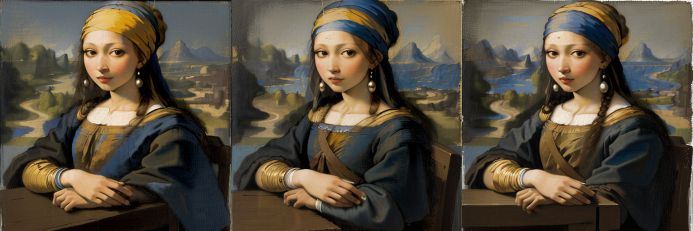

# 명화의 주인공 되기 — 명화 합성 AI (Main Quest 2)

> 김주영 (시각디자인) · 아이펠 KDT AI 에이전트 1기
> **한 줄 요약:** 사람이 명화를 "남의 그림"으로만 보던 것을, AI로 **"내가(혹은 원하는 인물이) 그 명화의 주인공이 되는" 체험**으로 바꾼다. 전문가의 포토샵 화풍 합성(수십 분)을 **비전문가도 클릭 한 번(~30초)** 으로.

---

## 1. 데모 결과 (대표 이미지)

**진주 귀고리를 한 소녀 × 모나리자** — 진주소녀(터번·진주귀걸이·얼굴·의상)를 **모나리자의 포즈·분위기·풍경**에 앉혔다. seed 고정으로 재현 가능한 결과 3종:



**원본 → 결과 비교** (원본 모나리자 │ 원본 진주 귀고리를 한 소녀 │ 합성 결과)


> 두 명화가 한눈에 다 읽힌다: *진주소녀의 정체성*(파란/금색 터번·큰 진주귀걸이) + *모나리자의 구도*(3/4 착석·모아 쥔 손·안개 낀 강 풍경·sfumato 유화 화풍). 개별 결과는 `results/final_seed10.png` · `final_seed20.png` · `final_seed30.png`.

---

## 2. 문제 정의 (무엇을 개선하나)

- **관심 영역:** 미술·명화 감상 (시각디자인 전공자로서의 관심 영역).
- **현재의 문제:** 명화에 특정 인물을 "그 화풍 그대로" 넣으려면 → 포토샵으로 **누끼 + 명암·색감·붓터치(화풍) 맞추기 + 자연스럽게 녹이기**가 필요. **수십 분 + 전문 기술**. 비전문가는 사실상 불가.
- **기존 AI 필터의 한계:** 사진 전체를 화풍으로만 바꿔줄 뿐, **"바로 그 명화의 그 인물 자리에 인물을 앉히는" 건 못 한다.**
- **개선 가설:** 명화의 **구도(ControlNet)** 를 조건으로 잡고, 넣을 인물의 **정체성(IP-Adapter)** 을 주입해, **명화 화풍으로 그 자리에 인물을 전체 재생성**한다. → 누끼·화풍맞춤·합성이라는 제일 어려운 단계를 AI가 대신.

---

## 3. 사용 모델 · 파이프라인

이번 모듈에서 배운 **Diffusion 계열**을 직접 실행했다.

| 역할 | 모델/기법 | 비고 |
|---|---|---|
| 그림 생성 (베이스) | **Stable Diffusion 1.5** (`Lykon/dreamshaper-8`) | 유화 화풍 생성 |
| **구도 유지** | **ControlNet (Canny)** (`lllyasviel/sd-controlnet-canny`) | 모나리자의 포즈·손·풍경 구조를 조건으로 |
| **정체성 주입** | **IP-Adapter** (`h94/IP-Adapter`) | 진주소녀 외형(얼굴·터번·의상)을 참조로 주입 |

```
[모나리자] → Canny(구도 추출) ─┐
[진주소녀] → IP-Adapter(정체성) ─┼→ Stable Diffusion → [합성 결과]
[프롬프트: 터번·진주귀걸이·da Vinci 화풍] ─┘
```

핵심 파라미터: `controlnet_conditioning_scale=0.62`(구도는 살리되 터번이 들어올 여지), `ip_adapter_scale=0.85`(정체성 강하게), `steps=50`, seed 고정(재현 가능).

---

## 4. 개선효과 검증 (요약)

상세는 **[개선효과_검증.md](개선효과_검증.md)** 참고.

| 항목 | 기존 (포토샵 수동) | AI PoC | 개선 |
|---|---|---|---|
| **소요 시간** | 수십 분 (누끼+화풍맞춤+합성) | **~30초** (생성) | 시간 대폭 단축 |
| **필요 기술** | 포토샵·명암·화풍 전문 기술 | 프롬프트만 (비전문가 가능) | **진입장벽 제거** |
| **화풍 일치** | 수작업으로 붓터치 흉내 | 모델이 유화로 통째 생성 → 이질감 없음 | 자연스러움 ↑ |
| **재현·배리에이션** | 매번 수작업 반복 | seed로 재현 + 배치 생성 | 확장성 ↑ |

> 검증 성격을 정직하게: **정량 벤치마크가 아니라 "시간·접근성·정성 품질" 기반 비교**다. 핵심 개선축은 *"전문 기술이 있어야 가능하던 작업을, 비전문가도 짧은 시간에"* 이다.

### 방법 탐색 과정 자체가 검증 근거 (왜 이 방법이 맞는가)
같은 목표를 3가지 방식으로 시도해 비교했다 — 이 과정이 "왜 전체 재생성이 정답인지"의 근거다.

| 시도 | 방식 | 결과 | 판정 |
|---|---|---|---|
| ① Face-swap (insightface/inswapper) | 얼굴을 사진처럼 오려 붙임 | 유화 위 매끈한 사진 패치 → 이질적·언캐니 | ❌ |
| ② 얼굴만 인페인팅 | 얼굴 영역만 마스크 재생성 | 맥락 없이 채워 이목구비 **일그러짐** | ❌ |
| ③ 전체 재생성 (ControlNet+IP-Adapter) | 구도 유지 + 정체성 주입 + **전체 재생성** | 얼굴·손·의상이 어우러진 **완결된 초상** | ✅ 채택 |

→ "구멍 뚫고 채우기"(①②)는 맥락이 없어 깨지고, **전체를 일관되게 다시 그리는 ③** 만이 자연스럽다는 것을 실증.

---

## 5. 한계 및 다음 단계 (정직)

- **정체성 정확도:** IP-Adapter는 "느낌"은 잘 주입하나, **특정 실존 인물을 정확히 닮게** 하는 데는 아직 약하다(scale·참조 이미지 의존).
- **손·해상도:** SD 1.5 · 512px 기준이라 손 디테일이 완벽하지 않고 해상도가 낮다. (업스케일·SDXL·hires-fix로 개선 여지.)
- **SAM 미사용:** 애초 계획엔 SAM 누끼가 보조로 있었으나, **ControlNet 구도 제어 + IP-Adapter 정체성 주입**으로 목표(명화 화풍 인물 합성)를 달성해 이번 PoC 범위에선 쓰지 않았다. → **다음 단계**로 SAM 누끼를 결합하면 배경·인물 분리를 더 정밀히 제어할 수 있다.
- **다인·추상 명화:** 최후의 만찬(13인)·아비뇽의 처녀들(큐비즘)처럼 얼굴이 많거나 추상적인 화풍은 난도가 급상승(추가 시도 과제).

---

## 6. 메인 퀘스트 2 요건 부합 검토 (자체 정밀 점검)

| 요건 | 충족 | 근거 / 정직한 코멘트 |
|---|---|---|
| 내 도메인(관심 영역)에서 AI 개선점 발굴 | ✅ | 미술·명화 감상. 단, "업무 불편"보다 "체험·접근성 개선"에 가깝다(관심영역 대상이라 허용 범위). |
| 모듈에서 배운 모델 **최소 1개 직접 실행** | ✅ | Diffusion + ControlNet(+IP-Adapter) 실제 실행·성공. (ControlNet/Diffusion = N5에서 학습) |
| 내 도메인 **실제 데이터** 적용 | ✅ | 실제 명화(모나리자·진주 귀고리를 한 소녀, 퍼블릭 도메인) 사용. |
| **기존 방식 대비 개선 검증** | ✅(정성) | 시간·접근성·정성 품질 비교 + 3방법 비교. **정량 벤치마크는 아님**을 명시. |
| 제출물: repo(문제정의서·코드·검증·README) + 구글폼 | ✅ | 본 repo가 구성 충족. 구글폼은 별도 제출. |

**총평:** 필수 요건은 충족. 가장 약한 고리는 *"개선 검증이 정량적이지 않다"* 와 *"불편 해소보다 체험 개선 성격"* 이라는 점 — 이를 숨기지 않고 위 표·검증 문서에 명시했다.

---

## 7. 실행 방법

1. Google Colab에서 `명화합성.ipynb` 열기 → **런타임 유형 = T4 GPU**.
2. 위에서부터 셀 실행. 명화는 코드가 위키미디어(퍼블릭 도메인)에서 자동 다운로드.
3. 결과는 `final_seed{n}.png`로 저장. seed를 바꿔 배리에이션 생성.

## 8. 윤리 · 저작권

- **명화 = 퍼블릭 도메인**(모나리자·진주 귀고리를 한 소녀 등 오래된 작품) → 저작권 무관.
- 실존 인물 적용 시 **학습·비상업 목적** 명시, 초상권·딥페이크 오해 소지 있는 공개 배포는 지양. 개인 사진은 본인·동의된 것만.
