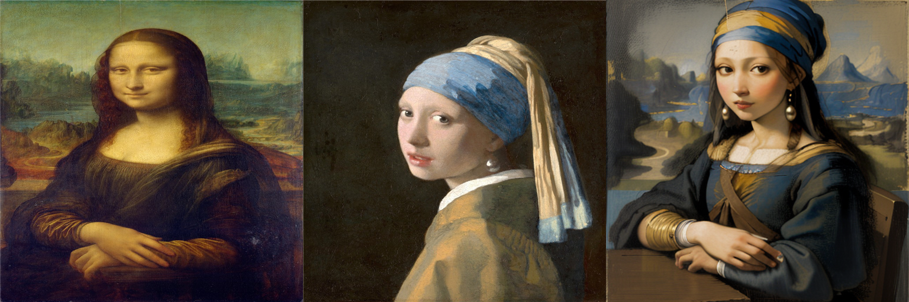
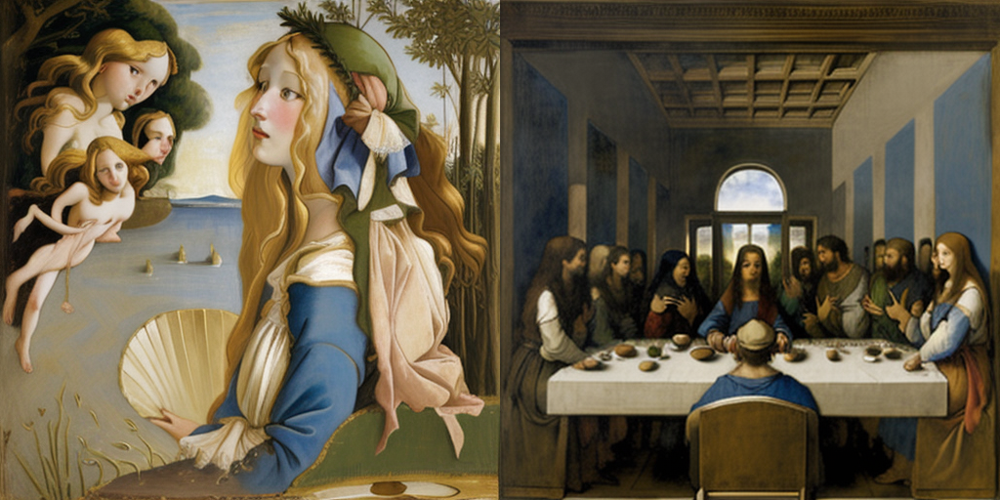

# 명화의 주인공 되기 — 명화 합성 AI (Main Quest 2)

> 김주영 (시각디자인) · 아이펠 KDT AI 에이전트 1기
> **한 줄 요약:** 사람이 명화를 "남의 그림"으로만 보던 것을, AI로 **"내가(혹은 원하는 인물이) 그 명화의 주인공이 되는" 체험**으로 바꾼다. 전문가의 포토샵 화풍 합성(수십 분)을 **비전문가도 클릭 한 번(~30초)** 으로.

---

## 1. 데모 결과 (대표 이미지)

**진주 귀고리를 한 소녀 × 모나리자** — 진주소녀(터번·진주귀걸이·얼굴·의상)를 **모나리자의 포즈·분위기·풍경**에 앉혔다. seed 고정으로 재현 가능한 결과 3종:


**원본 → 결과 비교** (원본 모나리자 │ 원본 진주 귀고리를 한 소녀 │ 합성 결과)



> 두 명화가 한눈에 다 읽힌다: *진주소녀의 정체성*(파란/금색 터번·큰 진주귀걸이) + *모나리자의 구도*(3/4 착석·모아 쥔 손·안개 낀 강 풍경·sfumato 유화 화풍). 개별 결과는 `results/final_seed10.png` · `final_seed20.png` · `final_seed30.png`.

---

## 2. 문제 정의 (무엇을 개선하나)

- **관심 영역:** 미술·명화 감상 (시각디자인 전공자로서의 관심 영역).
- **현재의 문제:** 명화에 특정 인물을 "그 화풍 그대로" 넣으려면 → 포토샵으로 **누끼 + 명암·색감·붓터치(화풍) 맞추기 + 자연스럽게 녹이기**가 필요. **수십 분 + 전문 기술**. 비전문가는 사실상 불가.
- **기존 AI 필터의 한계:** 사진 전체를 화풍으로만 바꿔줄 뿐, **"바로 그 명화의 그 인물 자리에 인물을 앉히는" 건 못 한다.**
- **개선 가설:** 명화의 **구도(ControlNet)** 를 조건으로 잡고, 넣을 인물의 **정체성(IP-Adapter)** 을 주입해, **명화 화풍으로 그 자리에 인물을 전체 재생성**한다. → 누끼·화풍맞춤·합성이라는 제일 어려운 단계를 AI가 대신.

---

## 3. 사용 모델 · 파이프라인

이번 모듈에서 배운 **Diffusion 계열**을 직접 실행했다.

| 역할 | 모델/기법 | 비고 |
|---|---|---|
| 그림 생성 (베이스) | **Stable Diffusion 1.5** (`Lykon/dreamshaper-8`) | 유화 화풍 생성 |
| **구도 유지** | **ControlNet (Canny)** (`lllyasviel/sd-controlnet-canny`) | 모나리자의 포즈·손·풍경 구조를 조건으로 |
| **정체성 주입** | **IP-Adapter** (`h94/IP-Adapter`) | 진주소녀 외형(얼굴·터번·의상)을 참조로 주입 |

```
[모나리자] → Canny(구도 추출) ─┐
[진주소녀] → IP-Adapter(정체성) ─┼→ Stable Diffusion → [합성 결과]
[프롬프트: 터번·진주귀걸이·da Vinci 화풍] ─┘
```

핵심 파라미터: `controlnet_conditioning_scale=0.62`(구도는 살리되 터번이 들어올 여지), `ip_adapter_scale=0.85`(정체성 강하게), `steps=50`, seed 고정(재현 가능).

---

## 4. 개선효과 검증 (요약)

상세는 **[개선효과_검증.md](개선효과_검증.md)** 참고.

| 항목 | 기존 (포토샵 수동) | AI PoC | 개선 |
|---|---|---|---|
| **소요 시간** | 수십 분 (누끼+화풍맞춤+합성) | **~30초** (생성) | 시간 대폭 단축 |
| **필요 기술** | 포토샵·명암·화풍 전문 기술 | 프롬프트만 (비전문가 가능) | **진입장벽 제거** |
| **화풍 일치** | 수작업으로 붓터치 흉내 | 모델이 유화로 통째 생성 → 이질감 없음 | 자연스러움 ↑ |
| **재현·배리에이션** | 매번 수작업 반복 | seed로 재현 + 배치 생성 | 확장성 ↑ |

> 검증 성격을 정직하게: **정량 벤치마크가 아니라 "시간·접근성·정성 품질" 기반 비교**다. 핵심 개선축은 *"전문 기술이 있어야 가능하던 작업을, 비전문가도 짧은 시간에"* 이다.

### 방법 탐색 과정 자체가 검증 근거 (왜 이 방법이 맞는가)
같은 목표를 3가지 방식으로 시도해 비교했다 — 이 과정이 "왜 전체 재생성이 정답인지"의 근거다.

| 시도 | 방식 | 결과 | 판정 |
|---|---|---|---|
| ① Face-swap (insightface/inswapper) | 얼굴을 사진처럼 오려 붙임 | 유화 위 매끈한 사진 패치 → 이질적·언캐니 | ❌ |
| ② 얼굴만 인페인팅 | 얼굴 영역만 마스크 재생성 | 맥락 없이 채워 이목구비 **일그러짐** | ❌ |
| ③ 전체 재생성 (ControlNet+IP-Adapter) | 구도 유지 + 정체성 주입 + **전체 재생성** | 얼굴·손·의상이 어우러진 **완결된 초상** | ✅ 채택 |

→ "구멍 뚫고 채우기"(①②)는 맥락이 없어 깨지고, **전체를 일관되게 다시 그리는 ③** 만이 자연스럽다는 것을 실증.

## ➕ 추가 시도 (원문 "조금 더 발전시키고 싶다면" 대응)

**실행한 추가 시도:**
1. **다중 기법 파이프라인 결합** — 단일 모델이 아니라 `Diffusion + ControlNet(구도) + IP-Adapter(정체성)`을 **하나의 파이프라인**으로 엮어 "구도 유지 + 정체성 주입"을 동시 달성.
2. **방법 3종 실험 비교** — face-swap / 얼굴 인페인팅 / 전체 재생성을 **실제로 돌려** 비교(위 표 · [개선효과_검증.md](개선효과_검증.md)).
3. **실패 케이스 수집·원인 분석** — 언캐니·이목구비 일그러짐·팔걸이 흰 덩어리·홍조 과다 각각의 **원인과 해결**(파라미터 조정)을 기록.
4. **인터랙티브 데모(Gradio)** — 얼굴 업로드 → 명화 선택 → 합성하는 **웹 UI**를 노트북에 구현. `demo.launch(share=True)` 실행 시 Colab GPU로 돌아가는 **공개 URL** 생성. *(배포는 원문상 선택 항목)*
5. **다른 명화로 확장 실증** — 같은 얼굴을 비너스의 탄생·최후의 만찬에 넣어 **일반화 성공 + 다인 명화 한계**를 실제로 확인(아래).

**다른 명화로 확장 — 실행 결과:** 코어 파이프라인은 특정 명화에 의존하지 않아 `target`(canny 구도 소스)만 바꾸면 적용된다. **같은 참조 얼굴(진주소녀)** 을 다른 명화들에 넣어 실제로 돌렸다:



| 타겟 명화 | 인원·특징 | 결과 |
|---|---|---|
| 진주 귀고리를 한 소녀 (본 PoC) | 1인·정면 | ✅ 성공 (히어로) |
| **비너스의 탄생** | 다인·전신 | ✅ **일반화 성공** — 보티첼리 화풍·구도로 자연스럽게 재생성 |
| **최후의 만찬** | 13인 | ⚠️ **한계 실증** — 홀·식탁·13인 구도는 재현하나 **얼굴들이 개별 정체성 없이 뭉개짐** |
| 천지창조 | 2인 | ▫️ 미실행 (이미지 소스 URL 이슈) |

→ **핵심 발견:** 단일 인물·명확한 구도는 잘 되지만, **다인 명화는 "구도는 되는데 개별 얼굴은 안 되는" 한계**가 뚜렷하다(단일 IP-Adapter는 참조 얼굴 1개를 전체에 퍼뜨림). **한계를 아는 것도 성과.** → 다음 단계 = 얼굴별 영역 마스킹 + 다중 IP-Adapter.

**추가 개선 방향:** 파인튜닝(인물 LoRA) 정체성↑ · SDXL·업스케일 해상도↑ · 웹 데모 배포(Gradio, 노트북에 포함).

---

## 5. 한계 및 다음 단계 (정직)

- **정체성 정확도:** IP-Adapter는 "느낌"은 잘 주입하나, **특정 실존 인물을 정확히 닮게** 하는 데는 아직 약하다(scale·참조 이미지 의존).
- **손·해상도:** SD 1.5 · 512px 기준이라 손 디테일이 완벽하지 않고 해상도가 낮다. (업스케일·SDXL·hires-fix로 개선 여지.)
- **SAM 미사용:** 애초 계획엔 SAM 누끼가 보조로 있었으나, **ControlNet 구도 제어 + IP-Adapter 정체성 주입**으로 목표(명화 화풍 인물 합성)를 달성해 이번 PoC 범위에선 쓰지 않았다. → **다음 단계**로 SAM 누끼를 결합하면 배경·인물 분리를 더 정밀히 제어할 수 있다.
- **다인·추상 명화:** 최후의 만찬(13인)·아비뇽의 처녀들(큐비즘)처럼 얼굴이 많거나 추상적인 화풍은 난도가 급상승(추가 시도 과제).

---

## 6. 메인 퀘스트 2 요건 부합 검토 (자체 정밀 점검)

공식 평가 5문항에 하나씩 대조.

| 평가 문항 | 충족 | 근거 |
|---|---|---|
| **1. 도메인 개선지점 정의** (문제·가설·사용자·성공기준) | ✅ | [문제정의서](문제정의서.md)에 5항목 명확. 성공기준=시간(수십분→1분)·접근성 등 확인 가능 지표. 관심 영역·"나 자신 대상"은 원문에서 허용. |
| **2. 문제에 맞는 모델 선정 + 이유** | ✅ | [문제정의서 "모델 선정 근거"](문제정의서.md) — YOLO·STT·SAM·Diffusion 후보를 문제에 대입 비교, Diffusion+ControlNet+IP-Adapter 채택 근거 기록. |
| **3. 모델 동작 + PoC** (입력→AI처리→결과출력) | ✅ | [노트북](명화합성.ipynb) end-to-end 실행(명화 다운로드→canny→생성→저장), seed 고정으로 **재현 가능**. |
| **4. 개선 효과 검증** (기존 비교·재현) | ✅ | [개선효과_검증.md](개선효과_검증.md) — 포토샵 수동 vs AI 비교 + **방법 3종 비교** + **실패 사례** + 파라미터 로그. |
| **5. 한계 파악 + 새로운 시도** | ✅ | 한계·다음단계 정리 + **추가 시도**(다중 기법 파이프라인 결합·방법 3종 실험·실패케이스 수집) + 다른 명화 확장 설계. |

**총평:** 5개 평가문항 모두 대응. 정직한 유의점 = ① 개선 검증이 정량 벤치가 아닌 **정성·시간 기반**(원문이 정성 방식 허용) ② 실패 **이미지**·다른 명화 **실제 실행**은 Colab 안정 시 추가 예정(현재는 상세 서술 + 확장 설계로 대응).

---

## 7. 실행 방법

1. Google Colab에서 `명화합성.ipynb` 열기 → **런타임 유형 = T4 GPU**.
2. 위에서부터 셀 실행. 명화는 코드가 위키미디어(퍼블릭 도메인)에서 자동 다운로드.
3. 결과는 `final_seed{n}.png`로 저장. seed를 바꿔 배리에이션 생성.

## 8. 윤리 · 저작권

- **명화 = 퍼블릭 도메인**(모나리자·진주 귀고리를 한 소녀 등 오래된 작품) → 저작권 무관.
- 실존 인물 적용 시 **학습·비상업 목적** 명시, 초상권·딥페이크 오해 소지 있는 공개 배포는 지양. 개인 사진은 본인·동의된 것만.
