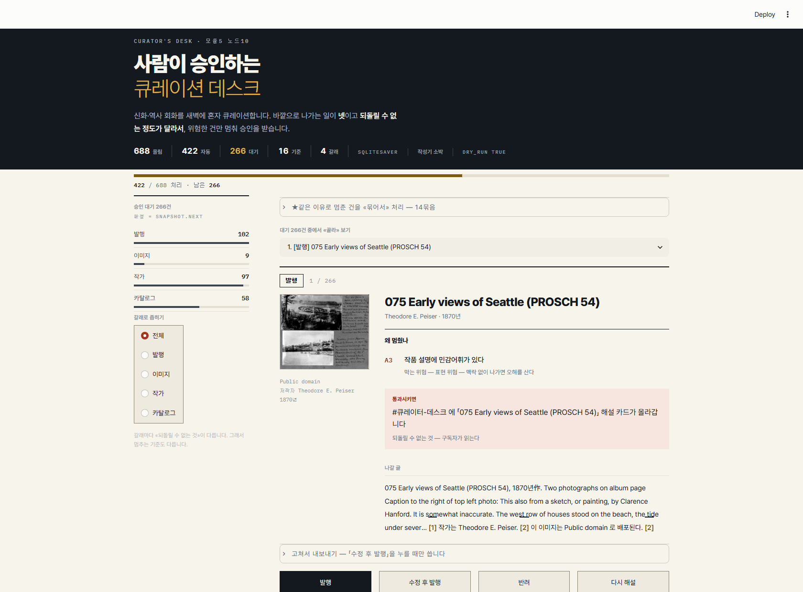

# 큐레이터 데스크 — 사람이 승인하는 회화 큐레이션 에이전트

**모듈5 노드10 [프로젝트] 사람이 승인하는 에이전트 만들기** · 김주영 · 2026-09-28

> 📄 자세한 판단 근거·측정·실패 분석 → **[REPORT.md](REPORT.md)**
> 🎨 화면 설계 결정 → **[DESIGN.md](DESIGN.md)**

---

## 한 줄

신화·역사 회화를 큐레이션하는 **데스크**. 새벽에 혼자 돌고,
**바깥으로 나가는 일마다 위험이 달라서** 위험한 건만 멈춰 승인을 받습니다.



---

## 무엇을 하나 — 한 주제가 **네 갈래**로 나갑니다

```
                   「이번 주 — 홍수 신화」
                            ↓  새벽에 혼자
                     수집 → ★세탁 → 작가 조회 → 작성
                            ↓
   ┌───────────┬───────────┬───────────┬───────────┐
   ▼           ▼           ▼           ▼
 ① 발행       ② 이미지     ③ 작가      ④ 카탈로그
 Discord     재배포       프로필      작품정보 등재
   │           │           │           │
   └───────────┴─────┬─────┴───────────┘
                     ▼
          ★한 데스크 — 위험이 «다른» 네 갈래가 섞여 들어온다
```

| 갈래 | 되돌릴 수 없는 것 |
|---|---|
| **① 발행** | 구독자가 읽는다 |
| **② 이미지** | ★**저작권** — 법적 문제 |
| **③ 작가** | ★**사람에 관한 사실** — 생몰년·국적을 틀리면 더 무겁다 |
| **④ 카탈로그** | 잘못된 정보가 **고착**되고 ★**다음 주 큐레이션이 그걸 쓴다** |

---

## 돌려 보기

```bash
python -m venv .venv
.venv/Scripts/python.exe -m pip install -r requirements.txt

python fetch_art.py        # 위키미디어 공용에서 회화 수집 (키 불필요)
python normalize.py        # ★세탁 — 기계가 고칠 수 있는 것은 사람에게 안 보낸다
python enrich.py           # 위키백과·위키데이터에서 작가 조회
python write.py            # 해설·작가소개 작성  (--조심 으로 다른 작성기)
python graph.py --올린다    # ★관문까지 굴린다 — 걸린 것만 멈춘다

streamlit run app.py       # 승인 데스크
```

**API 키 없이 전 과정이 돕니다.** `--llm` 을 쓸 때만 `OPENAI_API_KEY` 가 필요합니다.
발행은 `DRY_RUN` 이 기본이라 **바깥으로 나가지 않습니다** (`output/published.jsonl` 에만 적힙니다).

### 명령줄만으로도

```bash
python graph.py --목록                      # 승인 대기 (판정 = snapshot.next)
python graph.py --답 "<슬러그>:작가" 반려     # 한 건 이어서 실행
python compare.py                           # ★비교표 — 개입률·놓침·헛멈춤
python redteam.py                           # 내 산출물을 내가 친다
python e2e.py                               # 전 과정을 실제로 돌린다
```

---

## 지금 수치

<!-- 관문표:START -->
| 갈래 | 되돌릴 수 없는 것 | 정답 | 전부 켜면 | 권장 조합 |
|---|---|---|---|---|
| **발행** | 구독자가 읽는다 | 88건 | 59.3% · 놓침 0 · 헛멈춤 14 | 59.3% · 놓침 0 · 헛멈춤 14 |
| **이미지** | ★저작권 — 법적 문제 | 5건 | 5.2% · 놓침 0 · 헛멈춤 4 | 5.2% · 놓침 0 · 헛멈춤 4 |
| **작가** | ★사람에 관한 사실 — 생몰년·국적을 틀리면 더 무 | 97건 | 56.4% · 놓침 0 · 헛멈춤 0 | 56.4% · 놓침 0 · 헛멈춤 0 |
| **카탈로그** | 잘못된 정보가 고착되고 ★다음 주 큐레이션이 그걸  | 56건 | 62.8% · 놓침 0 · 헛멈춤 52 | 33.7% · 놓침 0 · 헛멈춤 2 |
<!-- 관문표:END -->

<!-- 요약:START -->
올린 **688**건(작품 172 × 갈래 4) 중 **422**건이 자동 처리되고 **266**건이 대기했습니다 — 자동 **61.3%**.
<!-- 요약:END -->

> 표의 모든 숫자는 `output/compare.json` 에서 **찍어냅니다** (`python sync_numbers.py`).
> ⛔손으로 적지 않습니다 — 노드9 에서 같은 프로젝트가 **두 점수**를 말한 적이 있습니다.

---

## 폴더

```
config.json        ★도메인 값의 «유일한» 출처 — 갈래·관문·권장 조합
fetch_art.py       위키미디어 공용 수집 (라이선스·저작자를 «원문 그대로»)
normalize.py       ★세탁 — HTML 태그 · 중복 · ★연도 정밀도 해석
enrich.py          위키백과 → 위키데이터 작가 조회 (생몰년·직업·레이블)
write.py           해설·작가소개 — «소박» / «조심» / «llm» 세 작성기
gates.py           ★관문 판정. 갈래는 «인자» — 기준이 늘어도 코드는 한 벌
graph.py           ★LangGraph — interrupt / Command(resume=) / SqliteSaver
app.py             승인 데스크 화면
ui.py              디자인 시스템 (정본은 DESIGN.md)
compare.py         ★비교표 — 기준을 바꿔 가며 개입률·놓침·헛멈춤
redteam.py         대비·선택자·config 정합·비밀·제어문자를 «실제로» 친다
e2e.py             전 과정을 돌리고 «말이 되는가»를 본다
sync_numbers.py    수치를 문서에 «찍어낸다»
capture_demo.py    ★화면을 사람 손 없이 찍는다
data/ output/      수집·세탁·조회·작성 결과 · 체크포인트 · 비교표
docs/              화면 캡처
```

---

## 피어리뷰 하신다면 — **여기를 보시면 됩니다**

| 보실 것 | 어디 |
|---|---|
| HITL 이 «맞게» 짜였나 | [graph.py](graph.py) — `관문` 노드와 `실행` 노드가 **왜 나뉘어 있는지** |
| 승인 기준이 «계산 가능»한가 | [config.json](config.json) `_관문` · [gates.py](gates.py) |
| 기준이 «값을 하는가» | [REPORT.md](REPORT.md) §비교표 — ★「하나 빼기」 |
| 화면이 «10초»를 노리는가 | [DESIGN.md](DESIGN.md) §중요도 · `docs/demo*.png` |
| 제가 «틀린» 것 | [REPORT.md](REPORT.md) §실패 — 기준을 **여섯 번** 고쳤습니다 |

⚠**제가 확신이 없는 곳**도 REPORT §남은 것에 적어 뒀습니다. 거기부터 보셔도 좋습니다.
