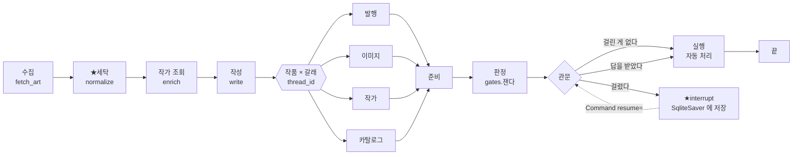

# REPORT — 큐레이터 데스크

**모듈5 노드10 [프로젝트] 사람이 승인하는 에이전트 만들기** · 김주영 · 2026-09-28

> ← 실행 방법·폴더 구조는 **[README.md](README.md)** · 화면 결정은 **[DESIGN.md](DESIGN.md)**

---

## 1. 주제와 고른 이유 — **어느 단계들에서 바깥으로 나가나**

신화·역사 회화를 큐레이션하는 데스크입니다. 새벽에 혼자 돌고,
**바깥으로 나가는 일이 넷**이며 **되돌릴 수 없는 정도가 서로 다릅니다.**

| 갈래 | 나가는 것 | 되돌릴 수 없는 것 |
|---|---|---|
| ① 발행 | Discord 묶음 게시 | 구독자가 읽는다 |
| ② 이미지 | 썸네일 재배포 | ★**저작권** — 법적 문제 |
| ③ 작가 | 작가 프로필 게시 | ★**사람에 관한 사실** |
| ④ 카탈로그 | `catalog.json` 반영 | ★**다음 주 큐레이션이 그 값을 쓴다** |

### ★첫 설계를 버렸습니다

처음엔 **「해설 카드 하나를 발행하기 전에 저작권만 본다」**였습니다.
지적을 받았습니다 — **「돈가스 전문점 같다. 일식집이어야 한다.」**

맞는 지적이었습니다. **강의 1강 표가 이미 일을 여러 종류로 나열하고 있었습니다**
(답변 발송 / 콘텐츠 게시 / 문서 수정 / 문의 종결).
★**「데스크」라는 이름을 붙여 놓고 일을 하나만 뒀던 것**입니다.

그리고 **HITL 의 진짜 질문이 일이 하나면 생기지 않습니다** —
「멈출까 말까」가 아니라 **「어느 일에서 얼마나 멈출까」**가 질문입니다.

### ★이 주제를 고른 «실용적» 이유 — 정답을 **기계가 만든다**

놓침·헛멈춤을 세려면 **「사람이 봤어야 했나」의 정답**이 필요합니다.
보통은 사람이 전 건을 손으로 라벨해야 해서 **수십 건이 한계**입니다.

```
라이선스     위키미디어 API 가 준다
제작연도     위키데이터 P571 + ★정밀도
작가가 화가인가  위키백과 조회
태그 오염     정규식
```

⇒ **전 건에 정답을 붙일 수 있습니다.** `A3`(민감 어휘)만 사람 라벨입니다.

### ⚠정직하게 — 이건 「실제로 쓸 서비스」가 아닙니다

관심 주제로 골랐습니다. 그래서 **위험을 «진짜»로 만드는 데** 공을 들였습니다.

---

## 2. 파이프라인 구조도 — **멈추는 지점과 재개 경로**



### ★그래프는 **하나**입니다 — 갈래는 «인자»

갈래가 넷이어도 노드는 `준비 → 판정 → 관문 → 실행` 넷뿐입니다.
갈래는 **`thread_id` 에 실어 보냅니다** — `"슬러그:갈래"`.

⇒ 한 작품이 **이미지와 작가로 동시에 대기**할 수 있고, 서로 간섭하지 않습니다.
기준이 15개여도 **코드는 한 벌**입니다.

### ★⛔관문 노드 «안»에서 바깥으로 나가지 않습니다

> 강의 2강 — 멈춘 **단계**가 **처음부터** 다시 실행된다.

체크포인트는 「어느 **단계**에서 멈췄나」만 적습니다. 몇 번째 **줄**인지는 모릅니다.
⇒ 관문 안에서 발행하면 **재개할 때 두 번 나갑니다.**
그래서 **실행은 별도 노드**입니다. 관문은 **묻기만** 합니다.

### ★대기 판정은 `snapshot.next`

```python
st = app.get_state({"configurable": {"thread_id": tid}})
if st.next:          # ★비어 있지 않으면 «대기 중»
    ...
```

⛔색인 파일(`output/threads.json`)을 대기 여부의 근거로 쓰지 않습니다.
색인은 **「어떤 thread 가 있나」만** 압니다. 실제 상태는 체크포인터에 있습니다.

### 체크포인터 = `SqliteSaver`

> 강의 4강 — **「승인을 기다리는 시간은 초 단위가 아니다.」**

`InMemorySaver` 는 껐다 켜면 대기 건이 사라집니다.
루브릭 ①이 **「대기 건을 보관」**이라 직접 걸립니다.

---

## 3. 승인 기준과 그 이유 — **갈래마다 다르다**

정본은 [config.json](config.json) `_관문` 입니다. 전부 **계산 가능한** 형태입니다.

### ★관문 앞에 **세탁**이 있습니다

**기계가 고칠 수 있는 것은 사람에게 보내지 않습니다.**

<!-- 세탁표:START -->
| | 세탁 전 | 세탁 후 |
|---|---|---|
| 작가명·연도에 HTML 태그 | **35건** | ★**0건** |
<!-- 세탁표:END -->

⛔**그래도 관문은 남깁니다** — 세탁을 **하고도** 태그가 남으면 그때는 멈춥니다(`C1`·`D2`).
**세탁 실패는 판단거리**입니다.

### 갈래별 기준

| 갈래 | 기준 | 막는 위험 |
|---|---|---|
| **발행** | `A1` 원문에 없는 숫자 · `A2` 근거 0 · `A3` 민감 어휘 | 사실 왜곡 · 지어낸 글 · 표현 위험 |
| **이미지** | `B1` 표시의무인데 저작자 불명 · `B2` 1900년 이후 | ★라이선스 위반 · 살아 있는 저작권 |
| **작가** | `C1` 이름 오염 · `C2` 불명 · `C3` 생몰년 · `C4` 이름 충돌 · `C5` **화가로 확인 안 됨** + `A1`·`A2` | ★엉뚱한 사람을 작가라고 말한다 |
| **카탈로그** | `D1` 출처 충돌 · `D2` 연도 오염 · `D3` 중복 · `D4` **연도 정밀도** · `D5` 레코드 깨짐 + `A1` | ★잘못된 정보가 **고착** |

★`A1`·`A2` 는 **공통**입니다 — **글이 바깥으로 나가는 갈래**에 다 겁니다.

---

## 4. 실행 결과 — **비교표**

> 강의 3강 — 「프로젝트에서 이 비교표를 직접 만듭니다」

### ★정답은 **기준과 독립**입니다

「전부 켠 기준 = 정답」으로 두면 전부 켠 설정이 **정의상** 만점이 됩니다.
재는 것이 아니라 **자기를 자기로** 재는 것입니다.

⇒ `compare.py` 의 `정답_*` 는 **「나가면 실제로 해로운가」**만 봅니다
(예: 발행 정답 = 해설이 **원문에 없는 4자리 연도**를 말한다 — `A1` 은 3자리 이상 모든 숫자를 봅니다).

### 갈래별

<!-- 관문표:START -->
| 갈래 | 되돌릴 수 없는 것 | 정답 | 전부 켜면 | 권장 조합 |
|---|---|---|---|---|
| **발행** | 구독자가 읽는다 | 3건 | 10.0% · 놓침 0 · 헛멈춤 1 | 10.0% · 놓침 0 · 헛멈춤 1 |
| **이미지** | ★저작권 — 법적 문제 | 1건 | 5.0% · 놓침 0 · 헛멈춤 1 | 5.0% · 놓침 0 · 헛멈춤 1 |
| **작가** | ★사람에 관한 사실 — 생몰년·국적을 틀리면 더 무 | 19건 | 47.5% · 놓침 0 · 헛멈춤 0 | 47.5% · 놓침 0 · 헛멈춤 0 |
| **카탈로그** | 잘못된 정보가 고착되고 ★다음 주 큐레이션이 그걸  | 5건 | 57.5% · 놓침 0 · 헛멈춤 18 | 20.0% · 놓침 0 · 헛멈춤 3 |
<!-- 관문표:END -->

### ★「하나 빼기」 — **이 기준이 밥값을 하나**

쌓기만 보면 나중에 켠 기준이 다 잘하는 것처럼 보입니다(순서 탓).
**빼 보면** 압니다.

<!-- 빼기표:START -->
| 갈래 | 조합 | 개입률 | ★놓침 | 헛멈춤 |
|---|---|---|---|---|
| **작가** | 전부 | 47.5% | 0건 | 0건 |
| | 전부 − C1 | 47.5% | 0건 | 0건 |
| | 전부 − C2 | 47.5% | 0건 | 0건 |
| | 전부 − C3 | 47.5% | 0건 | 0건 |
| | 전부 − C4 | 47.5% | 0건 | 0건 |
| | 전부 − C5 | 45.0% | 1건 | 0건 |
| | 전부 − A1 | 47.5% | 0건 | 0건 |
| | 전부 − A2 | 47.5% | 0건 | 0건 |
| **카탈로그** | 전부 | 57.5% | 0건 | 18건 |
| | 전부 − D1 | 20.0% | 0건 | 3건 |
| | 전부 − D2 | 57.5% | 0건 | 18건 |
| | 전부 − D3 | 57.5% | 0건 | 18건 |
| | 전부 − D4 | 55.0% | 1건 | 18건 |
| | 전부 − D5 | 55.0% | 1건 | 18건 |
| | 전부 − A1 | 52.5% | 0건 | 16건 |
<!-- 빼기표:END -->

★**이 표가 `D1` 을 빼게 했습니다.** 놓침은 그대로인데 개입률이 3분의 1, 헛멈춤이 6분의 1이 됩니다.
그 판단은 `config.json` `_권장조합` 에 **근거와 함께** 적혀 있고, 그래프가 그것을 켭니다.

```
판단 규칙 둘
  ① 헛멈춤을 «만드는» 기준은 뺀다     사람 시간이 실제로 든다
  ② 아무것도 «안 하는» 기준은 남긴다   비용 0 이고 위험은 실재한다
  ⚠40점으로 정했다 — 표본이 바뀌면 ★다시 잰다 (과적합)
```

### ★작성기를 바꾸면

같은 기준으로 **작성기**를 잽니다. 「소박」은 LLM 이 하듯 값을 그대로 쓰고,
「조심」은 같은 자료로 **정밀도를 지켜** 씁니다.

<!-- 작성기표:START -->
| 갈래 | 작성기 | 개입률 | ★놓침 | 헛멈춤 |
|---|---|---|---|---|
| 발행 | 소박 | 10.0% | 0건 | 1건 |
|  | 조심 | 2.5% | 0건 | 1건 |
| 카탈로그 | 소박 | 57.5% | 0건 | 18건 |
|  | 조심 | 52.5% | 0건 | 18건 |
<!-- 작성기표:END -->

### 전체

<!-- 요약:START -->
올린 **160**건(작품 40 × 갈래 4) 중 **127**건이 자동 처리되고 **33**건이 대기했습니다 — 자동 **79.4%**.
<!-- 요약:END -->

---

## 5. 데모 화면 설계 — 무엇을 보여주고 **무엇을 뺐나**

자세한 결정은 [DESIGN.md](DESIGN.md). 여기는 **왜 그렇게 했나**입니다.

### 이 화면이 하는 일은 **하나**

> **「10초 안에 판단하게 한다」**

30건이면 같은 동작을 30번 합니다. 한 건에 30초면 15분, 10초면 5분입니다.
그래서 **중요도 순서가 고정**입니다.

```
1 왜 멈췄나   2 통과시키면   3 무엇에 대한 건인가   4 대기열 어디쯤인가
```


★**이 한 장이 프로젝트 전체를 보여 줍니다.**
`Rrroza` — 위키백과에 **화가로 없습니다**(`C5`). 사진을 올린 사람입니다.
그런데 「소박」 작성기는 **근거 없이** 「바로크 시대를 대표하는 거장」이라 썼습니다(`A2`).
**두 기준이 독립적으로 같은 건을 잡았습니다.**

### ★「통과시키면」을 **버튼 바로 위**에

강의 1강의 «금액이 계좌로 나갑니다» 자리입니다.
**되돌릴 수 없는 것**을 한 줄 더 붙였습니다 — 갈래마다 다르기 때문입니다.

### ★안 멈춘 것도 **보입니다**

「자동으로 처리된 N건」을 접어서 둡니다.
**놓침은 대기 목록에 «안 뜹니다».** 안 보이는 것을 볼 자리가 없으면 영영 못 찾습니다.

### ⛔뺀 것

- **갈래를 색으로 가르지 않습니다** — 규칙 `color-not-only`. 글자가 먼저, 테두리 모양이 거듦
- **「나갈 글」과 수정칸의 중복** — 수정칸을 접었습니다
- **`st.sidebar`** — ★띄워 보니 **DOM 에 아예 안 생겼습니다.** 최소 앱으로 격리 시험해도 같았습니다.
  대기열이 «사라질 수 있는 자리»에 있으면 안 됩니다 ⇒ 본문 2단으로 옮겼습니다
- **키보드 단축키·다크 모드** — 못 했습니다(§6)

---

## 6. 회고 — **기준이 데이터를 만나 여섯 번 바뀌었다**

이 프로젝트에서 **가장 공들인 것**은 코드가 아니라 **「기준을 재서 고친 것」**입니다.

| # | 무엇이 틀렸나 | 어떻게 알았나 | 고친 뒤 |
|---|---|---|---|
| 1 | `G1` 「자유 라이선스인가」가 **100% 통과** | 실측 | → `B1` 「표시의무인데 저작자 불명」 |
| 2 | 기준이 **39/40(97.5%)** 을 잡음 | 실측 | → **세탁**을 관문 앞에 · 42.5% |
| 3 | `B2` 가 **사진 촬영일시**를 제작연도로 읽음 | 남은 목록에 **초 단위 시각** | → `QS:P571` · 13건 → **1건** |
| 4 | `C3` ≡ `C5` (교집합 19 · **차집합 0**) | 겹침을 셈 | → `C3` 는 «화가로 확인된» 사람만 |
| 5 | `C4` 가 **한국어 레이블**을 충돌로 셈 | 목록을 **눈으로** 봄 | → 영어 레이블 비교 · 11건 → **3건** |
| 6 | `A1` 이 **작가 생몰년·Q번호**를 잡아 60% | 무엇이 걸리는지 **찍어 봄** | → 갈래별로 «내보낼 글»만 · **10%** |

### ★가장 값진 발견 — **값만 읽으면 220년 틀린다**

```
between 1677 and 1720 date QS:P571,+1500-...Z/6,
                           P1319,+1677-...Z/9,
                           P1326,+1720-...Z/9
```

`P571` 의 값은 `1500` 인데 **정밀도가 `/6` = 천년기**입니다.
「1500년작」이라 적으면 실제 범위(1677~1720)와 **220년** 어긋납니다.

⇒ 관문 `D4`(연도 정밀도)와 `D5`(레코드 깨짐, `QS:P,` 꼴)가 여기서 나왔습니다.
그리고 `normalize.py` 가 **표기 자체를** 「%d세기」·「제작연도 미상」으로 만듭니다.

### ★강의 3강에는 **반대쪽**도 있었다

> 「기준을 너무 낮게 잡으면 있으나 없으나 같아집니다.」

**너무 높아도 똑같이 무너집니다.** 97.5%가 멈추면 사람이 전 건을 보는 것이고,
그건 **선택지 ①(전부 막기)**이지 자동화가 아닙니다.
그리고 원인은 **판단거리가 아니라 세탁거리**였습니다.

### 제가 **밟은** 것 — 도구가 잡았습니다

| 무엇 | 누가 잡았나 |
|---|---|
| `fieldline` 이 **단추 바탕**과 2.66:1 (3:1 미달) | ★`redteam.py` — 계산해서 |
| `.why` 를 **두 번 정의**해 margin 이 사라짐 | `redteam.py` |
| `.dk img`·`.primary` 후손 선택자가 **블록을 못 넘음** | 브라우저 실측 → `redteam.py` 에 검사 추가 |
| `graph.py` 가 gates 규칙을 **우회**(발행 A1 4→24건) | 목록을 **세어 봄** |
| `\| tail` 뒤에서 종료코드를 봐서 **KeyError 를 exit 0** 으로 읽음 | 파이프를 **떼고** 다시 잼 |

### 보완하고 싶은 것 — **정직하게**

### ⚠적중 0인 (갈래, 관문) 쌍 — **18쌍 중 7쌍**

`redteam.py` 가 **갈래마다 전부** 쳐서 셉니다. 0건이 «없음»인지 «못 읽음»인지 여기 적습니다.

| 쌍 | 왜 0인가 | 어떤 것인가 |
|---|---|---|
| 작가/`C1` · 카탈로그/`D2` | ★**세탁이 먼저 지운다** (35건 → 0) | ✅설계대로 |
| 작가/`C3` | 화가로 «확인된» 21명이 **전부 생몰년이 있다** | 표본 탓 — 현대 작가가 섞이면 산다 |
| 카탈로그/`D3` | 카탈로그가 **비어 있을 때** 잰 값. ★다시 올리면 **32/40** | ✅설계대로 |
| 발행/`A2` | 해설은 **항상 근거를 단다**(`[2]` 라이선스) | ✅설계대로 |
| 작가/`A1` | 작가소개의 숫자는 **조회 결과 안에** 다 있다 | ✅설계대로 |
| 발행/`A3` | ⚠**어휘가 한국어인데 원문이 영어다** | ⛔**못 읽는 것** |

★**`A3` 만 진짜 구멍입니다.** 유일하게 **사람이 라벨해야 하는 기준**인데
어휘 목록이 원문 언어와 안 맞아 **한 번도 판정된 적이 없습니다.**
⇒ 다음에 할 것: 영어 어휘를 넣거나, 설명을 번역한 뒤 재기.

- ⚠**`C1`·`C3`·`D3` 을 빼도 결과가 같습니다.** 그래도 남겼습니다 —
  비용이 0 이고 막는 위험은 실재합니다(§4 판단 규칙 ②).
- ⚠**⑤ 정정 갈래**(이미 나간 카드 수정·삭제)는 **설계만** 했습니다.
  **기준을 두지 않는 것이 기준**입니다 — 고쳐도·지워도·둬도 되돌릴 수 없어
  자동 판정이 설 자리가 없습니다.
- ⚠**실제 Discord 발행**은 안 켰습니다. 웹훅 주소가 없어 `DRY_RUN` 입니다.
- ⚠**키보드만으로 30건 처리**는 불편합니다. Streamlit 에서 단축키를 안전히 붙이기 어려웠습니다.
- ⚠**`C5` 가 47.5%** 를 잡습니다. 「위키백과에 화가로 없다」가 그만큼 흔합니다.
  기준이 틀린 게 아니라 **데이터가 그렇습니다** — 하지만 사람이 19건을 보는 건 부담입니다.
  ★다음에 할 것: 파일명·카테고리에서 **두 번째 단서**를 찾아 자동 통과 폭을 넓히기.

---

## 부록 — 재현

```bash
python e2e.py          # 전 과정을 돌리고 «말이 되는가»를 본다 → output/e2e.json
python redteam.py      # 대비·선택자·정합·비밀·제어문자 → 실패하면 exit 1
python sync_numbers.py # 이 문서의 수치를 output/*.json 에서 찍어낸다
```

> 이 문서의 표와 숫자는 **전부 `sync_numbers.py` 가 찍습니다.**
> ⛔손으로 적지 않습니다 — 노드9 에서 같은 프로젝트가 **두 점수**를 말한 적이 있고,
> 피어리뷰가 **치환 안 된 자리표시자**를 찾아냈습니다.
