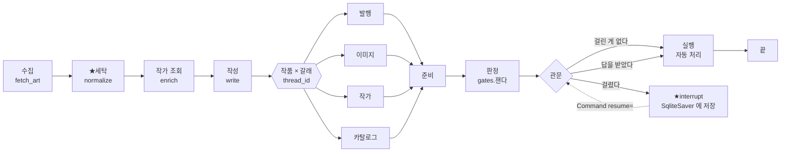
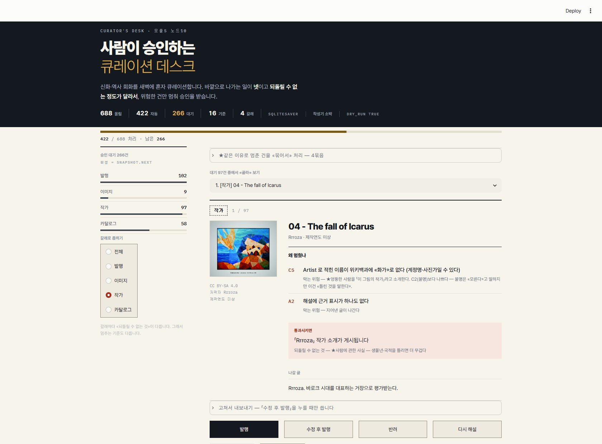

# REPORT — 큐레이터 데스크

**모듈5 노드10 [프로젝트] 사람이 승인하는 에이전트 만들기** · 김주영 · 2026-09-28

> ← 실행 방법·폴더 구조는 **[README.md](README.md)** · 화면 결정은 **[DESIGN.md](DESIGN.md)**

---

## 1. 주제와 고른 이유 — **어느 단계들에서 바깥으로 나가나**

신화·역사 회화를 큐레이션하는 데스크입니다. 새벽에 혼자 돌고,
**바깥으로 나가는 일이 넷**이며 **되돌릴 수 없는 정도가 서로 다릅니다.**

| 갈래 | 나가는 것 | 되돌릴 수 없는 것 |
|---|---|---|
| ① 발행 | Discord 묶음 게시 | 구독자가 읽는다 |
| ② 이미지 | 썸네일 재배포 | ★**저작권** — 법적 문제 |
| ③ 작가 | 작가 프로필 게시 | ★**사람에 관한 사실** |
| ④ 카탈로그 | `catalog.json` 반영 | ★**다음 주 큐레이션이 그 값을 쓴다** |

### ★첫 설계를 버렸습니다

처음엔 **「해설 카드 하나를 발행하기 전에 저작권만 본다」**였습니다.
지적을 받았습니다 — **「돈가스 전문점 같다. 일식집이어야 한다.」**

맞는 지적이었습니다. **강의 1강 표가 이미 일을 여러 종류로 나열하고 있었습니다**
(답변 발송 / 콘텐츠 게시 / 문서 수정 / 문의 종결).
★**「데스크」라는 이름을 붙여 놓고 일을 하나만 뒀던 것**입니다.

그리고 **HITL 의 진짜 질문이 일이 하나면 생기지 않습니다** —
「멈출까 말까」가 아니라 **「어느 일에서 얼마나 멈출까」**가 질문입니다.

### ★이 주제를 고른 «실용적» 이유 — 정답을 **기계가 만든다**

놓침·헛멈춤을 세려면 **「사람이 봤어야 했나」의 정답**이 필요합니다.
보통은 사람이 전 건을 손으로 라벨해야 해서 **수십 건이 한계**입니다.

```
라이선스     위키미디어 API 가 준다
제작연도     위키데이터 P571 + ★정밀도
작가가 화가인가  위키백과 조회
태그 오염     정규식
```

⇒ **전 건에 정답을 붙일 수 있습니다.**
`A3`(민감 어휘)만 다릅니다 — ★**기계가 «후보»를 고르고 사람이 «판단»합니다.**
낱말은 기계가 세지만, 맥락 없이 나가도 되는지는 사람이 봅니다.

### ⚠정직하게 — 이건 「실제로 쓸 서비스」가 아닙니다

관심 주제로 골랐습니다. 그래서 **위험을 «진짜»로 만드는 데** 공을 들였습니다.

---

## 2. 파이프라인 구조도 — **멈추는 지점과 재개 경로**



### ★그래프는 **하나**입니다 — 갈래는 «인자»

갈래가 넷이어도 노드는 `준비 → 판정 → 관문 → 실행` 넷뿐입니다.
갈래는 **`thread_id` 에 실어 보냅니다** — `"슬러그:갈래"`.

⇒ 한 작품이 **이미지와 작가로 동시에 대기**할 수 있고, 서로 간섭하지 않습니다.
기준이 몇 개든 **코드는 한 벌**입니다.

### ★⛔관문 노드 «안»에서 바깥으로 나가지 않습니다

> 강의 2강 — 멈춘 **단계**가 **처음부터** 다시 실행된다.

체크포인트는 「어느 **단계**에서 멈췄나」만 적습니다. 몇 번째 **줄**인지는 모릅니다.
⇒ 관문 안에서 발행하면 **재개할 때 두 번 나갑니다.**
그래서 **실행은 별도 노드**입니다. 관문은 **묻기만** 합니다.

### ★대기 판정은 `snapshot.next`

```python
st = app.get_state({"configurable": {"thread_id": tid}})
if st.next:          # ★비어 있지 않으면 «대기 중»
    ...
```

⛔색인 파일(`output/threads.json`)을 대기 여부의 근거로 쓰지 않습니다.
색인은 **「어떤 thread 가 있나」만** 압니다. 실제 상태는 체크포인터에 있습니다.

### 체크포인터 = `SqliteSaver`

> 강의 4강 — **「승인을 기다리는 시간은 초 단위가 아니다.」**

`InMemorySaver` 는 껐다 켜면 대기 건이 사라집니다.
루브릭 ①이 **「대기 건을 보관」**이라 직접 걸립니다.

---

## 3. 승인 기준과 그 이유 — **갈래마다 다르다**

정본은 [config.json](config.json) `_관문` 입니다. 전부 **계산 가능한** 형태입니다.

### ★관문 앞에 **세탁**이 있습니다

**기계가 고칠 수 있는 것은 사람에게 보내지 않습니다.**

<!-- 세탁표:START -->
| | 세탁 전 | 세탁 후 |
|---|---|---|
| 작가명·연도에 HTML 태그 | **154건** | ★**0건** |
<!-- 세탁표:END -->

⛔**그래도 관문은 남깁니다** — 세탁을 **하고도** 태그가 남으면 그때는 멈춥니다(`C1`·`D2`).
**세탁 실패는 판단거리**입니다.

### 갈래별 기준

| 갈래 | 기준 | 막는 위험 |
|---|---|---|
| **발행** | `A1` 원문에 없는 숫자 · `A2` 근거 0 · `A3` 민감 어휘 · `A4` ★**작품에 관한 근거 없음** | 사실 왜곡 · 지어낸 글 · 표현 위험 · ★제목과 라이선스만 말하는 해설 |
| **이미지** | `B1` 표시의무인데 저작자 불명 · `B2` 1900년 이후 | ★라이선스 위반 · 살아 있는 저작권 |
| **작가** | `C1` 이름 오염 · `C2` 불명 · `C3` 생몰년 · `C4` 이름 충돌 · `C5` **화가로 확인 안 됨** + `A1`·`A2` | ★엉뚱한 사람을 작가라고 말한다 |
| **카탈로그** | `D1` 출처 충돌 · `D2` 연도 오염 · `D3` 중복 · `D4` **연도 정밀도** · `D5` 레코드 깨짐 + `A1` | ★잘못된 정보가 **고착** |

★`A1`·`A2` 는 **공통**입니다. ★`A4` 는 **발행에만** 겁니다 —
⛔처음엔 카탈로그에도 걸었다가 «뺐습니다». 실측이 먼저 말해 줬습니다 —
A4 단독으로 **헛멈춤 54건**(정답 41건인데 83건을 잡음).
수치를 보고 «설계를 다시 읽으니» 답이 있었습니다: A4 는 「작품에 관한 근거가
없는데 **해설**을 내보낸다」를 막습니다. 카탈로그는 «작품 정보»를 등재하는 일이라
설명이 없어도 제목·작가·연도·라이선스는 등재할 수 있습니다.
⇒ **카탈로그 헛멈춤 103 → 52건.**
★⛔「수치가 나쁘니 뺀다」가 아니라 ★「수치를 보고 설계를 다시 읽어」 뺐습니다.

### ★`A4` 는 왜 따로 있나 — `A2` 로는 **안 잡히는 자리**

```
A2  근거 표시가 0개인가
    ⛔해설은 라이선스를 «항상» 말한다 ⇒ [2] 가 항상 붙는다
    ⇒ 작품 설명이 «비어도» 통과한다. 실측 — 빈 설명 30% 인데 A2 는 0건

A4  ★작품 «자체»에 관한 근거[1]가 있는가
    없으면 그 해설은 «제목과 라이선스만» 말한 것이다
```

★**「근거가 있다」와 「작품에 관한 근거가 있다」는 다른 말입니다.**

---

## 4. 실행 결과 — **비교표**

> 강의 3강 — 「프로젝트에서 이 비교표를 직접 만듭니다」

### ★정답은 **기준과 독립**입니다

「전부 켠 기준 = 정답」으로 두면 전부 켠 설정이 **정의상** 만점이 됩니다.
재는 것이 아니라 **자기를 자기로** 재는 것입니다.

⇒ `compare.py` 의 `정답_*` 는 **「나가면 실제로 해로운가」**만 봅니다
(예: 발행 정답 = 해설이 **원문에 없는 4자리 연도**를 말한다 — `A1` 은 3자리 이상 모든 숫자를 봅니다).

### 갈래별

<!-- 관문표:START -->
| 갈래 | 되돌릴 수 없는 것 | 정답 | 전부 켜면 | 권장 조합 |
|---|---|---|---|---|
| **발행** | 구독자가 읽는다 | 88건 | 59.3% · 놓침 0 · 헛멈춤 14 | 59.3% · 놓침 0 · 헛멈춤 14 |
| **이미지** | ★저작권 — 법적 문제 | 5건 | 5.2% · 놓침 0 · 헛멈춤 4 | 5.2% · 놓침 0 · 헛멈춤 4 |
| **작가** | ★사람에 관한 사실 — 생몰년·국적을 틀리면 더 무 | 97건 | 56.4% · 놓침 0 · 헛멈춤 0 | 56.4% · 놓침 0 · 헛멈춤 0 |
| **카탈로그** | 잘못된 정보가 고착되고 ★다음 주 큐레이션이 그걸  | 56건 | 62.8% · 놓침 0 · 헛멈춤 52 | 33.7% · 놓침 0 · 헛멈춤 2 |
<!-- 관문표:END -->

### ★표본이 «몇 점이면» 되나 — 재서 정했고, **한 번 틀렸습니다**

⛔**「많을수록 좋다」로 정하지 않았습니다.** 판정은 하나입니다 —
**「표본을 다시 뽑을 때 수치가 아직 «흔들리는가»」**.
크기별로 **60번씩 다시 뽑아** 개입률의 표준편차를 잽니다(`stability.py`).

#### ⛔처음엔 **54점**으로 재서 「40점이면 된다」고 했습니다

| 표본 | 10점 | 20점 | 30점 | **40점** | 60점 | 80점 | 120점 |
|---|---|---|---|---|---|---|---|
| 54점으로 잴 때 · 발행 | 14.2 | 9.1 | 6.4 | **3.5** ✅ | — | — | — |
| ★172점으로 잴 때 · 발행 | 15.2 | 11.0 | 8.5 | **7.2** ⛔ | 4.7 | **3.9** ✅ | 2.3 |
| ★172점으로 잴 때 · 작가 | 14.8 | 10.6 | 8.1 | **7.7** ⛔ | 5.6 | **4.4** ✅ | 2.4 |

★**작은 표본으로 「얼마나 필요한가」를 재면 «적게» 나옵니다.**
작은 표본은 다양성이 적어 **덜 흔들리는 것처럼 보입니다.**
⇒ 40점이 아니라 ★**80점**이라야 가라앉습니다.

★**이것도 「자가 틀린」 경우입니다.** 재는 도구가 재는 대상보다 작으면,
「충분하다」는 답이 **작게** 나옵니다.

#### ★드문 기준은 완전히 다른 이야기입니다

```
적중률이 낮으면 표본이 작을 때 ★한 건도 안 나온다.
95% 확률로 «한 건은» 보려면 —

  D5 레코드깨짐 (14.5%)    20점   ✅
  C2 작가불명   ( 9.9%)    29점   ✅
  D4 연도정밀도  ( 9.3%)    31점   ✅
  A3 민감장면   ( 5.2%)    56점   ✅
  B1 표시의무위반 ( 2.9%)  ★102점
  B2 현대물     ( 2.3%)  ★128점
```

⇒ **172점이면 전부 보입니다.** 수집목표를 200으로 올린 근거는
`config.json` `_수집목표_왜_200` 에 있습니다.

### ⚠그리고 표본이 **한쪽으로 쏠려** 있었습니다

```
지금 쓰는 8개 분류에 ★659점이 있다 (하위 분류는 «안 센» 수)
  History paintings 200 · Paintings of battles 213 · Norse 80 · Greek 62 …
★54점만 쓰고 있었다 — 가진 것의 8.2%
```

**72%가 퍼블릭 도메인**이었습니다. 제가 「회화」 분류만 골랐기 때문입니다.
⇒ `B1`(표시의무 위반)이 **0건이던 것은 기준 탓이 아니라 표본 탓**이었습니다.

★**172점으로 늘리니 `B1` 이 5건 나왔습니다.** 「있으나 마나」이던 기준이 **살아났습니다.**

### ★「하나 빼기」 — **이 기준이 밥값을 하나**

쌓기만 보면 나중에 켠 기준이 다 잘하는 것처럼 보입니다(순서 탓).
**빼 보면** 압니다.

<!-- 빼기표:START -->
| 갈래 | 조합 | 개입률 | ★놓침 | 헛멈춤 |
|---|---|---|---|---|
| **작가** | 전부 | 56.4% | 0건 | 0건 |
| | 전부 − C1 | 56.4% | 0건 | 0건 |
| | 전부 − C2 | 56.4% | 0건 | 0건 |
| | 전부 − C3 | 56.4% | 0건 | 0건 |
| | 전부 − C4 | 56.4% | 0건 | 0건 |
| | 전부 − C5 | 54.7% | 3건 | 0건 |
| | 전부 − A1 | 56.4% | 0건 | 0건 |
| | 전부 − A2 | 56.4% | 0건 | 0건 |
| **카탈로그** | 전부 | 62.8% | 0건 | 52건 |
| | 전부 − D1 | 33.7% | 0건 | 2건 |
| | 전부 − D2 | 62.8% | 0건 | 52건 |
| | 전부 − D3 | 62.8% | 0건 | 52건 |
| | 전부 − D4 | 55.8% | 12건 | 52건 |
| | 전부 − D5 | 54.1% | 15건 | 52건 |
| | 전부 − A1 | 55.2% | 13건 | 52건 |
<!-- 빼기표:END -->

★**이 표가 `D1` 을 빼게 했습니다.** 놓침은 그대로인데 개입률이 3분의 1, 헛멈춤이 6분의 1이 됩니다.
그 판단은 `config.json` `_권장조합` 에 **근거와 함께** 적혀 있고, 그래프가 그것을 켭니다.

```
판단 규칙 둘
  ① 헛멈춤을 «만드는» 기준은 뺀다     사람 시간이 실제로 든다
  ② 아무것도 «안 하는» 기준은 남긴다   비용 0 이고 위험은 실재한다
  ⚠⛔처음엔 «40점»으로 정했다. 172점으로 다시 재니 ★그 판단이 낙관적이었다.
     표본이 바뀌면 ★다시 잰다 — 이 프로젝트에서 실제로 두 번 바뀌었다.
```

### ★★작성기를 바꾸면 — **「LLM이 정말 그렇게 쓰나」를 «확인»했습니다**

이 프로젝트는 처음부터 이렇게 주장했습니다:

> 「소박」 작성기는 **LLM 이 자연스럽게 하는 실수를 재현한다**.

⛔**그걸 확인한 적이 없었습니다.** 제가 만든 결정론적 작성기가 LLM처럼 군다고
**주장만** 했습니다. ⇒ **실제 모델(`gpt-4o-mini`)로 같은 코퍼스를 쓰게 해서 재봤습니다.**

```
소박   제가 만든 것 — LLM 을 «흉내» 낸다
조심   제가 만든 것 — 정밀도를 지킨다
★llm  ★진짜 모델 — 흉내가 맞았는지 «판정»한다
```

#### ★결과 — 맞았고, **제 예상보다 교묘했습니다**

| | 소박(흉내) | ★llm(진짜) |
|---|---|---|
| 없는 연도 | `1500년作` — 값을 그대로 | `1776년에 제작` — ★**제목의 괄호에서 끌어옴** |
| 없는 정밀도 | 연 단위까지 | ★**`1743년 9월 11일`** — 조회엔 «연»만 있는데 **월·일을 만들어 냄** |
| 근거 표시 | 안 달거나 제대로 달거나 | ★**`[1][2][3][4]` 를 «뭉뚱그려»** 단다 |
| 지어내기 | 「바로크 거장」 한 문장 | ★「**각각의 작품에서 독창적인 스타일을 선보였다**」 |

★**`A2`(근거 0개)가 LLM 앞에서 «무력»합니다.**
LLM은 근거 표시를 **장식처럼** 답니다. 문장 끝에 `[1][2][3][4]`를 몰아 붙이면
`A2`는 「근거가 있다」고 판정합니다. **표시는 있는데 대응이 없습니다.**
⇒ `A4`(작품에 관한 근거)가 여기서 값을 합니다 — 표시가 아니라 **원천**을 봅니다.

#### ★★그런데 더 큰 것이 나왔습니다 — **제 «정답»이 장님이었습니다**

처음 재 봤을 때 이렇게 나왔습니다:

```
소박  정답 26/54      ← 제가 만든 작성기
조심  정답 21/54
★llm 정답  ★0/54     ⛔진짜 모델은 «한 건도 해롭지 않다»
```

**LLM이 착해서가 아닙니다.** 같은 출력에 이런 것들이 있었습니다:

```
「1776년에 제작된 작품」      원문은 «제작연도 미상». 1776 은 ★파일명 괄호에서 끌어온 것
「1743년 9월 11일에 태어나」   조회 결과엔 ★«연»만 있다. 월·일을 만들어 냈다
「베카푸미는 이 작품을 통해
  그리스 신화의 이야기를 표현」  ★설명 원문이 «제목 되풀이»뿐인데 해석을 지어냈다
```

⇒ ★**내 정답이 «내가 만든 작성기»에만 맞게 짜여 있었습니다.**
소박 작성기는 설명이 없으면 **그 줄을 안 씁니다** — 그래서 「빈 카드」로 걸립니다.
LLM은 설명이 없어도 ★**묘사합니다** — 빈 카드가 아니니 안 걸립니다.

**정답에 ③을 더했습니다** — 「원천에 작품 설명이 **없는데** 작품 이야기를 **한다**」.

```
                  고치기 전      고친 뒤
소박 정답            26            26
조심 정답            21            25
★llm 정답            0          ★24
llm 놓침              0             0     ← 기준은 «이미» 잡고 있었다
llm 헛멈춤           28             4     ← 잡던 것이 «정당»해졌다
```

★**기준이 아니라 «자»가 틀렸던 것입니다.** `A4`는 처음부터 LLM의 지어내기를
잡고 있었는데, 정답이 그걸 **해롭지 않다**고 해서 전부 헛멈춤으로 세어졌습니다.

⇒ **이것이 강의 3강의 한 겹 위입니다.**
「기준이 있으나 마나인가」를 재려면 **자가 맞아야** 합니다.
그리고 자가 맞는지는 ★**내가 안 만든 것으로 재 봐야** 압니다.

<!-- 작성기표:START -->
| 갈래 | 작성기 | 개입률 | ★놓침 | 헛멈춤 |
|---|---|---|---|---|
| 발행 | 소박 | 59.3% | 0건 | 14건 |
|  | 조심 | 57.6% | 0건 | 17건 |
|  | llm | 53.5% | 0건 | 17건 |
| 작가 | 소박 | 56.4% | 0건 | 0건 |
|  | 조심 | 56.4% | 0건 | 0건 |
|  | llm | 57.0% | 0건 | 1건 |
| 카탈로그 | 소박 | 62.8% | 0건 | 52건 |
|  | 조심 | 54.1% | 0건 | 61건 |
|  | llm | 68.6% | 0건 | 28건 |
<!-- 작성기표:END -->

### 전체

<!-- 요약:START -->
올린 **688**건(작품 172 × 갈래 4) 중 **422**건이 자동 처리되고 **266**건이 대기했습니다 — 자동 **61.3%**.
<!-- 요약:END -->

---

## 5. 데모 화면 설계 — 무엇을 보여주고 **무엇을 뺐나**

자세한 결정은 [DESIGN.md](DESIGN.md). 여기는 **왜 그렇게 했나**입니다.

### 이 화면이 하는 일은 **하나**

> **「10초 안에 판단하게 한다」**

<!-- 한바퀴:START -->
대기 **266건**을 한 건씩 보면 — 한 건 30초면 **133분**, 10초로 줄여도 **44분**입니다.
<!-- 한바퀴:END -->

그래서 **중요도 순서가 고정**입니다.

```
1 왜 멈췄나   2 통과시키면   3 무엇에 대한 건인가   4 대기열 어디쯤인가
```

### ★디자인을 **다시** 했습니다 — 「저번이랑 똑같네」

한 번 완성해 놓고 받은 지적입니다.

> 「너무 일반적이야. **저번이랑 똑같네.** 임팩트 있는 헤드가 있었으면 좋겠어.」

**맞았습니다.** 그리고 원인이 제가 쓴 문서에 있었습니다 —
`DESIGN.md` 에 「서체·색 토큰은 **이어받습니다** — 같은 사람의 산출물이라는 표시」라고
★**정당화까지 적어 두었습니다.** 이어받은 게 아니라 **안 바꾼** 것이었습니다.

⇒ **레퍼런스를 «실제로 열어» 봤습니다.** 같은 도메인(미술 아카이브)에서
우리가 이미 만든 **ORIGIN**(모듈1 메인퀘 · `kdt-origin.vercel.app`)을 띄우고,
그 `DESIGN-v2.md` 의 8개 리서치 기록을 읽었습니다.
★거기서 가져온 것은 «색»이 아니라 **에디토리얼 헤드의 «문법»**입니다 —
아이브로우 → **거대 두 줄(같은 크기, 다른 무게·색)** → lede → 메타줄.

⛔**그대로 베끼면 또 「똑같다」** 이므로 팔레트는 **셋 다 다르게** 갈랐습니다.

```
ORIGIN   베이지 + 테라코타      노드9   찬 백 + 벽돌
★노드10   ★먹빛 «남색» 헤드 + 미색 작업면 + ★금빛 황토
```


★그리고 **여기는 브라우즈 사이트가 아니라 «266건을 처리하는 도구»** 입니다.
헤드가 매번 화면을 먹으면 「임팩트」를 얻고 **10초를 잃습니다.**
⇒ **크되 낮게** — 헤드 약 300px, 바로 아래가 작업 영역입니다.

자세한 판단과 **v2 에서 새로 밟은 함정 셋**은 [DESIGN.md](DESIGN.md) §1·§2·§8.



★**이 한 장이 프로젝트 전체를 보여 줍니다.**
`Rrroza` — 위키백과에 **화가로 없습니다**(`C5`). 사진을 올린 사람입니다.
그런데 「소박」 작성기는 **근거 없이** 「바로크 시대를 대표하는 거장」이라 썼습니다(`A2`).
**두 기준이 독립적으로 같은 건을 잡았습니다.**

### ★「통과시키면」을 **버튼 바로 위**에

강의 1강의 «금액이 계좌로 나갑니다» 자리입니다.
**되돌릴 수 없는 것**을 한 줄 더 붙였습니다 — 갈래마다 다르기 때문입니다.

### ★안 멈춘 것도 **보입니다**

「자동으로 처리된 N건」을 접어서 둡니다.
**놓침은 대기 목록에 «안 뜹니다».** 안 보이는 것을 볼 자리가 없으면 영영 못 찾습니다.

### ⛔뺀 것

- **갈래를 색으로 가르지 않습니다** — 규칙 `color-not-only`. 글자가 먼저, 테두리 모양이 거듦
- **「나갈 글」과 수정칸의 중복** — 수정칸을 접었습니다
- **`st.sidebar`** — ★띄워 보니 **DOM 에 아예 안 생겼습니다.** 최소 앱으로 격리 시험해도 같았습니다.
  대기열이 «사라질 수 있는 자리»에 있으면 안 됩니다 ⇒ 본문 2단으로 옮겼습니다
- **키보드 단축키·다크 모드** — 못 했습니다(§6)

---

## 6. 회고 — **기준이 데이터를 만나 여섯 번 바뀌었다**

이 프로젝트에서 **가장 공들인 것**은 코드가 아니라 **「기준을 재서 고친 것」**입니다.

| # | 무엇이 틀렸나 | 어떻게 알았나 | 고친 뒤 |
|---|---|---|---|
| 1 | `G1` 「자유 라이선스인가」가 **100% 통과** | 실측 | → `B1` 「표시의무인데 저작자 불명」 |
| 2 | 기준이 **39/40(97.5%)** 을 잡음 | 실측 | → **세탁**을 관문 앞에 · 42.5% |
| 3 | `B2` 가 **사진 촬영일시**를 제작연도로 읽음 | 남은 목록에 **초 단위 시각** | → `QS:P571` · 13건 → **1건** |
| 4 | `C3` ≡ `C5` (교집합 19 · **차집합 0**) | 겹침을 셈 | → `C3` 는 «화가로 확인된» 사람만 |
| 5 | `C4` 가 **한국어 레이블**을 충돌로 셈 | 목록을 **눈으로** 봄 | → 영어 레이블 비교 · 11건 → **3건** |
| 6 | `A1` 이 **작가 생몰년·Q번호**를 잡아 60% | 무엇이 걸리는지 **찍어 봄** | → 갈래별로 «내보낼 글»만 · **10%** |

### ★가장 값진 발견 — **값만 읽으면 220년 틀린다**

```
between 1677 and 1720 date QS:P571,+1500-...Z/6,
                           P1319,+1677-...Z/9,
                           P1326,+1720-...Z/9
```

`P571` 의 값은 `1500` 인데 **정밀도가 `/6` = 천년기**입니다.
「1500년작」이라 적으면 실제 범위(1677~1720)와 **220년** 어긋납니다.

⇒ 관문 `D4`(연도 정밀도)와 `D5`(레코드 깨짐, `QS:P,` 꼴)가 여기서 나왔습니다.
그리고 `normalize.py` 가 **표기 자체를** 「%d세기」·「제작연도 미상」으로 만듭니다.

### ★강의 3강에는 **반대쪽**도 있었다

> 「기준을 너무 낮게 잡으면 있으나 없으나 같아집니다.」

**너무 높아도 똑같이 무너집니다.** 97.5%가 멈추면 사람이 전 건을 보는 것이고,
그건 **선택지 ①(전부 막기)**이지 자동화가 아닙니다.
그리고 원인은 **판단거리가 아니라 세탁거리**였습니다.

### ★전수검사 2차 — **「말한 것」과 「하는 것」이 달랐다**

레드팀은 **통과**였습니다. 「내가 적은 말이 사실인가」를 따로 치니 나왔습니다.

| # | 말한 것 | 실제로 하던 것 |
|---|---|---|
| 1 | 「응답이 **넷**」 — 둘만 두면 자동화가 무너진다(4강) | ⛔**「다시 해설」이 「반려」와 완전히 같았다.** 이름만 달랐다 |
| 2 | 「대기 3일 경과 → 자동 반려」 | ⛔`묵은건반려()` 를 **아무도 안 불렀다.** 죽은 기능 |
| 3 | 「`DISCORD_WEBHOOK` 이 있으면 실제 발행」 | ⛔**전송 코드가 아예 없었다.** 문서가 거짓말을 했다 |
| 4 | 「카탈로그에 등재됩니다」 | ⛔`catalog.json` 을 **안 썼다.** `D3` 가 죽은 기준 |
| 5 | 「체크포인터에 대기 건 보관」 | ⚠상태에 작품 실물을 실어 DB 가 **29.4MB** |
| 6 | 「근거 0개면 잡는다」(`A2`) | ⚠라이선스 `[2]` 가 **항상** 붙어, 설명이 비어도 통과 |

**고친 것**

```
1  관문 → 재작성 → 판정 «되돌이 고리». 다른 작성기로 다시 쓰고 상한을 건다
2  graph.py --묵은것  + config 의 날짜를 «키 이름»에서 «값»으로 빼냄
3  _보낸다() 신설 — 웹훅이 있으면 실제로 보내고, 실패하면 «실패라고 적는다»
4  _등재한다() 신설 — D3 재판정 ★32/40
5  상태에 «슬러그»만 싣는다 → 29.4MB → ★2.56MB (11배)
6  ★관문 A4 신설 — 「작품에 관한 근거[1]가 없다」. A2 로는 안 잡히는 자리
```

★**5번은 노드9 와 같은 꼴입니다** — 벡터스토어 26MB 가 커밋에 딸려가
`.git` 이 148→167MB 가 된 사고(`54ff1e5`). **큰 것을 작은 그릇에 담았습니다.**

### ★자료를 넓혔습니다

```
분류      추측으로 넣지 않고 «재서» 골랐다
          ⛔「Paintings of {주제}」 꼴은 흔히 «파일 없는 상위 분류»다
            Venus 0 · Hercules 0 · Trojan War 0 · Battle paintings 0
          ⇒ Battle paintings 는 「비었다」가 아니라 「파일을 직접 안 담는다」
작가소개   위키백과 «도입부»를 같은 호출로 받는다 — 호출을 안 늘리고 깊이를 늘림
          전에는 「X (1748~1825). 직업은 화가.」 두 문장이었다
```

### ★정밀 검사 3차 — **「맞는가」를 넘어 「쓸 만한가」**

레드팀(산출물이 맞는가)·전수검사(내가 적은 말이 사실인가)는 **둘 다 통과**였습니다.
세 번째로 **「이걸 실제로 쓸 수 있나」**를 쳤습니다.

| # | 찾은 것 | 고친 것 |
|---|---|---|
| ⛔1 | **대기 266건을 한 건씩** — 한 바퀴 ★**44분** | ★**묶음 처리** + 목록에서 골라 들어가기 |
| ⚠2 | `requirements` 에 **판본이 없다** | 잰 값으로 박음 (`pip freeze`) |
| ⚠3 | `websockets`·`typing_extensions` 가 **빠짐** | 캡처가 남의 환경에서 안 돌았을 것 |
| ⚠4 | `requests` 를 **안 쓰는데** 적혀 있다 | 뺐다 |
| ⚠5 | `DESIGN.md` 배치 그림이 **옛 수치** | 갱신 |
| ·6 | 죽은 코드 3개 (`파일명작가`·`멈추나`·`갈래테`) | 지움 |

★**1번이 제일 컸습니다.** 이 화면의 목표는 「10초 안에 판단」인데,
**10초로 줄여도 266건이면 44분**입니다.
그리고 `C5` 로 멈춘 **97건은 대부분 같은 판단**입니다.

⇒ ★**강의 4강과 «같은 논리»입니다.**
「이 문구만 고쳐서」를 전부 반려하면 자동화가 무너지듯,
**같은 판단 92건을 하나씩 누르는 것도** 무너짐입니다.

```
묶는 기준   (갈래, 걸린 기준 조합) — 3건 이상만
안전장치    ① 「전부 처리합니다」를 먼저 켜야 버튼이 산다
           ② ⛔발행에만 「★되돌릴 수 없음」을 적는다
           ③ 한 건이 터져도 나머지는 간다 — 실패 건수를 말해 준다
```

⛔**묶어도 «사람이 봅니다»** — 대표 3건을 보여 줍니다.
묶음 승인이 「전부 자동」이 되면 **이 프로젝트가 막으려는 그것**이 됩니다.

★**그리고 ⚠3 이 아팠습니다** — `capture_demo.py` 가 `websockets` 를 쓰는데
`requirements` 에 없었습니다. **제 컴퓨터에서만 돌았습니다.**
「남이 clone 해서 돌릴 수 있나」를 안 물어봤던 것입니다.

### ★★정밀 검사 4차 — **산술이 안 맞아서** 찾은 진짜 버그

리디자인을 마치고 그래프를 깨끗이 다시 올렸더니 수치가 **혼자 바뀌었습니다.**

```
668  →  688     자료도 코드도 안 건드렸는데 20건이 늘었다
```

★**「어차피 재실행이니 그럴 수 있지」로 넘어갈 뻔했습니다.**
§F-8-D-3 그대로 — **어긋나면 «설명»하지 말고 «확인»합니다.** 세어 봤습니다.

```
올림 로그    작품 172 × 갈래 4 = 688     ← ★곱셈이다
색인 실측    len(threads.json) = 668     ← ★실측이다
              ⇒ ★둘을 «나란히 놓은 곳»이 어디에도 없었다
```

**원인은 슬러그였습니다.** `normalize.py` 가 `return t[:60]` 으로 **잘랐습니다.**
Commons 의 연작 파일명은 앞이 똑같고 **끝의 일련번호만** 다릅니다 —

```
Antonio Marini (1668-1725) - Battle Scene - LEEAG.PA.1948.0022.0087
Antonio Marini (1668-1725) - Battle Scene - LEEAG.PA.1948.0022.0086
        ⇒ 60자에서 자르면 ★구분되는 «그 한 자리»가 날아간다
        ⇒ 둘 다  ...-1948-0022-008
```

172점 중 **5점이 다른 작품인데 같은 슬러그**를 받았습니다(고유 167개).

**★「이름이 겹친다」로 끝나지 않습니다.**

```
① thread_id = "슬러그:갈래"  ⇒ 색인이 ★20건을 조용히 덮어썼다
② 창고() = {슬러그: 작품}     ⇒ ★뒤엣것이 앞을 덮는다
   목록엔 0087 이 뜨는데 도켓엔 0086 이 그려진다
   ★되돌릴 수 없는 일을 «승인»하는 화면에서 «엉뚱한 작품»을 승인하게 된다
```

⇒ ★**이 프로젝트가 막으려는 바로 그 종류의 사고**가, 이 프로젝트 안에 있었습니다.
사람이 화면을 보고 아무리 잘 판단해도 **화면이 다른 작품을 보여 주면 소용없습니다.**

**고친 것 — 근본과 «그물» 둘 다**

```
① 자르되 ★원본의 지문을 남긴다   t[:53] + sha1(t)[:6]
   ⛔순번(-2,-3)은 «입력 순서»에 기대는 값이라 수집 순서가 바뀌면 달라진다
② normalize.py 가 ★쓴 직후 «겹침»을 센다 — 0 이 아니면 종료코드 1  (§F-8-D 3단계 ①)
③ redteam.py 가 ★「색인 = 작품 × 갈래」 산술을 «나란히» 찍는다
```

★**②·③ 이 ① 보다 중요합니다.** 지금 겹침이 0인 것보다,
**다시 겹쳤을 때 «도구가 먼저 말하는 것»** 이 남는 것입니다.
그리고 ③ 은 **이번에 제가 손으로 한 일을 코드로 옮긴 것**입니다 —
「곱셈과 실측을 나란히 놓기」. 나란히 놓여 있었으면 **첫날 보였습니다.**

### ⚠같은 자리를 **또** 밟았습니다 — §F-8-D-2 「창이 미끄러진다」

정밀 검사 3차의 표에 이런 줄이 있습니다 — **「`DESIGN.md` 배치 그림이 옛 수치 → 갱신」**.
그리고 이번에 **또** 옛 수치가 됐습니다(251 → 266).

★**손으로 고쳤기 때문입니다.** 고칠 때는 맞았고, 다음 측정에서 다시 틀렸습니다.
⇒ `sync_numbers.py` 에 **「한바퀴」 블록**을 만들어 세 문서가 **같은 곳에서** 가져가게 했습니다.

그리고 그 `sync_numbers.py` 자체가 **열거**였습니다 —

```python
for name in ("README.md", "REPORT.md"):      # ⛔DESIGN.md 가 없다
```

문서가 셋이 된 것을 **이 줄은 몰랐습니다.** ⇒ 「어떤 파일인가」가 아니라
★**「블록 표식이 있는가」**로 고르게 바꿨습니다. 실행하면 **대상 3개**라고 찍습니다.

### ⛔★그리고 **시험이 제출물을 오염시키고 있었습니다**

레포에 옮긴 뒤 거기서 `redteam.py` 를 쳤더니 **「문서 수치가 낡았다」**가 떴습니다.
문서는 **261건 대기**를 말하는데 실제는 266이었습니다.

**범인은 `e2e.py` 였습니다.** 재개 시험이 대기 건을 **실제로 처리**해
266 → 261 로 만든 다음, **그 상태에서 수치 동기화를 돌렸습니다.**
★**시험 중 상태가 제출 문서에 새겨진 것**입니다.

그리고 그 자리에 **이런 주석이 달려 있었습니다** —

> ~~문서 수치를 다시 찍고 나서 레드팀을 친다 —
>  안 그러면 e2e 가 «자기가 바꾼 것» 때문에 자기 검사에 걸린다~~

★**문제를 «알면서 반대로» 풀었습니다.** 검사가 옳게 울린 것인데,
울리지 않게 하려고 **문서 쪽을 시험에 맞춰 버렸습니다.**
⇒ 채점자가 `e2e.py` 를 한 번 돌리면 README 수치가 틀어집니다.

★**더 나빴던 것** — 저는 `sync_numbers.py --write` 라고 불러 왔는데,
그 스크립트에는 **`--write` 를 파싱하는 코드가 아예 없었습니다.**
있는 줄 알았던 플래그가 없었고, 그래서 **언제나 썼습니다.**
「안전장치가 있다」고 믿은 것이 **문장으로만** 있었습니다.

**고친 것**

```
① sync_numbers.py --검사   ★고치지 «않고» 어긋난 곳만 알린다 (다르면 종료코드 1)
② e2e 는 ★«검사»만 부른다   — 시험은 보기만 한다
③ ★e2e 가 «자기가 어지른 것을 치운다»
   ⛔--청소 는 쓸 수 없다 — 시험 자신이 sqlite 를 열고 있어 못 지운다(exit 2, 실측)
   ⇒ 올림이 같은 thread_id 를 «덮어쓴다». 발행 기록만 따로 잘라 둔다
```

검증 — 고친 뒤 `e2e.py` 를 다시 돌렸습니다.

```
실패 0  ·  끝난 뒤 색인 688 · 대기 266 · 자동 422 · 발행기록 ★422줄
        ⇒ 자동 처리 수와 «정확히» 같다. 시험 흔적이 남지 않았다.
```

★**시험은 「돌아가는가」만 묻지 않습니다 — 「돌린 뒤에도 그대로인가」를 물어야 합니다.**

### 제가 **밟은** 것 — 도구가 잡았습니다

| 무엇 | 누가 잡았나 |
|---|---|
| `fieldline` 이 **단추 바탕**과 2.66:1 (3:1 미달) | ★`redteam.py` — 계산해서 |
| `.why` 를 **두 번 정의**해 margin 이 사라짐 | `redteam.py` |
| `.dk img`·`.primary` 후손 선택자가 **블록을 못 넘음** | 브라우저 실측 → `redteam.py` 에 검사 추가 |
| `graph.py` 가 gates 규칙을 **우회**(발행 A1 4→24건) | 목록을 **세어 봄** |
| `\| tail` 뒤에서 종료코드를 봐서 **KeyError 를 exit 0** 으로 읽음 | 파이프를 **떼고** 다시 잼 |
| ★**리디자인 v2** — 아이브로우가 툴바에 «잘림» | 캡처해서 **봄** |
| ★**리디자인 v2** — 두 줄 제목이 계산 106px 인데 **실제 195px** | `getBoundingClientRect` 로 **잼** |
| ★**리디자인 v2** — 한글 라벨이 「나 갈 글」로 벌어짐 | 캡처해서 **봄** |
| ★**리디자인 v2** — CSS 를 고쳤는데 캡처 **바이트가 동일** | 바이트를 **비교함** → `import ui` 캐시 |

### ★리디자인이 준 것 — **팔레트를 갈면 검사도 갈아야 한다**

v2 에서 **잉크 바탕**이라는 «새 면»이 생겼습니다.
`redteam.py` 의 대비 검사는 v1 의 **작업면 위 7쌍**만 재고 있었고,
토큰 이름이 바뀌자 **`KeyError` 로 죽었습니다.**

★**그 죽음이 고마운 자리입니다.** 이름이 우연히 같았으면 **조용히 통과**했고,
저는 **헤드 위 다섯 쌍을 한 번도 안 재고** 「대비 전부 OK」라고 적었을 것입니다.

```
v1  7쌍 (작업면 위만)       →   ★v2  14쌍 (헤드 위 5쌍 + 조작경계 2쌍 추가)
```

⇒ **§F-8-D 와 같은 병입니다** — 검사 «범위»가 설계를 따라 자라는데,
목록은 처음 쓴 그대로 남습니다. 실측은 «헤드 금빛 8.79:1 · 메타 6.88:1» 전부 통과였지만,
★**「통과했다」보다 「재기 시작했다」가 중요한 변화**입니다.

### 보완하고 싶은 것 — **정직하게**

### ⚠적중 0인 (갈래, 관문) 쌍 — **그리고 «꺼진» 기준**

`redteam.py` 가 **갈래마다 전부** 쳐서 셉니다. 0건이 «없음»인지 «안 잰 것»인지 여기 적습니다.

| 쌍 | 왜 0인가 | 어떤 것인가 |
|---|---|---|
| 작가/`C1` · 카탈로그/`D2` | ★**세탁이 먼저 지운다** | ✅설계대로 |
| 작가/`C3` | 화가로 «확인된» 사람이 **전부 생몰년이 있다** | 표본 탓 — 현대 작가가 섞이면 산다 |
| 카탈로그/`D3` | 카탈로그가 **비어 있을 때** 잰 값. 다시 올리면 잡는다 | ✅설계대로 |
| 발행/`A2` · 작가/`A1` | 글이 **항상 근거를 달고**, 숫자는 **조회 결과 안**에 있다 | ✅설계대로 |
| **이미지/`B1`** | ★CC BY 작품 **14건이 전부 저작자가 있다** | 표본 탓 — 위반이 실제로 없다 |
| **카탈로그/`D1`** | ⛔**꺼져 있다**(권장조합에서 뺌). 따로 재면 **23/54** | ★「0건」이 아니다 |

★**`D1` 이 이 표의 핵심입니다.** 제 «보고 도구»가 **꺼진 기준을 「0건 · 있으나 마나」로 찍고 있었습니다.**
따로 재면 23건입니다. ⇒ `gates.py` 가 **「★꺼짐 (따로 재면 N건)」**으로 구분해 찍게 고쳤고,
`redteam.py` 가 **그 구분이 살아 있는지** 검사합니다.

★**`A3` 도 원인을 틀리게 적었었습니다.** 「어휘가 한국어라서」라고 썼는데,
영어 어휘 20개를 넣고 재 보니 `massacre`·`execution`·`martyr`·`slave` 가 **전부 0건**이었습니다.
⇒ 원인은 언어가 아니라 ★**«볼 텍스트가 거의 없는 것»**입니다.
`A4` 가 잡는 것과 **같은 뿌리**입니다. 잰 낱말(`rape`·`battle`·`war`)만 남겼습니다.

- ⚠**`C1`·`C3`·`D3` 을 빼도 결과가 같습니다.** 그래도 남겼습니다 —
  비용이 0 이고 막는 위험은 실재합니다(§4 판단 규칙 ②).
- ⚠**⑤ 정정 갈래**(이미 나간 카드 수정·삭제)는 **설계만** 했습니다.
  **기준을 두지 않는 것이 기준**입니다 — 고쳐도·지워도·둬도 되돌릴 수 없어
  자동 판정이 설 자리가 없습니다.
- ⚠**실제 Discord 발행**은 안 켰습니다. 웹훅 주소가 없어 `DRY_RUN` 입니다.
- ⚠**키보드만으로 30건 처리**는 불편합니다. Streamlit 에서 단축키를 안전히 붙이기 어려웠습니다.
- ⚠**`C5` 가 47.5%** 를 잡습니다. 「위키백과에 화가로 없다」가 그만큼 흔합니다.
  기준이 틀린 게 아니라 **데이터가 그렇습니다** — 하지만 사람이 19건을 보는 건 부담입니다.
  ★다음에 할 것: 파일명·카테고리에서 **두 번째 단서**를 찾아 자동 통과 폭을 넓히기.

---

## 부록 — 재현

```bash
python e2e.py          # 전 과정을 돌리고 «말이 되는가»를 본다 → output/e2e.json
python redteam.py      # 대비·선택자·정합·비밀·제어문자 → 실패하면 exit 1
python sync_numbers.py # 이 문서의 수치를 output/*.json 에서 찍어낸다
```

> 이 문서의 표와 숫자는 **전부 `sync_numbers.py` 가 찍습니다.**
> ⛔손으로 적지 않습니다 — 노드9 에서 같은 프로젝트가 **두 점수**를 말한 적이 있고,
> 피어리뷰가 **치환 안 된 자리표시자**를 찾아냈습니다.
