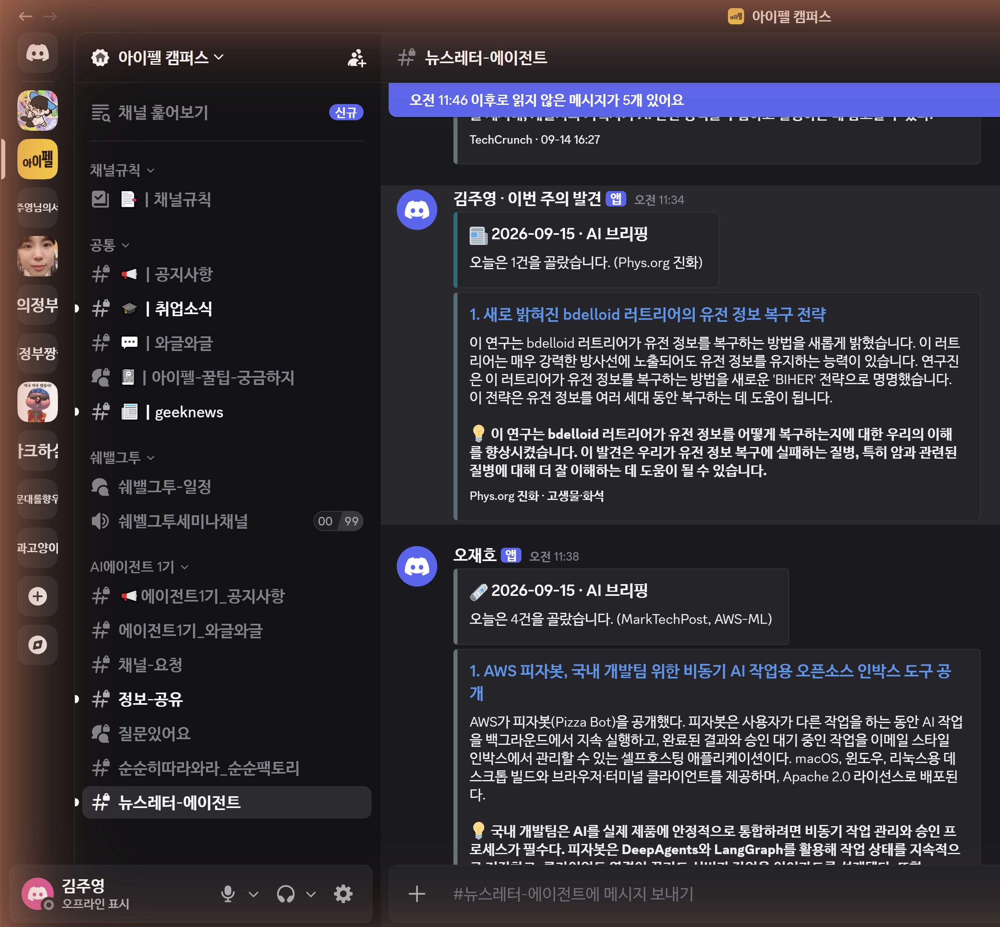

# 「이번 주의 발견」 — 나만의 뉴스레터 에이전트

**모듈5 노드3 [실습 프로젝트]** · 김주영 · 2026-09-15

> **📄 자세한 내용은 → [REPORT.md](REPORT.md)**

---

## 한 줄

**우주 · 고고학 · 고생물** 소스 **14곳**에서 48시간치를 모아 → **선별 → 요약 → 검수**를 거쳐
**검수를 통과한 것만** Discord 카드로 발행합니다.
LangGraph로 지었고, **OpenAI 키 없이 로컬 Ollama(`qwen2.5:3b`)** 로 돌아갑니다.

## 실제로 발행된 화면



`2026-09-15 11:34` · Discord `#뉴스레터-에이전트` · **HTTP 204**

## 깔때기 (실측)

```
수집 434건 → 후보 59 → 본선 5 → 취재 4 → 발행 2      (219초)
```

| 단계 | 무엇 |
|---|---|
| ① 수집 | RSS 14곳 · 48h 창 · 추적파라미터만 제거하는 중복판정 · 소스별 상한 |
| ② 선별 | **주제별** 예선(20→8) → 본선 상대평가 → 같은사건·매체·**주제 상한** |
| ③ 요약 | 원문 본문 추출 후 **세 칸**(`headline`·`summary`·`why`) |
| ④ 검수 | 규칙검사 + 숫자지목 + LLM대조 **3겹** · 불합격은 **재생성 1회** → 그래도 안 되면 사유와 함께 스킵 |
| ⑤ 발행 | Discord `embed` · 한도 방어 · `DRY_RUN` 기본 켜짐 |

## 돌려보기

```bash
pip install -r requirements.txt
cp .env.example .env          # DISCORD_WEBHOOK_URL 채우기

python run.py --hours 48            # 보내지 않고 «무엇을 보낼지»만 출력
python run.py --hours 48 --send     # 실제 발행
python 03_probe_topics.py --g1      # 소스를 «재서» 고르기 (후보 31곳 측정)
python 01_test_verify.py            # 검수 장치가 «진짜 도는지» 가짜 입력으로 점검
python 04_scorecard.py              # 쌓인 실행 기록 집계 — 어떤 소스가 실제로 기여하나
python 05_audit.py                  # ★제출물 자체를 전수검사 (요건·비밀누출·수치 일관성)
```

---

## 🔍 피어리뷰 하시는 분께 — **어디를 보면 되는지**

리뷰 템플릿(PRT) 5항목 ↔ 이 저장소의 자리입니다. **REPORT.md가 35KB라 여기부터 보세요.**

| PRT 항목 | 어디를 보면 되나 | 한 줄 |
|---|---|---|
| **1 실행 가능성** | 위 [발행 화면 캡처](#실제로-발행된-화면) · `store/run-*.log`(실행 로그 전문) · `store/metrics.jsonl`(10회) | `pip install -r requirements.txt` 후 `python run.py --hours 48` — **키 없이** 로컬 Ollama로 돕니다 |
| **2 아키텍처 가독성** | [REPORT.md §4](REPORT.md) — **mermaid 구조도**(LangGraph가 직접 뽑음) · 노드 5개 `collect·select·report·verify·publish` | 「**왜 이 패턴인가**」는 §4 «팬아웃 경계» — *「이 단계는 다른 항목을 봐야 답할 수 있는가」* |
| **3 측정 가능성** | [REPORT.md §2](REPORT.md) 소스 채택표(후보 **31곳** 실측) · §5 깔때기·통과율 · `04_scorecard.py` | **전→후 비교 있습니다** — 본문추출 `0/3 → 3/3` · 본선 `2건 → 5건` |
| **4 견고성** | `graph.py` — 타임아웃 4곳(15·20초) · 재시도 상한(온도 3단계 + 재생성 **건당 1회**) · 상한 6종(`per_source_cap`·`tier1_cap`·`media_cap`·`group_caps`·`embed_max`·`target`) · `except` 10곳 | ⚠ `recursion_limit`은 **안 걸었습니다** — 이 그래프는 **순환이 없어서**(DAG) 폭주할 경로가 없습니다. 대신 **개수 상한**으로 막았습니다 |
| **5 작업 추적성** | 커밋 메시지(무엇을·왜) · 프롬프트는 `graph.py`의 `draft_sys()`·`ask_picks()`에 **주석과 함께** | 「**직접 고친 부분**」은 [REPORT.md §6 회고](REPORT.md) — 실측으로 고친 것 다섯 가지가 전부 **제가 틀렸다가 고친 기록**입니다 |

**❓ 질문거리로 좋은 곳** — 검수 3겹이 왜 필요했는지(§6), 왜 「채점」이 아니라 「정렬」인지(§3),
「사람인 척」이 더 나빴던 이유(§2), 재생성 회복률이 **0인데 왜 안 껐는지**(§6).

**⚠ 솔직하게 적어 둔 약점** — 로컬 3B 모델이 품질 병목이라 **검수 통과율이 23.5%**입니다.
검수를 느슨하게 푸는 대신 **발행 건수가 적은 쪽**을 골랐습니다. 자동 실행(cron)은 아직 없습니다.

---

## 교안과 «다르게» 한 것

퍼실 안내대로 교안 구조를 그대로 따르지 않았습니다. 바꾼 곳과 **왜**:

| | 바꾼 것 | 왜 |
|---|---|---|
| 1 | **OpenAI 키 없이 로컬 Ollama** 로도 동작 (`get_llm()` 한 함수) | 키가 없어도 끝까지 돌아야 했다. 키를 `.env`에 넣으면 **코드 수정 0**으로 전환 |
| 2 | **프로필 스위치** (`audience.yaml`/`settings.yaml` 교체) | 13강 「내 분야로 옮기기」를 **파일 교체**로 구현. 코드는 안 바뀐다 |
| 3 | **주제별 예선** | 순서대로 자르면 건수 많은 우주가 예선을 독식해 고고·고생물이 **본선에 오기 전에** 탈락했다 |
| 4 | **주제 상한**(`group_caps`) | 7강 매체 상한과 같은 코드, **다른 축** |
| 5 | **검수 3겹** (규칙 + 숫자지목 + LLM) | 9강은 LLM 대조를 골랐지만, 문장 끊김·문자 혼입은 **문자열로 확인되므로** 코드가 맞다 |
| 6 | **검수 자가점검** (`01_test_verify.py`) | 9강 더 해보기 ② — 평소 아무 일도 안 하는 장치는 **고장 나도 티가 안 난다** |
| 7 | **정직한 봇 User-Agent** | 크롬인 척하면 Phys.org가 403으로 막는데, **「나는 봇입니다」라고 밝히면 통과**한다 |

## 실측으로 고친 것 넷 — 전부 [REPORT.md](REPORT.md) 회고에

1. **「사람인 척」이 더 나빴다** — Phys.org 본문추출 `0/3` → 정직한 봇 UA로 **`3/3`**
2. **재시도가 «사실상 1회»였다** — `temperature=0`은 결정적이라 세 번 다 같은 답
3. **예선을 순서대로 자르니 우주만 통과** — 본선 2건 → 주제별로 나눠 **5건**
4. **카드 제목이 코드에 박혀** 프로필을 바꿔도 안 따라왔다 → 설정으로 분리

## ★그리고 — 내가 만든 검사가 «정상»을 세 번 떨어뜨렸다

| 검사 | 걸린 **정상** 표기 |
|---|---|
| 한영 혼입 1차 | 「오픈**AI가**」 「**API를**」 |
| 한영 혼입 2차 | 「**Tapper에게**」 「**Altman은**」 |
| 숫자 지목 | 「**40만년**」 vs `400,000 years` |

> **«아니다»를 판정하는 검사가 제일 위험합니다.**
> 「맞다」를 놓치면 한 번 더 보지만, **「아니다」로 찍히면 아예 안 봅니다.**
> ⇒ 그래서 검사기 테스트에 **「통과해야 맞다」 케이스를 절반 섞었습니다.**

---

## 파일

| | |
|---|---|
| `graph.py` | State · 노드 5개 · `build()` · `run()` — **불러오기만 해도 안전** |
| `run.py` | 진입점 (`--hours` · `--send` · `--profile`) |
| `audience.yaml` | 독자 · 중요도 기준 · 버릴 것 · 토픽 ← **편집 방향을 정하는 사람**이 고치는 파일 |
| `settings.yaml` | 소스 14곳 · 임계값 · `group_caps` ← **개발자**가 고치는 파일 |
| `03_probe_topics.py` | 소스를 «재는» 도구 — 후보 31곳 · G1/G2/G3 관문 |
| `01_test_verify.py` | 검수 자가점검 — 가짜 입력 5개 |
| `04_scorecard.py` | 쌓인 기록을 «읽는» 도구 — 소스 기여 · 단계 통과율 · 탈락 사유 |
| `05_audit.py` | **제출물 자체**를 검사하는 도구 — 8축 51항목 (아래) |
| `store/metrics.jsonl` | 실행마다 «숫자» 한 줄 — 기계가 센다 |
| `store/run-*.log` | 실행마다 «로그 전문» 한 파일 — 사람이 읽는다 |

⛔ `.env`(웹훅 주소)는 `.gitignore` 대상입니다. **웹훅 URL은 주소 자체가 열쇠**라 저장소에 올리지 않습니다.
