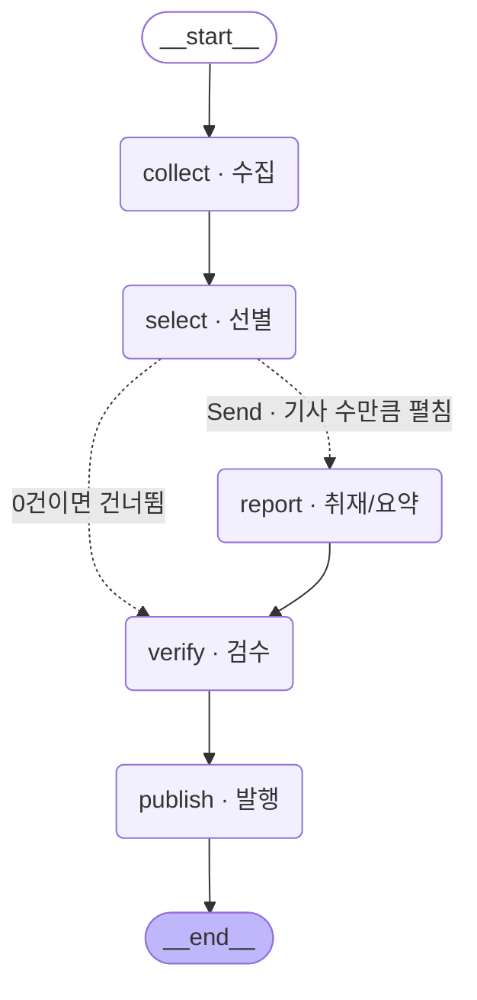

# 「이번 주의 발견」 — 나만의 뉴스레터 에이전트

모듈5 노드3 [실습 프로젝트] · 김주영 · 2026-09-15

> **한 줄:** 우주·고고학·고생물 소스 **14곳**에서 48시간치를 모아, **선별 → 요약 → 검수**를 거쳐
> 검수를 통과한 것만 **Discord 카드**로 발행하는 파이프라인입니다. **LangGraph**로 지었고
> **OpenAI 키 없이 로컬 Ollama(`qwen2.5:3b`)로 돌아갑니다.**

```bash
pip install -r requirements.txt

python run.py --hours 48            # 보내지 않고 «무엇을 보낼지»만 출력 (기본값)
python run.py --hours 48 --send     # 실제 발행
python 03_probe_topics.py --g1      # 소스를 «재서» 고르기 (후보 31곳 측정)
python 01_test_verify.py            # 검수 장치가 «진짜 도는지» 가짜 입력으로 점검
```

> `.env` 에 `DISCORD_WEBHOOK_URL` 을 넣으면 발행되고, `OPENAI_API_KEY` 를 넣으면
> **코드 수정 없이** OpenAI 로 전환됩니다(없으면 로컬 Ollama). `.env.example` 참고.

---

## 0. 무엇을 만들었나 (30초 요약)

| 단계 | 하는 일 | 실측 (2026-09-15) |
|---|---|---|
| ① 수집 | RSS 14곳 + 48시간 창 + 중복 제거 + 소스별 상한 | 전체 434건 → **후보 59건** |
| ② 선별 | **주제별** 예선(20→8) → 본선 상대평가 → 주제 상한 | 59 → 예선 34 → **본선 5건** |
| ③ 요약 | 원문 본문을 긁어와 **세 칸**(headline·summary·why)으로 | 5 → **취재 4건** |
| ④ 검수 | 규칙검사 + 숫자지목 + LLM 대조 **3겹** | 4 → **합격 2건** |
| ⑤ 발행 | Discord `embed` 카드 | **HTTP 204** |

**깔때기: 434 → 59 → 5 → 4 → 2** · 약 219초 · 기록은 `store/metrics.jsonl`에 한 줄씩(총 13회).

---

## 1. 분야 및 독자 정의

### 왜 「발견」인가

관심사가 **우주**와 **고고학**이었습니다. 그런데 두 개를 그냥 합친 게 아니라 —
**「새롭게 발견한 것들」**이라는 하나의 축으로 묶었습니다. 우주에서 **찾은 것**,
땅에서 **파낸 것**, 화석에서 **읽은 것**은 독자가 기대하는 감정이 같습니다.

**그리고 숫자가 그 판단을 뒷받침했습니다** (§2).

| 단독으로 가면 | 24시간 | 판정 |
|---|---|---|
| 우주만 | 28건 | 가능 |
| **고고학만** | **4~18건** | ⚠ **날마다 편차가 커서 「오늘은 조용합니다」가 잦다** |
| **셋을 합치면** | **56건** | ✅ 매일 채워진다 |

### 타깃 독자

```yaml
누구: "과학 뉴스를 좋아하지만 논문은 안 읽는 사람 —
       새로 밝혀진 것을 «무엇이 어떻게 달라졌나»로 알고 싶어한다"
이미_아는_것: "고등학교 수준 과학. 전문 용어는 풀어 줘야 한다"
```

이 정의가 **중요도 기준 네 문장**을 직접 낳았습니다. 전부 **기사 하나를 보고 «예/아니오»로
답할 수 있는** 형태여야 했습니다 — 「흥미로운가」 같은 문장은 모델이 매번 다르게 해석하니까요.

```
1. «전에는 몰랐던 것»이 새로 밝혀졌나 — 발견·관측·발굴·해독 중 하나가 실제로 있었나
2. 교과서에 적힌 내용을 «바꿀» 만한가 (연대가 당겨졌다 · 정설이 뒤집혔다)
3. 무엇을 어떻게 알아냈는지 «방법»이 적혀 있나 (망원경·연대측정·DNA·라이다)
4. 숫자가 있나 — 몇 년 전 · 몇 광년 · 몇 개체 · 몇 퍼센트
```

---

## 2. 소스 채택표 — **추측이 아니라 «쟀습니다»**

후보 **31곳**에 실제로 요청을 보내 세 가지를 측정했습니다: **건수 · 요약길이 · 최신글 경과**.
그다음 **관문 세 개**(G1 본문 · G2 생존 · G3 접근)로 걸렀습니다.

### 묶음별 결과

| 묶음 | 채택 | 24시간 | 7일 | 판정 |
|---|---|---|---|---|
| **A 우주·천문** | 6/6 | 28건 | 121건 | ★단독 가능 |
| **B 고고학·유적** | 4/4 | 18건 | 69건 | 48h면 가능 |
| **C 고생물·인류** | 5/5 | 10건 | 85건 | 48h면 가능 |
| **A+B+C 채택** | **14곳** | **56건** | **275건** | ✅ |
| D 예술·미술 | 3/5 | 14건 | 35건 | 7일 35건 — **얇아서 탈락** |
| E 디자인·건축 | 3/5 | 29건 | 84건 | 숫자는 좋으나 **축이 다르고 G1 실패** |
| F 한국어 | **1/6** | — | — | ⚠ 아래 |

### ✅ 과제가 «제외하라»고 한 소스 — 사용 0건

```
OpenAI · DeepMind · TechCrunch · The Verge · MIT TR · AI타임스
```

**눈으로 보지 않고 기계로 대조했습니다** (호스트 기준):

```
settings.yaml 소스 14곳  ·  제외목록 위반 0건
```

애초에 분야가 「AI 뉴스」가 아니라 **「과학 발견」**이라 겹칠 일이 없었습니다.
`03_probe_topics.py` 가 재 본 후보 31곳 중에도 위 여섯 매체는 들어 있지 않습니다.

### 채택한 14곳

| 묶음 | 소스 | tier |
|---|---|---|
| 우주 | NASA · ESA · Space.com · Universe Today · Phys.org 우주 · SpaceNews | 1·1·2·2·2·2 |
| 고고 | Phys.org 고고학 · Nature 고고학 · ScienceDaily 고고 · The Past | 2·1·2·2 |
| 고생물 | Nature 고생물 · Phys.org 진화 · ScienceDaily 화석 · Sci.News | 1·2·2·2 |

### 탈락시킨 것과 «이유»

| 소스 | 탈락 사유 | 관문 |
|---|---|---|
| Archaeology Magazine | 주소 2개 모두 **404** | G3 |
| HeritageDaily | HTTP 200인데 **항목 0건** | G3 |
| Ancient Origins · Sky & Telescope | **403** — UA 바꿔도 차단 | G3 |
| 동아사이언스 | 주소 3개 시도 · 전부 실패 | G3 |
| 경향 과학 | 최신글이 **13,066시간(약 1.5년) 전** — 죽은 피드 | G2 |
| 한겨레 과학·문화 | 30건인데 **날짜가 없다** → 시간 창에서 전부 버려짐 | G2 |
| Dezeen | 피드는 살아 있으나 **본문 추출 0/3** | **G1** |
| Smithsonian SmartNews | 269건짜리 **전체 피드** — 주제 필터 없이는 못 씀 | 설계 |

### ★G1(본문) 관문 — 「이 소스들이 다 좋다」가 결론이 아니었다

| 소스 | RSS 요약 | 원문 추출 |
|---|---|---|
| ESA | 496자 | 3/3 |
| Space.com | 129자 | 3/3 |
| Universe Today | 409자 | 3/3 |
| **Nature 고고학·고생물** | **0자** | **3/3** |
| ScienceDaily · The Past · Sci.News | 167~352자 | 3/3 |
| NASA | 342자 | **2/3** |

**RSS 요약은 «한 곳도» 기준선 600자에 닿지 못했습니다.** (0~496자)
그리고 **원문 추출은 거의 전부 통과했습니다.**

> **RSS 수집과 본문 추출은 별개의 단계이고, 둘 다 있어야 G1을 통과합니다.**
> 요약길이는 소스를 고르는 기준이 **못 됩니다** — 어차피 전부 부족하니까요.
> 고르는 기준은 **「원문 주소로 갔을 때 본문이 뽑히느냐」**입니다.

재료가 없으면 모델이 **제목만 보고 지어냅니다.** 이게 환각의 가장 흔한 입구입니다.

### ★★가장 뜻밖이었던 것 — 「사람인 척」이 **더 나빴다**

Phys.org 세 곳이 처음엔 **원문 추출 0/3**이었습니다. 403 봇 검사에 막힌 겁니다.
그런데 그 403 페이지 HTML에 이렇게 적혀 있었습니다:

> **NOTICE TO BOT ADMINISTRATORS:** 봇이면 `<bot-name> (+contact-url)` 형식의
> descriptive User-Agent를 쓰라

시키는 대로 **「나는 봇입니다」라고 밝혔더니 3/3 통과**했습니다.

| User-Agent | Phys.org 고고학 | Phys.org 우주 |
|---|---|---|
| 크롬인 척 | **0/3** | **0/3** |
| **정직한 봇 이름** | **3/3** | **3/3** |

Phys.org 고고학은 고고학 후보의 **절반 이상**을 혼자 냅니다. **한 줄이 그만큼이었습니다.**

### ⚠ 한국어 소스가 거의 없다 — 정직하게 남김

6곳을 시도해 **1곳만 살아남았고**(연합뉴스 문화, 그마저 전체 피드) 결국 **채택 0곳**입니다.
⇒ **이 뉴스레터는 소스가 100% 영어입니다.** 그래서 §4의 「한국어 강제」가 필수가 됩니다.

---

## 3. 선별 로직 설계

### 왜 「채점」이 아니라 「정렬」인가

처음 떠오르는 방법은 기사마다 1~10점을 매기고 상위 5개를 자르는 것입니다. **안 됩니다.**

- 12건을 채점하면 **서로 다른 점수 값이 네댓 개**뿐이고 가운데에 뭉칩니다
- 5건을 자르는 **경계가 동점 위에 떨어집니다** → 목록 순서처럼 **가치와 무관한 것**으로 자르게 됩니다

> **출력 개수가 고정되어 있으면 그건 «정렬» 문제이지 «채점» 문제가 아닙니다.**

### 예선 → 본선 (2단 상대평가)

후보가 수백 건이면 한 프롬프트에 다 넣을 수 없습니다. 토큰 한도 때문이 아니라 —
**목록이 길어지면 모델이 앞뒤를 보고 중간을 흘립니다.**

```
후보 59건
  └ 예선  ★«주제별»로 나눠 묶음 20건 → 8건 씩   (병렬화 sectioning)
          [우주 20→8] [우주 15→8] [고고 12→8] [고생물 10→8]
  └ 본선  통과분 34건을 «한 화면»에 놓고 상대평가
  └ 코드 강제  같은 사건 · 매체 상한 · ★주제 상한
  └ 최종 5건
```

#### ★예선 묶음을 «주제별»로 나눈 이유 — 실측으로 고친 자리

처음엔 후보를 **들어온 순서대로** 20건씩 잘랐습니다. 결과가 이랬습니다:

```
본선 2건 · 우주 8건이 주제 상한에 걸림 · 고고 0 · 고생물 0
```

원인: 우주가 24시간 28건으로 제일 많아 **예선 묶음이 우주로만 채워졌고**,
고고·고생물은 **본선에 오기도 전에 탈락**했습니다.
**주제 상한은 «본선»에서만 도는데, 앞에서 없어진 건 못 살립니다.**

묶음을 주제별로 나누자 —

| | 예선 통과 | 본선 | 발행 |
|---|---|---|---|
| 순서대로 자름 | 22건 (거의 우주) | **2건** | 1건 |
| **주제별로 나눔** | **34건 (세 주제 전부)** | **5건** | **2건** |

> **8강의 「팬아웃 경계」와 같은 이야기입니다 — 어디서 나누느냐가 답을 바꿉니다.**

| 값 | 왜 그 값인가 |
|---|---|
| `batch: 20` | 교안은 40. **로컬 3B 모델**이라 한 화면에서 흘리지 않을 크기로 줄였습니다 |
| `batch_keep: 8` | 최종 5건보다 **넉넉히** 통과시켜 「묶음 운」을 완화합니다 |
| `tier1_cap: 2` | 1차 소스(NASA·ESA·Nature)는 경쟁 면제하되 **면제에도 상한**을 둡니다 |
| `media_cap: 2` | 한 매체가 다섯 자리를 독점하지 못하게 |
| **`group_caps` 우주2·고고2·고생물2** | ★**없으면 우주가 다섯 자리를 다 가져갑니다** (24h 28건 vs 고생물 10건) |

### ★기준이 «의도대로 동작했다»는 근거

프롬프트에 적은 부탁은 **확률적으로만** 지켜집니다. 그래서 **코드로 셉니다.**

실행 로그에 탈락 사유가 그대로 남습니다:

```
예선 [우주]   20건 → 8건      ← 주제별로 나눠서 각 주제가 자리를 «보장»받는다
예선 [고고]   12건 → 8건
예선 [고생물] 10건 → 8건
− Lebanese faunal legacy collections uncov …  같은 사건(…)
− Sept. 21: What Comes Next for On-Orbit S …  주제 상한(우주 2)
```

**주제별 예선 + 주제 상한 두 겹으로 고고·고생물이 실제로 자리를 얻었습니다.**
최종 발행 2건의 소스가 **Phys.org 고고학 1 · Phys.org 진화 1** 입니다 — 우주가 아닙니다.
`event` 라벨은 구조화 출력의 필드로 받아서 **모델의 내부 판단을 우리가 «셀 수 있는 값»으로** 꺼낸 것입니다.

---

## 4. 파이프라인 구조도

LangGraph가 **선언된 그래프에서 직접 뽑은 것**이라 코드와 그림이 어긋날 수 없습니다.



### State — 단계 사이를 «건너가는 것»만 담습니다

```python
class Brief(TypedDict):
    hours:     int
    collected: List[dict]                        # 덮어쓰기
    picked:    List[dict]                        # 덮어쓰기
    drafted:   Annotated[List[dict], operator.add]   # ★워커들이 «동시에» 쓴다
    verified:  List[dict]                        # ★합치는 키와 «줄이는» 키를 분리
    log:       Annotated[List[str], operator.add]
```

**리듀서는 두 곳에만** 붙였습니다.
`drafted`는 취재 워커 여러 개가 동시에 쓰고, `log`는 모든 노드가 한 줄씩 남기므로 **합쳐야** 합니다.
반면 `collected`·`picked`는 **한 노드가 쓰고 다음 노드가 읽는 값**이라 덮어쓰기가 맞습니다.

> ⚠ 여기에 리듀서를 붙이면 **선별이 9건을 5건으로 줄였는데 결과가 14건이 됩니다.**

**★그리고 검수에서 실제로 걸렸습니다.** 검수는 `drafted`를 **줄이는** 일인데 그 키엔 리듀서가 붙어 있어서,
통과분을 그대로 돌려주면 줄지 않고 늘어납니다. → 통과분을 **`verified`라는 새 키**에 담아
**합치는 키와 줄이는 키를 나눴습니다.** State에 칸이 하나 늘었지만
「노드는 자기가 바꾼 키만 돌려준다」는 규칙 덕에 **다른 노드는 하나도 안 고쳤습니다.**

### 팬아웃 경계 — 찾는 질문은 하나

기사가 몇 건일지는 **실행해 봐야 압니다.** 그래서 조건부 엣지가 노드 이름 대신
**`Send` 리스트**를 돌려주고, 프레임워크가 그 개수만큼 워커를 띄웁니다.

> **「이 단계는 «다른 항목»을 봐야 답할 수 있는가?」**
> 봐야 하면 **앞쪽**(모아서 한 번에) — 중복 판정 · 상대평가 · 상한
> 안 봐도 되면 **뒤쪽**(건별로 펼침) — 본문 추출 · 요약 · 검수

경계를 잘못 그으면 **프로그램은 잘 돌고 결과만 조용히 달라집니다.**
선별을 기사별로 펼치면 각 워커가 자기 기사만 보고 「중요하다」고 답해서,
「5건을 고르는 문제」가 「각자 점수 매기는 문제」로 바뀝니다.

### ④ 검수 — **3겹**

| 겹 | 무엇 | 왜 이 자리인가 |
|---|---|---|
| **규칙 검사** | 헤드라인 길이 · 문장이 맺어졌는가 · 한글 뒤 소문자 영문 | 번역과 무관하게 **문자열로** 확인된다 → 코드가 맞다 |
| **숫자 지목** | 요약의 숫자가 원문에 없으면 LLM에 **「이걸 특히 봐라」** | 판정을 안 맡기고 **지목만** 시키면 오탐은 다음 겹이 거른다 |
| **LLM 대조** | 각 주장이 원문에서 뒷받침되는가 | 의미 수준 비교 → 번역·단위 환산을 올바르게 통과시킨다 |

**불통과 시 대안:**
- **한국어가 아니면** → 지적을 붙여 **최대 3회 재요청**
- **3회 실패 / 본문 부족 / 검수 불합격** → **그 건만 버리고 로그에 남김**
- 발행 규칙은 단순합니다 — **검수를 통과한 만큼 그대로 보냅니다.**
  5건 채우려고 다시 긁어오지 않습니다. **단순한 규칙 하나가 재시도 설계 전체를 대신합니다.**

### ⑤ 발행 — 되돌릴 수 없는 유일한 단계

- **언어 모델이 들어가지 않습니다.** 수집을 두 번 해도 세상은 아무 일 없지만 발행은 남의 화면에 뜹니다
- `DRY_RUN` 기본값은 **보내지 않음** — 실수로 발행되는 쪽보다 안 보내는 쪽이 덜 나쁩니다
- Discord 한도(embed 10개·제목 256·본문 4096·합계 6000)를 **보내기 전에** 자릅니다. 넘으면 **아무것도** 발행되지 않습니다
- 0건인 날에도 **「오늘은 조용합니다」**를 보냅니다 — 안 보내면 **파이프라인이 죽은 것과 구분이 안 됩니다**

---

## 5. 실행 기록

### 발행 화면 — 2026-09-15 11:34 · Discord `#뉴스레터-에이전트`


봇 이름이 **「김주영 · 이번 주의 발견」**으로 뜹니다 — 웹훅 payload의 `username` 필드입니다.
같은 채널에 수강생 여럿이 발행하므로 **누가 올린 것인지 보이게** 이름을 박았습니다.

> ⚠ 이 캡처는 **카드 머리말을 설정으로 빼기 «전»** 실행분이라 제목이 「AI 브리핑」으로 되어 있습니다.
> 코드에 문구가 박혀 있어 **프로필을 바꿔도 안 따라온 것**이고, 지금은
> `settings.yaml` 의 `discord.title` 로 뺐습니다(회고 참고). **발행 자체는 이 실행으로 확인됐습니다.**

```
① 수집   48h 창 · 전체 434 → 후보 59건 (소스 11곳)
   예선 [우주]   20건 → 8건
   예선 [우주]   15건 → 8건
   예선 [고고]   12건 → 8건
   예선 [고생물] 10건 → 8건
② 선별   59건 → 예선 34 → 본선 5건 (tier1 면제 2)
③ 취재   5 → 4건   (재시도 1~2회로 회복 · 3건)
   ⚠한국어 실패(4회) — Astronomers unmask a supernova impostor
④ 검수   4건 → 합격 2 · 불합격 2
⑤ 발행   HTTP 204 · embed 3장
깔때기  수집 59 → 선별 5 → 취재 4 → 발행 2   (219초)
소스별  Phys.org 고고학 1 · Phys.org 진화 1
```

**실행 기록은 `store/metrics.jsonl`에 한 줄씩 쌓입니다** (현재 10회).
`collected → picked → drafted → published` 네 숫자를 나란히 두면
**어느 단계에서 줄었는지**가 보입니다 — 결과물만 보면 「업계가 조용한가 보다」로 오해합니다.

---

## 6. 프로젝트 회고

### 가장 공들인 곳 — 검수

**첫 실행에서 검수 불합격이 «0건»이었습니다.** 좋아 보였지만 아니었습니다.
그때 통과한 것 중에 이런 게 있었습니다:

```
「오바마 전 대통령, 디플레민트 당이 …」   원문은 Democrats. 존재하지 않는 정당
「트럼프와 미키 존슨이 …」                원문은 Mike Johnson
```

> **`verify_fail`이 0이라는 것은 «좋은 소식»이 아니라 «확인이 필요하다»는 신호입니다.**

그래서 두 가지를 했습니다.

1. 검수 프롬프트에 **「원문에 없는 고유명사가 등장하면 불합격」**을 명시 → **불합격 0건 → 3건**
2. **자가점검 스크립트**를 만들어 가짜 입력 5개를 상시 흘려보냄 (`01_test_verify.py`)

| 케이스 | 기대 | 실제 |
|---|---|---|
| 정상 — 사실만 | 합격 | ✅ |
| 번역·단위 환산(`60 million` → `6000만`) | 합격 | ✅ |
| **가짜 숫자**(40만 → 400만) | 불합격 | ❌ **통과시켰다** |
| **없는 고유명사** | 불합격 | ✅ |
| **문장 끊김** | 불합격 | ✅ |

**4/5.** 남은 하나는 3B 모델의 한계입니다 — `400만`과 `400,000`은 문자열로 `400`이 겹칩니다.
**검수를 붙였다고 정확성이 «보장»되는 게 아니라 틀릴 «확률»이 줄어드는 것**이고,
그 차이를 혼동하면 검수를 믿고 다른 안전장치를 빼게 됩니다.

### ★가장 많이 배운 실패 — 내가 만든 검사가 «정상»을 세 번 떨어뜨렸다

| 회 | 검사 | 걸린 **정상** 표기 | 피해 |
|---|---|---|---|
| 1 | `[A-Za-z]{2,}[가-힣]` | 「오픈**AI가**」·「**API를**」 | 자가점검 정상 2건 탈락 |
| 2 | `+ [a-z]{2,}[가-힣]` | 「**Tapper에게**」·「**Altman은**」 | **발행 0건** |
| 3 | 숫자 지목 | 「**40만년**」 vs `400,000 years` | 멀쩡한 요약 불합격 |

대문자 약어나 영문 고유명사가 **한글 조사에 붙는 건 정상 표기**입니다. 실제 결함은 한 방향뿐이었습니다.
3번은 특히 뼈아팠습니다 — **숫자 문자열 대조를 버린 이유가 「번역·환산 오탐」이었는데,
제가 그걸 「지목으로만」이라며 되살리면서 «그 오탐도 같이 되살렸습니다».**

> **★«아니다»를 판정하는 검사가 제일 위험합니다.**
> 「맞다」를 놓치면 한 번 더 보지만, **「아니다」로 찍히면 아예 안 봅니다.**

**⇒ 그래서 검사기 테스트에 「통과해야 맞다」 케이스를 «절반» 섞었습니다.**
결함 케이스만 넣으면 **오탐을 영영 못 봅니다.** 위 표에서 정상 2건이 이걸 잡아 준 유일한 장치였습니다.

### ★재시도가 «사실상 1회»였다 — 셋째 발견

한국어가 아니면 지적을 붙여 **3회 재요청**하도록 만들어 뒀습니다.
그런데 로그에 「한국어 실패(3회 재시도)」가 계속 찍혔습니다. **세 번 다 실패한 것**입니다.

원인은 한 줄이었습니다 — **`temperature=0`은 결정적**이라,
같은 입력에 **같은 출력**이 나옵니다. 「한국어로 다시 써라」를 세 번 말해도
**세 번 다 같은 영어**가 돌아왔습니다. **한 번을 세 번 센 것**이었습니다.

```python
RETRY_TEMPS = [0.0, 0.5, 0.8, 0.9]   # 1차만 결정적, 재시도는 온도를 올린다
for attempt, temp in enumerate(RETRY_TEMPS):
    llm = get_llm(temp)
```

| | 한국어 실패(탈락) |
|---|---|
| 고치기 전 | **3건** |
| 고친 뒤 | **0~1건** (재시도 1~2회로 회복) |

> **재시도는 «온도를 올려야» 재시도입니다.** 사실을 옮기는 1차 시도만 0.0으로 두면 됩니다.

### 오역을 «환각»으로 만들지 않는 법

`endemic fauna` → 「고유 동물 **콘텐츠**」 · `aurochs` → 「**황소(en**」 처럼,
모델이 모르는 고유명사를 **지어내서** 옮겼습니다. 처방은 단순했습니다:

> **인명·지명·학명·기관명은 «원문 표기 그대로» 두고 한국어 조사만 붙여라.**
> 「JWST가」 「Levant에서」 「Homo sapiens는」.
> **모르는 이름을 억지로 옮기지 마라 — 그건 지어내는 것이다.**

⇒ 한국어 실패 **2건 → 0건**. **옮기라고 하면 지어내고, 두라고 하면 지어낼 자리가 없습니다.**

### 「프로필을 바꿨는데 안 따라온 것」 — 넷째 발견

프로필을 「발견」으로 갈아 끼우고 발행했는데, **디스코드 카드 머리말은 여전히 「AI 브리핑」**이었습니다.
`build_embeds()` 안에 문구가 **코드로 박혀** 있었기 때문입니다.

```python
head = {"title": "📰 %s · AI 브리핑" % when, ...}   # ← 설정을 갈아 끼워도 안 따라온다
```

13강이 말한 자리가 정확히 이것입니다 — **분야가 바뀌면 달라지는 값은 설정에 있어야** 합니다.
`settings.yaml` 의 `discord.title` 로 뺐습니다.

> **설정과 코드의 경계는 «한 번 그으면 끝»이 아니라, 실제로 갈아 끼워 봐야 새는 곳이 보입니다.**

### 향후 보완하고 싶은 것

| | 무엇 | 왜 |
|---|---|---|
| 1 | **OpenAI 키로 전환** | 품질 병목이 **전적으로 로컬 3B 모델**입니다. `get_llm()` 한 함수라 **코드 수정 0**으로 바뀝니다 |
| 2 | **GitHub Actions 자동 실행** | 지금은 손으로 돌립니다. cron + Secrets + 「0건인 날에도 보내기」 세 겹이면 됩니다 |
| 3 | **한국어 소스 확보** | 6곳 중 1곳만 살아남았습니다. 영어만이라 번역 부담이 그대로 남습니다 |
| 4 | **평가셋** | 프롬프트를 고칠 때 「좋아진 것 같다」로 판단했습니다. 기사 30~50건에 사람이 정답을 붙이면 **고쳤더니 다른 데가 나빠지는 것**을 잡을 수 있습니다 |
| 5 | **소스 성적표 집계** | `by_source`를 쌓고는 있는데 집계 셀이 없습니다. 몇 주째 0건인 소스를 **숫자가 지목**해 줘야 합니다 |

---

## 부록 · 파일 구조

```
d_hw_N3-newsletter/
├── graph.py                    State · 노드5 · build() · run()   ★불러오기만 해도 안전
├── run.py                      진입점 (--profile · --hours · --send)
├── audience.yaml               타깃 독자 · 중요도 기준 · 버릴 것 · 토픽   ← 편집자가 고치는 파일
├── settings.yaml               소스 14곳 · 임계값 · group_caps          ← 개발자가 고치는 파일
├── 02_probe_interests.py       관심사 1차 측정
├── 03_probe_topics.py          ★후보 31곳 전수 측정 + G1 관문
├── 01_test_verify.py           ★검수 자가점검 (가짜 입력 5개)
├── requirements.txt
├── store/metrics.jsonl         실행 기록 10회
└── REPORT.md                   이 문서
```

**설정과 코드를 두 파일로 나눈 이유**는 «누가 고칠 것인가»입니다.
독자 정의나 중요도 기준은 **개발자가 아니라 편집 방향을 정하는 사람**이 고쳐야 하는데,
그 사람에게 파이썬 파일을 열게 하면 **실제로는 아무도 안 고치게** 됩니다.

그리고 그 덕에 **프로필 교체 한 번으로 완전히 다른 뉴스레터가 됩니다.**

```bash
python run.py                       # 기본 = 「발견」(우주·고고학·고생물)
PROFILE=design python run.py        # audience_design.yaml 만 쓰면 «디자인 뉴스레터»가 된다
```

`graph.py` 는 `PROFILE` 환경변수를 보고 `audience_{PROFILE}.yaml` · `settings_{PROFILE}.yaml`
을 읽습니다. **코드는 한 줄도 안 바뀝니다.**
