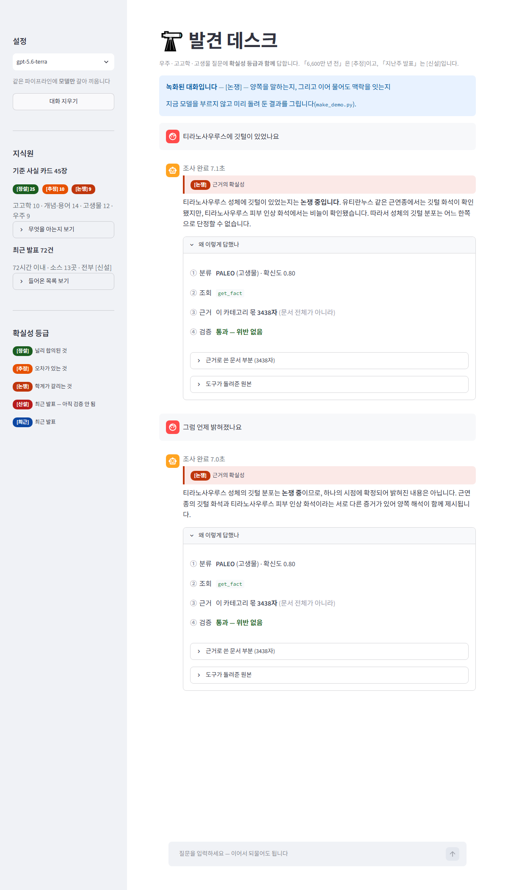

# 발견 데스크 — 확실성을 말하는 과학 질문 에이전트

**모듈5 노드5 [실습 프로젝트] · 김주영 · 2026-09-17**

> 자세한 판단 근거 → **[REPORT.md](REPORT.md)** · 준비 과정 → [notes/진행상황.md](notes/진행상황.md)

---

## 한 줄

우주·고고학·고생물 질문에 **확실성 등급과 함께** 답합니다.
「6,600만 년 전」은 [추정], 「지난주 발표」는 [신설] — **둘을 같은 말투로 말하지 않습니다.**
LangGraph로 지었고, 같은 파이프라인에 **모델만 갈아 끼웁니다**(gpt-5.6 / 로컬 Ollama).

## 왜 이걸 만들었나 — 모두몰에 «없던» 문제

노드4의 「배송비 2,500원」은 확정값입니다. 숫자만 맞으면 답이 맞습니다.
그런데 **과학의 숫자는 대부분 «추정»**입니다.

| 등급 | 무엇 | 예 |
|---|---|---|
| **[정설]** | 널리 합의 | 지구 나이 약 45.4억 년 |
| **[추정]** | 오차가 있다 | 공룡 멸종 6,600만 년 전 |
| **[논쟁]** | 학계가 갈린다 | 티라노사우루스 깃털 분포 |
| **[신설]** | ★최근 발표 — **아직 검증 안 됨** | 지난주 프리프린트 |

⇒ 여기서 틀리는 방식은 「숫자를 지어내는 것」만이 아닙니다.
**맞는 숫자를 «틀린 확신»으로 말하는 것**이 더 자주, 더 조용히 일어납니다.
「지난주 발표」를 「밝혀졌습니다」라고 쓰는 순간 [신설]이 [정설]로 둔갑합니다.
숫자는 하나도 안 틀렸는데 답변은 틀렸습니다.

⇒ 그래서 가드레일이 **「숫자에 출처가 있나」가 아니라 「확실성을 제대로 말했나」**를 봅니다.

## 파이프라인

```
질문 (+ 앞선 대화)
  ↓
① classify   SPACE / ARCHAEO / PALEO / CONCEPT / OTHER
  ↓
  gate       ★넘길까 — 판정과 «분리»된 판단
  ↓          REFUSE(안 하는 것) · ESCALATE(모르는 것) · ASK(못 정한 것)
② retrieve   카테고리별 근거만 조립 + 도구 호출 (최대 5턴)
  ↓            get_fact / get_term  → 사실 카드 25장  → [정설][추정][논쟁]
  ↓            search_article       → 기사 72건      → [신설] (72시간 이내)
  gate2      ★근거를 못 찾았으면 여기서도 넘긴다
  ↓
③ compose    조회 결과에만 근거 · 확실성 등급을 붙여서
  ↓
④ verify     가드레일 3겹 — 출처 없는 수치 · ★확실성 단정 · 답하면 안 되는 것
```

**지식원이 둘인 이유** — 「티라노사우루스 깃털」은 정설도 있고 이번 주 발표도 있습니다.
둘을 **함께** 말하되 등급을 구분해야 해서 지식원을 둘로 뒀습니다.

## 결과 (2026-09-17 실측 · gpt-5.6)

| 지표 | 값 | 비고 |
|---|---|---|
| ① 의도 분류 — **gpt-5.6-luna** | **평균 macro F1 0.925** (3회) · 범위 밖 78.6~85.7% | 채점 55건 · 폭 0.031 |
| ① 의도 분류 — 로컬 qwen2.5:7b | macro F1 0.878 · 범위 밖 80.0% | 폭 0.000(3회) |
| ② 답변 — 로컬 qwen2.5:7b | **15/25 (60.0%)** · 644초 | ★행동 오판 4건 — 답할 걸 3건 거절 |
| ① 의도 분류 — 규칙 라우터 | macro F1 0.976 · 범위 밖 85.7% | ⚠ **과적합** — 성적이 아니라 기준선 |
| ② 답변 통과율 — **gpt-5.6-terra** | **평균 73.3%** (3회) · ★**폭 16.0%p** | 항상 통과 16 · 항상 실패 4 · 흔들림 5 |
| 가드레일 | 오탐 **0/25** · 재현율 **6/6** | `guard_desk.py --audit` |

### ★이 숫자는 «세 번 내려간» 값입니다

```
1  분류 지침 예시 8개가 «평가셋 문항»이었다
   골든셋 2건·라우팅 6건이 «글자까지» 같았다
   제거하니  ① 0.929 → 0.915   ② 83.3% → 77.8%
   ⇒ 오염이 점수를 받쳐 주고 있었다

2  정답셋 forbid 에 「입니다.」가 있었다
   한국어 평서문 종결이라 «완벽한 넘기기 답변»도 틀렸다

3  ★② 의 «폭»을 안 쟀다
   같은 설정 3회가 80.0% · 64.0% · 76.0% — 폭 16.0%p
   내가 「개선 +4%p」라 부른 것이 이 폭 «안»에 있었다
   ⇒ 정직한 값은 평균 73.3% 다. 그리고 3회를 겹쳐 보니
     «항상 실패하는 4건»과 «운에 따라 갈리는 5건»이 갈렸다
```

**적어 두는 것은 막아 주지 않았습니다** — `golden.json` 첫 줄에
「⛔프롬프트에 넣지 않는다」고 적어 놓고 어겼습니다.
`99_audit.py` [9]에 **검사로** 심고 나서야 막혔고, 그 검사가
**제가 못 본 세 번째 자리**를 바로 찾아냈습니다. 자세한 것은 [REPORT.md](REPORT.md) 5절.

## 데모



**말풍선 대화**입니다. 「티라노사우루스에 깃털이?」 다음에
**「그럼 언제 밝혀졌나요」만 쳐도** 앞 대화를 이어 답합니다 — 그리고
그 유도에도 **확정하지 않습니다.**

요건이 요구하는 넷(**분류 · 호출한 도구 · 근거로 쓴 문서 부분 · 검증 결과**)은
답변 밑 **「왜 이렇게 답했나」**에 접어 두었습니다. 보여 주기를 포기하지 않으면서
대화를 막지도 않으려고요. 단 **확실성 등급만은 접지 않습니다** — 그건 답변의 일부입니다.

```bash
streamlit run desk/app.py
# 키 없이 화면만 보려면 — 미리 돌려 둔 대화를 재생합니다
#   http://localhost:8512/?demo=논쟁과_이어묻기&open=1
```

**공개 배포는 하지 않았습니다.** 키가 팀 공유 잔액이라 공개 URL로 열면 남이 소진시킵니다.

## 돌려보기

```bash
pip install -r requirements.txt
echo "OPENAI_API_KEY=sk-..." > desk/.env    # 로컬 모델만 쓸 거면 필요 없음

cd desk
python 10_collect.py --hours 72     # 지식원 수집 (RSS 14곳)
python 11_filter.py --write         # 주제 밖 거르기 + 라우트 재배정

python 20_router.py --mode rule                         # ① 규칙 기준선
python 20_router.py --mode llm --model gpt-5.6-luna     # ① LLM (지침 v2)
python 20_router.py --mode llm --guide v1               #   ★오염본 — 비교용
python agent.py --eval --model gpt-5.6-terra            # ② 답변 채점
DESK_PICK=v1 python agent.py --eval                     #   ★오염본 — 비교용

# ★검사 — 만들면서 계속 돌립니다 (건수는 스크립트가 찍습니다)
python 99_audit.py           # 전수 감사 9영역 — ★프롬프트 오염 검사 포함
python score_desk.py --self  # 채점기 자기 검증
python guard_desk.py --audit # 가드레일 정밀도·재현율 «둘 다»
python 12_eval_search.py     # 검색 채점
python make_demo.py          # 데모 녹화 갱신
```

## 파일

| 파일 | 무엇 |
|---|---|
| `desk/agent.py` | **파이프라인** — 판정 → 근거조립 → 답변 → 검증 (LangGraph) · 멀티턴 |
| `desk/escalate.py` | ★**넘기기 판단** — 판정과 «분리». 임계값을 인자로 받는다 |
| `desk/context_desk.py` | ★**매핑표** — 카테고리↔문서. policy 5,107자 → 평균 2,963자 |
| `desk/guard_desk.py` | ★가드레일 3겹 + 두 축(정밀도·재현율) 감사 |
| `desk/score_desk.py` | 채점기 + ★자기 검증 · must/forbid 동의어 지원 |
| `desk/tools_desk.py` | 조회 도구 5개 |
| `desk/ko_en.py` | ★한영 사전 — 지식원이 영어인데 질문이 한국어다 |
| `desk/20_router.py` | ① 규칙·LLM 라우터 · `--guide v1/v2` · `--repeat` 폭 측정 |
| `desk/10_collect.py` `11_filter.py` | 지식원 수집(노드3 소스 14곳) · 주제 밖 거르기 |
| `desk/app.py` `make_demo.py` | 데모 화면 + ★녹화 재생(키 없이 돈다) |
| `desk/99_audit.py` | ★산출물 전수 감사 — 문서와 실제가 어긋나는지까지 |
| `desk/facts_base.json` | 기준 사실 카드 25장 |
| `desk/golden.json` | ② 정답셋 **25건** (난이도 hard 14 · easy 11) |
| `data/eval_routing.csv` | ① 라우팅 평가셋 — `eval` 41 · `outscope` 14 · ★`example` 9 |
| `docs/policy.md` | 「과학 소통 원칙」 — 업무 매뉴얼에 해당 |
| `desk/store/` | 수집한 데이터 (기사 72건) |
| `desk/측정_*.txt` | 측정 원본 — 개선 이력의 근거 |

**원본을 고치지 않았습니다** — 노드4 코드는 «복사»해 왔고, 노드3 설정은 그대로 읽습니다.
