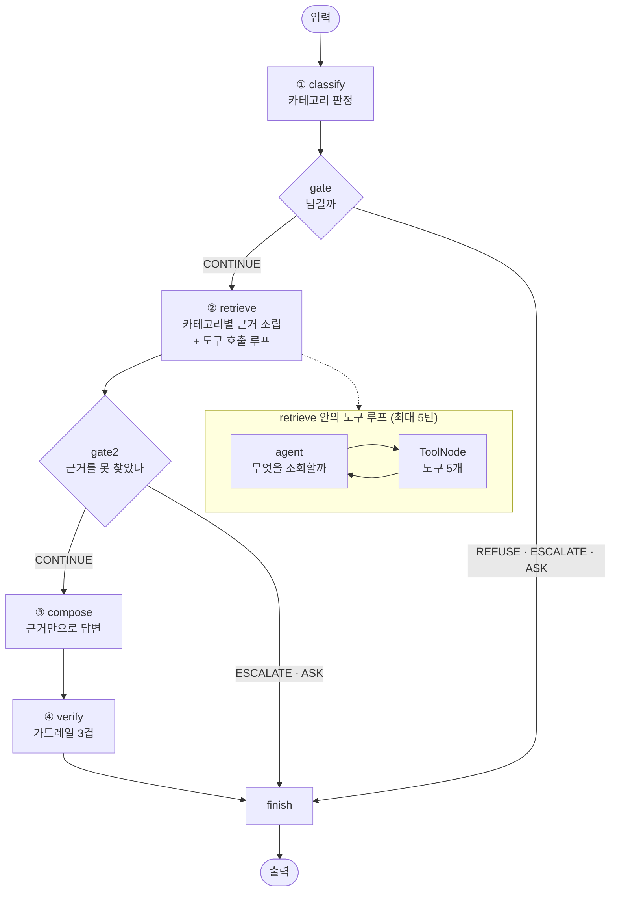

# 발견 데스크 — 우주·고고학·고생물 질문에 «확실성 등급과 함께» 답하는 에이전트

**모듈5 노드5 [실습 프로젝트] · 김주영 · 2026-09-17**

> 실행 `streamlit run desk/app.py` · 측정 `python desk/agent.py --eval --model gpt-5.6-terra`

---

## 0. 30초 요약

| | |
|---|---|
| 무엇 | 과학 질문을 5갈래로 나누고, **근거의 확실성 등급**([정설]·[추정]·[논쟁]·[신설])을 함께 말하는 데스크 |
| ① 의도 분류 | **평균 macro F1 0.925** (gpt-5.6-luna · 3회) · 범위 밖 78.6~85.7% · 폭 0.031 |
| ② 답변 통과율 | **평균 93.3%** (gpt-5.6-terra · 3회) · 폭 4.0%p · 항상 실패 **1건** |
| ★홀드아웃 | 1차 **6/10 (60.0%)** → 고친 뒤 2차 **11/14 (78.6%)** · 한 번도 안 본 문항 |
| 규모 | 지식원 기사 72건 + 사실 카드 35장 · 라우팅 평가셋 55건 · 답변 정답셋 25건 |
| ★전제 | **이 숫자는 «세 번» 내려간 값이다.** ①지침에 평가셋 문항이 박혀 있었고 ②정답셋에 잘못된 금지어가 있었으며 ③②의 «폭»(16.0%p)을 안 재고 한 번 잰 값을 썼다. 셋 다 고치고 다시 쟀다 |

**이 프로젝트에서 가장 값진 것은 점수가 아니라 「그 점수를 믿을 수 없다는 걸 알아낸 과정」입니다.** 5절에 그대로 적었습니다.

---

## 1. 주제와 근거 문서 — 무엇을 왜 골랐나

**모두몰(노드4)에 없던 문제 하나를 일부러 골랐습니다.**

```
배송비 2,500원은 «확정»이다.      그런데 과학의 숫자는 «추정»이다.
```

쇼핑몰 문의는 답이 하나로 정해져 있습니다. 과학 질문은 그렇지 않습니다. 같은 「6,600만 년 전」도 **얼마나 확실한지**를 빼고 말하면 틀린 답이 됩니다. 그래서 이 데스크는 답변마다 **네 등급** 중 하나를 붙입니다.

| 등급 | 무엇 | 예 |
|---|---|---|
| **[정설]** | 널리 합의된 것 | 지구 나이 약 45.4억 년 |
| **[추정]** | 오차가 있는 것 | 매머드 복원 가능성 |
| **[논쟁]** | 학계가 갈리는 것 | 티라노사우루스 깃털 분포 |
| **[신설]** | **최근 발표 — 아직 검증 안 됨** | 지난주 프리프린트 |

### 근거 문서 — 두 종류를 «일부러» 섞었습니다

| 지식원 | 무엇 | 규모 | 확실성 |
|---|---|---|---|
| `desk/facts_base.json` | 기준 사실 카드 — 내가 쓴 것 | 35장 | [정설]·[추정]·[논쟁] |
| `desk/store/knowledge.json` | **최근 72시간 발표** — 노드3 수집기가 모은 것 | 72건 | **전부 [신설]** |
| `docs/policy.md` | 「과학 소통 원칙」 — 업무 매뉴얼에 해당 | 11.6KB · 7개 절 | 판정 기준 |

★**섞은 이유**: 노드3이 모으는 것은 **아직 다른 연구진이 확인하지 않은 발표**입니다. 「이건 지난주 발표라 아직 검증되지 않았습니다」라고 **말할 줄 아는지**가 이 프로젝트의 시험대입니다.

각 사실 카드에는 `caution`이 있습니다 — 「«약»을 빼지 않는다」, 「«사진»이 아니라 합성 영상이다」처럼. **이게 must/forbid의 근거가 됐습니다.**

---

## 2. 카테고리 설계 — 그렇게 나눈 근거

### 카테고리 5개 (범위 밖 포함)

| 라우트 | 무엇 | 나눈 근거 |
|---|---|---|
| `SPACE` | 지구 **밖**의 대상 | 답할 때 다루는 것이 «측정 오차와 유효숫자» |
| `ARCHAEO` | **사람이 만든 것**을 땅·물속에서 찾기 | 「무엇에 쓰였나」가 대개 [논쟁] — 용도를 단정하지 않는 규칙이 여기만 있다 |
| `PALEO` | **살아 있던 것**의 흔적 | 외형 복원·계통이 [추정] — 「A가 B의 조상인가」를 단정하지 않는다 |
| `CONCEPT` | **대상 없이** 방법·말만 묻기 | 정의는 [정설]이지만 «한계»를 같이 말해야 한다. 기사 검색이 **필요 없다** |
| `OTHER` | 어디에도 속하지 않는 것 | 점성술·의학상담·투자조언 등 |

**답하는 내용이 실제로 다릅니다** — CONCEPT만 도구가 둘(`get_term`·`get_fact`)이고 기사 검색을 쓰지 않습니다. 용어의 뜻은 최신 발표와 무관하기 때문입니다.

### 경계를 가르는 «단 하나의 기준»

라우트가 겹칠 때마다 판단이 흔들려서, 기준을 하나로 못박았습니다.

```
★대상이 «있나»
   있으면 → 그 대상의 라우트      「화석의 색은?」 → 화석이 있다 → PALEO
   없으면 → CONCEPT              「층서학이란?」 → 대상이 없다 → CONCEPT

★«사람»이 걸리면 ARCHAEO, 아니면 PALEO
   「빙하에서 나온 미라」 → 사람이다 → ARCHAEO
   「동굴에서 나온 곰 뼈」 → 비인류다 → PALEO
```

★한 번 틀렸던 자리: 「피라미드는 외계인이 지었나요」를 처음엔 OTHER로 뒀습니다. **유사과학 주장이라도 대상이 우리 분야면 ARCHAEO입니다** — 근거를 제시해 반박해야지, 「안 다룬다」고 밀어내면 안 됩니다. policy §6에 그렇게 고쳤습니다.

### 매핑표 — 카테고리 ↔ 문서의 어느 부분

**코드가 곧 표입니다** (`desk/context_desk.py`의 `MAPPING`). 문서에 적고 코드에 또 적으면 둘이 어긋납니다.

| 카테고리 | policy 의 어느 절 | 사실 카드 | 쓸 수 있는 도구 | 왜 그렇게 연결했나 |
|---|---|---|---|---|
| `SPACE` | 0·1·**2** | `route=SPACE` | `get_fact` `search_article` `get_article` `list_recent` | 거리·크기는 [정설]이나 측정 오차가 있고 탐사 일정은 [추정] — 유효숫자와 연기 가능성을 다루는 절이 따로 필요 |
| `ARCHAEO` | 0·1·**3** | `route=ARCHAEO` | 위와 같음 | 탄소연대의 보정 여부와 오차 ±, 용도 해석이 대개 [논쟁] |
| `PALEO` | 0·1·**4** | `route=PALEO` | 위와 같음 | 외형 복원과 계통이 [추정]·[논쟁] |
| `CONCEPT` | 0·1·**5** | `route=CONCEPT` | `get_term` `get_fact` | 정의는 [정설]이나 «한계»를 함께. **기사 검색은 안 씀** |
| `OTHER` | 0·**6** | — | (없음) | 조회하지 않고 거절 |

**전체 문서를 넣지 않습니다** — policy 전문은 5,107자인데, 카테고리별로 필요한 절만 조립하면 **평균 2,963자**입니다(42% 감축).

---

## 3. 평가셋 설계

### 두 개를 따로 만들었습니다

| | 무엇을 재나 | 건수 | 파일 |
|---|---|---|---|
| ① | 문의를 5갈래 중 맞는 곳으로 보내는가 | **55건** (eval 41 · 범위밖 14) | `data/eval_routing.csv` |
| ② | 조회하고 근거 있게 답하는가 | **25건** | `desk/golden.json` |
| ★홀드아웃 | **지침을 고칠 때 한 번도 안 본** 문항으로 일반화를 본다 | **10건** | `data/holdout.json` |

### ★예시용과 평가용을 «파일에서» 갈랐습니다

요건: 「프롬프트에 예시로 쓸 것과 점수를 잴 것을 갈라 둔다」

CSV의 `split` 열이 셋입니다 — `eval`(41) · `outscope`(14) · **`example`(9)**. 채점 코드(`load_seed`)는 `example`을 **읽지 않습니다.**

⛔ 머릿속으로 가르는 것은 «가른» 게 아닙니다. **5절에서 그 대가를 치렀습니다.**

### 쉬운 문제와 어려운 문제

| | ① 라우팅 55건 | ② 답변 25건 |
|---|---|---|
| 쉬움 | 35 | 11 |
| **어려움** | **20** | **14** |

난이도는 감으로 찍지 않고 **규칙으로** 갈랐습니다 — 하나라도 걸리면 `hard`:

```
1  넘겨야 하는 것(ESCALATE)      조회해도 근거가 없다는 걸 알아채야 한다
2  근거가 [논쟁]·[추정]·[신설]    단정하지 않고 «등급»을 말해야 한다
3  반드시 담을 사실이 2가지 이상   하나만 맞히면 안 된다
```

### 문항마다 적은 세 가지

```json
{ "id": "G22", "route": "ARCHAEO", "action": "ANSWER",
  "question": "로마 콘크리트가 스스로 복구된다는 게 사실인가요",
  "tools":  ["get_fact"],                              // 기대 도구
  "must":   [["추정","가설","연구가 있"],               // 반드시 담을 사실
             ["화산재","포촐라나","생석회"]],
  "forbid": ["입증됐습니다", "밝혀졌습니다"] }           // 말하면 안 되는 것
```

- **`must`는 동의어 묶음**입니다 — 표현이 달라도 «사실»이 같으면 통과해야 합니다
- **`forbid`에는 「문서를 안 읽었을 때 나오기 쉬운 그럴듯한 오답」**을 넣었습니다. 위 예에서 「입증됐습니다」는 조회 없이 답하면 나오기 쉬운 말입니다
- **넘기는 것이 정답인 문항 6건** (ESCALATE 3 · REFUSE 3) — 없으면 넘기기 경로를 잴 수 없습니다

### 카테고리별 개수

`PALEO 7 · SPACE 5 · ARCHAEO 5 · CONCEPT 5 · OTHER 3` — 처음 18건일 때는 PALEO 7 대 OTHER 2로 **3.5배** 차이라 한 카테고리가 점수를 끌고 다녔습니다. 7건을 더해 2.3배로 좁혔습니다.

---

## 4. 파이프라인 구조도



### ★판정과 넘기기를 «분리»했습니다

요건: 「카테고리를 고르는 일과, 확신이 없을 때 넘기는 판단을 분리한다」

`classify`는 **어디로 보낼지만** 정하고, `gate`는 **보낼지 말지**를 정합니다. 그래서 게이트가 **두 번** 있습니다 — 조회 «전»(확신도가 낮은가)과 조회 «후»(근거를 못 찾았나). 노드4에서 이 둘이 한 곳에 뭉쳐 있어 「왜 넘겼는지」를 못 가렸던 것을 고친 것입니다.

넘기기는 네 갈래입니다. **고치는 방법이 서로 다르기 때문입니다.**

| 판정 | 무엇 | 많아지면 |
|---|---|---|
| `CONTINUE` | 답한다 | — |
| `REFUSE` | **안 하는 것** (범위 밖) | 경계가 새면 라우터를 고친다 |
| `ESCALATE` | **모르는 것** (자료에 없음) | 지식원을 늘린다 |
| `ASK` | **못 정한 것** (후보가 여럿) | 질문을 좁히게 유도한다 |

### State — 단계 사이를 «건너가는 것»만 담습니다

| 필드 | 무엇 | 누가 채우나 |
|---|---|---|
| `question` · `history` | 질문과 **앞선 대화** | 입력 |
| `route` · `conf` | 카테고리와 확신도 | `classify` |
| `decision` · `reason` | 넘기기 판정과 **그 이유** | `gate` · `gate2` |
| `context` | **이 카테고리 몫의** 근거만 | `retrieve` |
| `used` | 호출한 도구와 결과 | `retrieve` |
| `answer` | 답변 | `compose` |
| `guard` | 위반 목록 | `verify` |

### 가드레일 3겹 (`desk/guard_desk.py`)

```
① 출처 없는 수치      조회 결과에 없는 숫자가 답변에 있나
② ★확실성 단정       [논쟁]인데 한쪽을 답으로 골랐나 · [신설]인데 「밝혀졌습니다」라 했나
③ 답하면 안 되는 것   의학 판단 · 미래 예측 · 유사과학 판정
```

★②가 이 프로젝트의 고유한 겹입니다. 모두몰에는 「출처 없는 숫자」만 있으면 됐지만, 여기서는 **맞는 숫자를 틀린 확신으로 말하는 것**이 더 위험합니다.

---

## 5. 측정 결과

### ★★먼저 — 이 숫자들은 «세 번 내려간» 값입니다

이 절이 이 REPORT에서 가장 중요합니다.

#### 발견 1 — 분류 지침에 평가셋 문항이 박혀 있었습니다

`GUIDE_V1`의 예시 8개가 **평가셋과 겹쳤습니다.**

```
골든셋      18건 중 2건   (G07 방사성탄소 · G10 피라미드 — «글자까지» 같음)
라우팅평가셋 55건 중 6건
도구선택지침  골든셋 G01 「공룡은 언제 멸종했나요」가 예시로 통째로
```

퍼실 지시는 「평가셋을 프롬프트에 절대 넣지 마세요」였고, 저는 `golden.json` 첫 줄에 **「⛔여기 질문을 프롬프트에 넣지 않는다」라고 적어 놓고 어겼습니다.**

★**적어 두는 것은 막아 주지 않았습니다.** 그래서 감사기에 검사를 심었습니다(`99_audit.py` [9]). 그 검사가 **제가 못 본 세 번째 자리**(`PICK_GUIDE`)를 바로 찾아냈습니다 — 저는 라우터만 보고 있었습니다.

#### 발견 2 — 정답셋의 금지어가 「입니다.」였습니다

G18의 `forbid`에 `"입니다."`가 들어 있었습니다. 의도는 「단정하지 마라」였는데, **「입니다.」는 한국어 평서문 종결**입니다.

```
답변: 「조회 결과에는 국내 공룡 발자국 화석지가 확인되지 않습니다.
      최근 72시간 내 자료는 공룡 발자국과 직접 관련 없는 발표들뿐입니다.」
판정: ★forbid 위반
```

**완벽한 넘기기 답변이 문장 끝 때문에 틀렸습니다.** 요건이 말한 「문서를 안 읽었을 때 나오기 쉬운 그럴듯한 오답」(국내 공룡 발자국 유명 지명 5개)으로 바꿨습니다.

⇒ 이건 «개선»이 아니라 **«측정 도구 교정»**입니다. 개선 이력과 따로 적습니다.

### ① 의도 분류 — 채점 55건 (eval 41 · 범위밖 14)

| 설정 | macro F1 | 범위 밖 탐지 | 시간 | 메모 |
|---|---|---|---|---|
| 규칙 라우터 | 0.976 | 85.7% | 0.0초 | ★아래 참조 — **믿을 수 없는 1등** |
| 로컬 `qwen2.5:7b` | 0.878 | 80.0% | 42초 | 폭 0.000 (3회) |
| `gpt-5.6-luna` · 지침 v1 | **0.929** | 71.4% | 7.5초 | ★**오염된 값** |
| **`gpt-5.6-luna` · 지침 v2** | **평균 0.925** (3회) | 78.6~85.7% | 13~16초 | 0.915·0.915·0.946 · 폭 0.031 |

#### ★규칙 라우터가 1등인 것을 «자백»합니다

규칙 라우터가 0.976으로 가장 높습니다. 그런데 **그 키워드를 내가 썼고, 그 평가셋 문항도 내가 썼습니다.** 같은 머리에서 나온 두 개를 맞대 본 것이라 높게 나오는 게 당연합니다. **새 문장에는 약합니다** — 실제로 「지구는 몇 살인가요」와 「로마 콘크리트」를 둘 다 OTHER로 보냈습니다(키워드에 없어서).

⇒ 이 값은 **기준선**이지 성적이 아닙니다.

#### ★★그리고 — 오염을 빼니 «한 축은 내려가고 한 축은 올라갔습니다»

```
              전체 F1        ARCHAEO f1     범위 밖 탐지
지침 v1(오염)   0.929          0.857          71.4%
지침 v2(정직)   0.915  ▼       1.000  ▲▲      78.6~85.7%  ▲
```

v1이 틀린 3건은 **전부 지침에 예시로 «적혀 있던» 문항**이었습니다. 정답을 글자 그대로 알려 줬는데도 틀렸습니다. 예시 3개가 모두 「~~에서 나온 X」 꼴이라 ARCHAEO를 「사람 뼈」와 과하게 묶어 버린 것으로 보입니다. v2에서 **대조쌍**(「청동기 무덤의 장신구」→ARCHAEO / 「동굴의 곰 뼈」→PALEO)으로 바꾸자 ARCHAEO가 **1.000**이 됐습니다.

⇒ **평가셋을 베껴 넣는 것은 점수를 올려 주지도 않았습니다. 타당성만 망가뜨렸습니다.**

#### 혼동행렬 — 「얼마나」가 아니라 「어디로」 샜나

f1 0.875는 «얼마나» 틀렸는지만 말합니다. 어느 쪽으로 샜는지는 혼동행렬이 말합니다.

```
gpt-5.6-luna · 지침 v2       세로=정답 · 가로=예측 · [ ]가 맞힌 것

              SPACE ARCHAEO   PALEO CONCEPT   OTHER    계
  SPACE        [10]       .       .       .       .    10
  ARCHAEO         .    [12]       .       .       .    12
  PALEO           .       .     [7]       2       .     9
  CONCEPT         .       .       .    [10]       .    10
```

★**오분류가 무작위가 아닙니다 — PALEO → CONCEPT 한 방향으로만 샙니다.**
샌 두 건은 「화석의 색은 **어떻게** 알아내나요」·「고생대와 중생대 경계는 언제인가요」입니다.
둘 다 **대상이 있는데**(화석·지질시대) 「어떻게」·「언제」라는 말에 끌려 CONCEPT로 갔습니다.
policy의 기준(「대상이 있나」)은 맞는데 **모델이 그 기준보다 «의문사»에 더 반응합니다.**

⇒ f1만 봤으면 「PALEO가 좀 약하다」로 끝났을 것을, **고칠 자리가 하나로 좁혀졌습니다.**

#### 재현성 — 흔들림 폭

```
gpt-5.6-luna v2   3회    0.915 · 0.915 · 0.946   ★폭 0.031
qwen2.5:7b        3회    0.878 · 0.878 · 0.878     폭 0.000
범위 밖 탐지       3회    78.6% · 85.7% · 85.7%   ★폭 7.1%p
```

★**2회를 재고 「폭 0.000」이라 적었는데, 3회째가 0.946이었습니다.**
2회로는 폭을 알 수 없습니다 — 두 번 같은 값이 나오는 건 흔한 일입니다.
로컬 7B는 3회 모두 같았지만(그쪽은 실제로 결정적인 듯합니다), gpt는 아니었습니다.

★그리고 **폭이 작아도 v1의 0.929는 틀린 숫자였습니다** — 재현성과 타당성은 다른 축입니다.

### ② 답변 적절성 — 골든셋 25건

| 기준 | 설정 | 통과 | 메모 |
|---|---|---|---|
| 18건 | 지침 v1 (오염) | 15/18 = 83.3% | 교정된 채점기로 재측정 |
| 18건 | 지침 v2 (정직) | 14/18 = 77.8% | ⇒ **오염이 5.5%p 받쳐 주고 있었다** |
| 25건 | 지침 v2 | 19/25 = 76.0% | 평가셋 확대 |
| 25건 | 지침 v3 (원리 보강) | 20/25 = 80.0% | ★**아래를 읽기 전에는 이 값을 쓰지 마세요** |
| 25건 | **로컬 `qwen2.5:7b`** | **15/25 = 60.0%** · 644초 | ★아래 — 모델을 바꾸면 얼마나 떨어지나 |

#### ★모델을 갈아 끼워 봤습니다 — 같은 파이프라인, 모델만

```
gpt-5.6-terra   평균 93.3%   65~68초
qwen2.5:7b          60.0%   644초        ★11배 느리고 13.3%p 낮다
```

로컬 7B가 어디서 지는지가 더 중요합니다. **점수가 아니라 «행동»에서 졌습니다.**

```
gpt   ANSWER→ANSWER 19 · ESCALATE→ESCALATE 3 · REFUSE→REFUSE 3   (전부 일치)
7B    ★ANSWER→REFUSE 3건 · ★ESCALATE→ANSWER 1건                  (행동 오판 4건)
```

★**답할 수 있는 것을 3건이나 거절했고, 모른다고 해야 할 것을 1건 답했습니다.**
`must` 누락도 10건(gpt는 2~3건)이라 **근거를 읽고도 필요한 사실을 빠뜨립니다.**

⇒ 이 파이프라인의 성능은 **설계만으로 나오지 않습니다.** 구조(판정↔넘기기 분리·카테고리별 근거)는
같은데 모델이 바뀌면 «넘기기 판단»부터 무너집니다. 정직하게 적어 둡니다.

#### ★★그런데 — ② 의 «폭»을 재 보니 16.0%p 였습니다

①에서는 폭을 재 놓고 ②에서는 **안 쟀습니다.** 같은 설정으로 3회 돌렸더니:

```
지침 v1(오염)   80.0% · 64.0% · 76.0%     평균 73.3%  ·  ★폭 16.0%p
지침 v2(정직)   76.0% · 72.0% · 76.0%     평균 74.7%  ·   폭  4.0%p
```

★★**그리고 여기서 하나 더 나왔습니다.** 위 v1 측정은 `agent.py`가
**라우팅에 오염된 `GUIDE_V1`을 그대로 쓰고 있을 때**의 값입니다.
라우터에 V2를 만들고 기본을 바꿨는데 `agent.py`는 `GUIDE_V1`을 **이름으로 직접**
부르고 있었습니다 — **오늘 다섯 번째 「한 곳만 고쳤다」**입니다.

고치고 다시 재니 **평균은 +1.4%p(폭 안)인데 «폭»이 16.0 → 4.0%p로 «네 배» 줄었습니다.**

⇒ **오염 제거는 점수를 올린 게 아니라 «일관성»을 만들었습니다.**
평균만 보면 「차이 없음」이지만, **폭이 줄어든 것은 폭으로 잴 수 없는 종류의 개선**입니다.
그리고 이건 감사기 [9]가 못 잡았습니다 — 「지침 *안에* 평가셋이 있나」는 봤지만
**「누가 그 오염본을 쓰는가」**는 아무도 안 봤습니다. 검사를 하나 더 달았습니다.

**위 표의 「76.0% → 80.0% (+4%p)」는 이 폭 안에 완전히 들어갑니다.**
제가 REPORT 다른 자리에 「이 폭보다 작은 차이는 개선이라 부를 수 없다」고 써 놓고,
②에서는 폭을 재지 않은 채 **+4%p를 «개선»이라 불렀습니다.**

⇒ 정직한 ② 값은 **평균 93.3% (폭 4.0%p)**입니다. 다만 **홀드아웃으로 확인하지 못했습니다** — 아래 참조.

**왜 ①은 폭 0.031인데 ②는 (오염 제거 전) 16.0%p였나**
① 은 LLM 을 **한 번** 불러 라우트 «한 단어»를 받습니다. ② 는 도구 선택과 답변 생성으로
**두 번** 부르고, 도구 호출이 최대 5턴 돕니다. 변동이 «곱해집니다».

#### ★폭을 나눠 보면 점수 하나보다 많은 것을 알 수 있습니다

3회 결과를 문항별로 겹쳐 봤습니다.

| | 건수 | 무엇 |
|---|---|---|
| **항상 통과** | **16건 (64.0%)** | 이게 «바닥»이다 |
| **항상 실패** | **4건** | G01 · G04 · G11 · G17 — **재현되는 진짜 결함** |
| 회차마다 갈림 | 5건 | G08 · G09 · G10 · G16 · G24 — 운에 따라 |

⇒ **고칠 대상은 «항상 실패하는 4건»입니다.** 흔들리는 5건을 붙잡고 프롬프트를 고치면
그날 운에 따라 「나아졌다」고 착각하게 됩니다.

### 개선 이력 — ★한 번에 하나씩

| # | 바꾼 것 | ① F1 | ② 통과 | 결과 |
|---|---|---|---|---|
| 0 | 기준선 — 규칙 라우터 | 0.976 | — | 과적합. 성적이 아니라 기준선 |
| 1 | LLM 라우터 투입 (v1) | 0.929 | 83.3% (18건) | ★이 숫자가 오염돼 있었다 |
| — | *(교정) 정답셋 `forbid` 수정* | — | — | *개선 아님 — 잘못 재던 것을 바로잡음* |
| 2 | **지침에서 평가셋 문항 제거** (v2) | **0.915** ▼ (그때 1회) | **77.8%** (18건) ▼ | 둘 다 내려갔다. **믿을 수 있는 값이 됐다** |
| 3 | 골든셋 18 → 25건 (균등화) | — | 76.0% (25건) | 기준이 바뀌어 직접 비교 불가 |
| 4 | 도구 선택 지침에 **원리** 보강 | — | 80.0% (1회) | ⚠ **폭 안** — 개선이라 말할 수 없다 |
| 5 | ★`agent.py` 라우팅 지침 v1 → v2 | — | 73.3% → 74.7% · **폭 16.0 → 4.0%p** | 평균이 아니라 **흔들림**이 줄었다 |
| 6 | ★**도구 지침에서 「또는」 제거** | — | 74.7% → **85.3%** | **폭의 2.6배** — 진짜 개선 |
| — | *(교정) 카드 F003 route SPACE → CONCEPT* | — | *85.3 → 89.3%* | *개선 아님 — 도달 불가능한 정답이었다* |
| 7 | ★의문사를 **버리지 않고 옮김** (`ASK_MAP`) | — | 89.3% → 90.7% | 되묻기가 사라졌다 |
| — | *(교정) G01 `must` 에 「약」 추가* | — | *90.7 → **93.3%*** | *개선 아님 — `why` 와 `must` 가 어긋나 있었다* |

★**「개선」과 「교정」을 갈라 적었습니다.** 6·7만 «내가 더 잘하게 만든 것»이고,
기울임 둘은 **«잘못 재던 것을 바로잡은 것»**입니다. 합치면 +18.6%p지만
그중 절반은 **원래 받았어야 할 점수**였습니다.
| 5 | 가드레일 큰 수 처리 수정 | — | 가드레일 오탐 **1 → 0** | 재현율은 6/6 유지 — 거래 없이 |

★**2번은 «개선»이라 말할 수 있고 4번은 못 합니다.** 2번은 「점수가 왜 그 값이었는지」가
바뀐 것(오염 제거)이고, 4번은 **폭 안의 흔들림**입니다. 같은 표에 나란히 두면
둘 다 「개선」으로 읽히므로 갈라 적습니다.

★**4번이 이 프로젝트의 교훈입니다.** v1은 「공룡은 언제 멸종했나요 → `get_fact("공룡 언제 멸종")`」이라고 **그 문항을 통째로** 적어 막았습니다. v3은 원리로 막았습니다 —

> 한 주제에 카드가 **여럿**일 수 있다(시점·원인·방법). 그래서 **무엇을 묻는지**(언제·왜·어떻게)까지 함께 넣는다.

문항을 몰라도 통하고, 평가셋과 겹치지도 않습니다.

### 틀린 건 — 점수만 세지 않고 직접 읽었습니다

**3회를 겹쳐 봐야 「진짜 결함」과 「그날의 운」이 갈립니다.**

#### 항상 실패한 4건 — 고칠 대상은 이것입니다

| ID | 실패 | 원인 | 답변 내용은? |
|---|---|---|---|
| G01 | `must` 2개 누락 | 「공룡 멸종」이 카드 2장(시점·원인)에 걸려 **되묻기**로 끝남 | ✗ 답을 못 함 |
| G04 | 도구 오선택 | 「광년」은 용어인데 `get_term` 대신 `get_fact` | **✓ 완전히 맞음** |
| G11 | 도구 과잉 | `search_article` 후 `get_article`까지 호출 | **✓ 맞음** |
| G17 | 도구 오선택 | 넘기기는 정확한데 `search_article` 대신 `get_fact` | **✓ 맞음** |

★**4건 중 3건은 답변이 맞는데 «도구 집합»이 달라서 틀렸습니다.** 요건이 「정확히 일치하면 1점」이라 이렇게 엄격합니다. 이 기준 덕에 **「근거를 안 읽고 맞힌 것」이 걸러지지만**, G04처럼 **더 많이/다르게 읽어서** 틀리는 경우도 같이 걸립니다.

#### 회차마다 갈린 5건 — G08 · G09 · G10 · G16 · G24

같은 질문·같은 설정인데 어떤 회차는 통과하고 어떤 회차는 실패했습니다. **이 5건을 붙잡고 프롬프트를 고치면 그날 운에 따라 「나아졌다」고 착각하게 됩니다.**

#### 가드레일 오탐 — 고쳤습니다

G11의 「약 2억 **4,000**만 년 전」에서 `4,000`을 따로 뽑아 「출처에 없다」고 판정했습니다. 지식원이 **영어**(`240 million`)라 한국어 환산값과는 애초에 문자열로 못 맞춥니다.

★1차 수정에서 **「만」이 붙은 숫자를 전부 뺐다가** 「약 8,800만 년 전」(조회는 6,600만)이라는 **진짜 지어낸 숫자를 놓쳤습니다.** 가르는 것은 뒤 단위가 아니라 **앞에 더 큰 단위가 있나**였습니다.

```
「2억 4,000만」 → 4,000 앞에 「억」  → 큰 수의 조각 → 판정 불가로 «남긴다»
「8,800만」     → 앞에 큰 단위 없음 → 그 수 자체   → 검사한다
```

⇒ 오탐 **1 → 0** (25건), 재현율 **6/6 유지**. 그리고 판정 못 한 수치는 `unchecked_nums`로 **드러냅니다** — 못 본 것을 조용히 넘기면 「다 봤다」로 읽힙니다.

### ★★홀드아웃 — 「한 번도 안 본 문항」으로 재 봤습니다

위 74.7%에는 문제가 하나 있습니다. **골든셋 25건을 «보면서» 지침을 고쳤습니다.**
틀린 문항을 읽고 그걸 고치는 식이었으니, 그 점수에는 **그 25건에 맞춰진 부분**이 섞입니다.

그래서 **지침을 다 고친 뒤에**, 골든셋이 아직 쓰지 않은 사실 카드 6장으로
새 문항 10건을 만들었습니다 (`data/holdout.json`).

```
골든셋(보면서 고친 것)   평균 74.7%
홀드아웃(한 번도 안 본 것)   6/10 = 60.0%     ★14.7%p 낮다
```

⇒ **과적합이 있었습니다.** 정직하게 적습니다.

⚠ **이 홀드아웃의 한계**: 문항도 카드도 제가 썼습니다. 「남이 낸 문제」가 아닙니다.
10건이라 1건이 10%p를 움직이므로 통계적으로 강한 주장도 못 합니다.
분명한 성질은 **하나뿐**입니다 — **이 문항에 맞춰 지침을 고치지는 않았습니다.**

#### ★그런데 이게 «설계 결함»을 드러냈습니다

실패 4건을 읽어 보니 **3건이 같은 유형**이었습니다.

| ID | 실패 | 답변 내용은? |
|---|---|---|
| H03 | 되묻기 — 「지구 나이」와 「층서학 원리」가 후보로 갈림 | ✗ 답을 못 함 |
| H05 | `get_term` 대신 `get_fact` | **✓ 완벽** |
| H06 | `get_term` 대신 `get_fact` | **✓ 완벽** |
| H07 | `search_article` 대신 `get_fact` | **✓ 넘기기 정확** |

골든셋에서도 G04·G17이 **똑같이** 「`get_term` 대신 `get_fact`」였습니다.
골든셋만 봤을 때는 2건이라 **「모델이 좀 헤맨다」**로 보였는데,
홀드아웃에서 **4건 중 3건**이 같은 유형이니 이야기가 달라집니다.

도구 구현을 열어 봤습니다.

```python
def get_fact(topic):   for f in FACTS                              # ★전부
def get_term(term):    for f in FACTS if f["route"] == "CONCEPT"   # ★부분집합
```

**`get_term`은 `get_fact`의 부분집합입니다.** 「층서학 원리」는 CONCEPT 카드라
`get_fact`로도 찾힙니다. 그런데 채점은 **「정확히 일치」**를 요구하고,
지침에는 **둘을 언제 나눠 쓰라는 규칙이 없었습니다.**

⇒ **모델이 틀린 게 아니라 제가 규칙을 안 알려 준 것입니다.**
도구를 둘로 나눠 놓고 「알아서 골라라」고 한 셈입니다.

#### ★그 뒤에 고쳤습니다 — 그리고 «확인할 방법이 없어졌습니다»

위 60.0% 를 재고 나서, 실패가 가리킨 **설계 결함을 고쳤습니다.**

```
도구 지침에서 「또는」 제거          74.7% → 85.3%   ★진짜 개선(폭의 2.6배)
(교정) 카드 F003 route SPACE→CONCEPT  85.3% → 89.3%
의문사를 버리지 않고 옮김(ASK_MAP)     89.3% → 90.7%
(교정) G01 must 에 「약」 추가         90.7% → 93.3%
```

**항상 실패가 5건 → 1건**이 됐습니다. 그런데 여기에 **정직하게 붙일 단서**가 있습니다.

> ★**이 93.3%가 «일반화되는지»는 확인하지 못했습니다.**
> 홀드아웃은 한 번 쓰면 끝인데, 저는 그것을 «보고» 고쳤습니다.
> 새 홀드아웃을 만들 재료(아직 안 쓴 사실 카드)도 남아 있지 않습니다.

즉 **60.0% → ?** 는 **비어 있습니다.** 골든셋에서 18.6%p 올랐다는 것만 압니다.
새 카드를 써서 새 홀드아웃을 만들기 전까지 그 칸은 채울 수 없습니다.
7절 「다음에 할 것」의 첫 줄이 그것입니다.

#### ⛔그래서 «(그때는) 고치지 않았습니다»

고치면 점수는 오를 겁니다. 하지만 **그 점수는 더 이상 홀드아웃 점수가 아닙니다** —
홀드아웃을 보고 고친 순간 그 10건도 「보면서 고친 문항」이 됩니다.
새 홀드아웃을 만들 재료(안 쓴 카드)도 이제 없습니다.

**60.0%를 그대로 남깁니다.** 고치는 것은 7절 「다음에 할 것」에 적었습니다.

★행동 판정은 **10/10 전부 일치**했습니다(ANSWER 6 · ESCALATE 2 · REFUSE 2).
**넘기기 판단은 일반화됐고, 도구 선택만 일반화되지 않았습니다.**

### ★★2차 홀드아웃 — 「고친 게 진짜 통했나」

1차 홀드아웃이 결함을 드러냈고, 고쳤고, 골든셋이 93.3%가 됐습니다.
그런데 **그게 일반화되는지는 1차로 확인할 수 없었습니다** — 그걸 보고 고쳤으니까요.

그래서 **사실 카드를 10장 더 쓰고**(25 → 35장), 그 카드로만 **새 문항 14건**을
만들어 **한 번만** 쟀습니다 (`data/holdout2.json`).

```
1차 홀드아웃 (고치기 전)    6/10  = 60.0%
2차 홀드아웃 (고친 뒤)     11/14 = 78.6%     ★+18.6%p
골든셋      (고친 뒤)            93.3%
```

⇒ **고친 것이 «처음 보는 문항»에서도 통했습니다.**

#### ★그런데 격차가 «그대로»입니다

```
1차  골든셋 74.7%  vs  홀드아웃 60.0%     차이 14.7%p
2차  골든셋 93.3%  vs  홀드아웃 78.6%     차이 14.7%p
```

**두 번 다 정확히 14.7%p**였습니다. 표본이 작아 우연일 수 있지만,
**「보면서 고친 셋」과 「처음 보는 셋」 사이에 일정한 거리가 있다**는 뜻으로 읽힙니다.
⇒ 그래서 **골든셋 점수를 그대로 「성능」이라 말하면 안 됩니다.**

#### ★★그리고 2차가 «내 수정의 부작용»을 잡았습니다

실패 3건 중 2건이 **제가 오늘 넣은 `ASK_MAP` 때문**이었습니다.

```
H15 「로제타석이 «왜» 중요한가요」
    → 「왜」를 「원인」으로 옮겼더니 ★「공룡 멸종 원인」 카드와 동점이 됐다
    → 되묻기로 떨어졌다
```

`ASK_MAP`은 G01(「공룡 언제 멸종」)을 고치려고 넣은 것이었습니다. **그 문항은 고쳤는데
다른 문항을 깨뜨렸습니다.** 골든셋에서는 안 보였습니다 — 골든셋에 「왜」로 묻는
다른 주제가 없었기 때문입니다.

⇒ **한 곳을 고치면 다른 곳이 깨질 수 있고, 그건 «같은 평가셋»으로는 안 보입니다.**

세 번째 실패(H21)는 **제 정답셋이 성급했던 것**입니다. 「이번 주 새 외계행성」을
ESCALATE로 정했는데, 지식원에 관련 기사가 실제로 있어 모델이 그것으로 답했습니다.
**지식원에 무엇이 있는지 보지 않고 정답을 정한** 제 잘못입니다.

#### ⛔2차도 «고치지 않았습니다»

같은 이유입니다. 이 14건도 이제 「본 문항」이 됐습니다.
고치려면 **3차 홀드아웃**이 필요하고, 그건 카드를 또 써야 합니다.

★이 프로젝트에서 홀드아웃을 두 번 돌리며 배운 것 한 줄:

> **「고쳤다」를 확인하려면 «고칠 때 안 본 것»이 필요한데,
> 확인하는 순간 그것도 «본 것»이 된다.** 그래서 홀드아웃은 «소모품»이다.

### 채점기 자체 검증

요건: 「채점기를 만든 뒤 모범 답안으로 채점기 자체를 검증한다」

25건 전부에 모범 답안을 붙이고 `python score_desk.py --self`로 **모범 답안이 실제 판정 경로를 지나 통과하는지** 확인합니다. G18의 「입니다.」는 **이 검사가 아니라 실패 사례를 읽다가** 찾았습니다 — 모범 답안이 「…확인되지 않습니다」로 끝나지 않았기 때문에 자기검증을 통과해 버렸습니다. **자기검증도 빈틈이 있습니다.**

전수 감사(`python 99_audit.py`)는 9개 영역을 봅니다 — 제어문자 · 데이터 · 도구 · 문서수치 · 골든셋 · 자기검증 · 일관성 · 평가셋정합 · **프롬프트 오염**. 통과 건수는 스크립트가 찍습니다.

---

## 6. 데모 설계


### 두 요건이 서로 다른 것을 요구했습니다

```
LMS   답변과 함께 «호출한 도구 · 근거로 쓴 문서 부분 · 검증 결과»를 보여 준다
노션  실제로 사용자가 «대화»를 실험해볼 수 있는 웹 데모
```

1차에는 LMS만 보고 만들었더니 **계기판**이 됐습니다 — 확신도·도구·근거가 전부 상시 노출이고 질문은 한 번만 할 수 있었습니다. 챗봇이 아니라 **보고서**였습니다.

⇒ **겉은 대화, 근거는 접어서**로 화해시켰습니다.

| 신경 쓴 것 | 왜 |
|---|---|
| 말풍선 + `chat_input` | 「질문 하나 넣고 결과 보기」가 아니라 **이어서 물을 수 있어야** 한다 |
| **확실성 등급만 안 접는다** | 같은 문장도 [정설]이냐 [신설]이냐에 따라 믿을 정도가 다르다. 이건 답변의 일부다 |
| 「왜 이렇게 답했나」 **접기** | 요건 4요소를 다 담되 대화를 막지 않는다 |
| 시작 예시는 **대화가 비었을 때만** | 늘 떠 있으면 폼처럼 보인다 |
| **색만으로 구분하지 않음** | 등급 칩에 색과 **이름**을 같이 쓴다 |
| 넘기기 판정을 **구분해 표시** | REFUSE·ESCALATE·ASK는 고치는 방법이 다르다. 화면에서 뭉뚱그리면 그 정보가 사라진다 |

### ★캡처를 «URL»로 만들었습니다

손으로 클릭해 만든 화면은 **다시 못 만듭니다.** 그래서 미리 돌린 대화를 저장하고(`make_demo.py` → `demo_runs.json`), URL로 재생합니다.

```
http://localhost:8512/?demo=논쟁과_이어묻기&open=1
```

부수 효과가 둘 있습니다.
1. **API 키 없이도 화면이 돕니다** — 요건이 「API 키를 저장소에 올리지 마세요」라고 못박으므로, 남이 열어 볼 방법이 필요했습니다
2. headless 브라우저가 **LLM 응답을 기다리지 못하는 문제**가 풀렸습니다 (1차 캡처는 전부 「파이프라인을 세우는 중…」에서 찍혔습니다)

⚠ 녹화 모드는 화면에 **「녹화된 대화입니다」라고 적습니다.** 실시간인 척하면 보는 사람을 속이는 것입니다.

| 화면 | 무엇을 보여 주나 |
|---|---|
| [01 시작 화면](docs/screens/01_시작화면.png) | 네 경로를 각각 눌러 볼 수 있는 입구 |
| [02 논쟁 + 이어 묻기](docs/screens/02_논쟁과_이어묻기.png) | [논쟁]에 양쪽을 말하고, 「그럼 언제 밝혀졌나요」에 **맥락을 이어** 답한다 |
| [03 신설](docs/screens/03_신설_검증전.png) | 최근 발표에 「아직 검증되지 않았습니다」를 붙인다 |
| [04 넘기기·거절](docs/screens/04_넘기기와_거절.png) | 자료에 없을 때와 범위 밖일 때가 **다르게** 처리된다 |

**공개 배포는 하지 않았습니다.** 키가 팀 공유 잔액이라 공개 URL로 열면 남이 소진시킵니다. 녹화 모드가 있으니 화면은 키 없이도 볼 수 있습니다.

---

## 7. 프로젝트 회고

### 가장 공들인 곳 — 「측정을 믿을 수 있게 만들기」

코드보다 **평가셋과 채점기**에 시간을 더 썼습니다. 그리고 그게 옳았습니다. 이 프로젝트에서 나온 두 발견이 전부 거기서 나왔기 때문입니다.

```
지침에 평가셋이 박혀 있었다      → 점수가 5.5%p 부풀려져 있었다
정답셋의 금지어가 「입니다.」였다  → 맞는 답이 틀리게 나오고 있었다
```

둘 다 **점수만 보고 있었으면 영영 못 찾습니다.** 올라간 숫자를 의심할 이유가 없으니까요.

### ★못 한 것 · 틀린 것

```
⛔ 공개 배포 안 함            키가 팀 공유 잔액 — 공개 URL 로 열면 남이 소진시킨다
⚠ 평가셋이 여전히 작다        라우팅 55 · 답변 25 · 홀드아웃 10건
⚠ 홀드아웃이 «내 손»에서 나왔다 문항도 카드도 내가 썼다. 10건이라 1건이 10%p다
⚠ 규칙 라우터 점수는 과적합    내가 쓴 키워드로 내가 쓴 문항을 쟀다 — 기준선일 뿐
★ 도구 구분이 «모호»했다       get_term 이 get_fact 의 부분집합이라 둘 다 답을 찾는다.
                             지침에 나눠 쓰는 규칙이 없었다 — 모델이 아니라 «내» 잘못이다.
                             골든셋에서 2건일 땐 못 봤고 홀드아웃 4건 중 3건에서 보였다
⚠ ② 의 폭이 16.0%p 로 크다     흔들리는 5건 때문에 한 번 재서는 아무것도 못 말한다

★ ★①은 폭을 재고 ②는 «안 쟀다»  「이 폭보다 작은 차이는 개선이 아니다」라고
                             REPORT 에 써 놓고, ② 에서 +4%p 를 «개선»이라 불렀다.
                             재 보니 폭이 16.0%p 였다. 내 문장이 나를 잡았다
★ 「적어 두면 안 지킨다」      golden.json 에 「프롬프트에 넣지 않는다」고
                             적어 놓고 어겼다. 검사로 만들고 나서야 막혔다
★ 이름을 «열거»해 검색했다     팀원 실명을 지우려고 아는 이름만 나열해 grep 했더니
                             목록에 없던 이름 하나가 샜다. 규칙(「~님」)으로 다시 찾았다
★ 같은 버그를 한 곳만 고쳤다    오늘만 네 번. 마지막엔 문자열 치환을 포기하고
                             «부를 곳을 하나로» 합쳤다 — 고칠 자리가 하나면 못 빠뜨린다
★ 백슬래시가 개행으로 박혔다    heredoc 에 정규식을 적어 코드가 깨졌다. 두 번째다
```

### 다음에 할 것

```
1  ★앞으로 ② 는 «3회 평균»으로만 말한다 — 한 번 재서 나온 숫자는
   16%p 폭 안의 한 점일 뿐이다. 개선 판정 기준도 「폭을 넘었나」로 둔다
2  ★항상 실패하는 4건만 고친다 (G01·G04·G11·G17) — 흔들리는 5건은 건드리지 않는다.
   그걸 고치려 들면 그날 운을 실력으로 착각한다
3  ★PALEO -> CONCEPT 한 방향 오분류를 고친다 — 혼동행렬이 자리를 좁혀 줬다.
   「어떻게·언제」가 붙어도 «대상이 있으면» 그 라우트라고 지침에 못박는다
4  평가셋에서 홀드아웃 10건을 떼어 «한 번도 안 본 문항»으로 마지막에 잰다
```

---

## 부록 — 돌려보는 법

```bash
pip install -r requirements.txt

# 키 — 저장소에 없다. 직접 만든다
echo "OPENAI_API_KEY=sk-..." > desk/.env       # 로컬 모델만 쓸 거면 필요 없음

cd desk
python 10_collect.py --hours 72      # 지식원 수집 → store/articles.json
python 11_filter.py --write          # 주제 밖 거르기 → store/knowledge.json

python 20_router.py --mode rule                        # ① 규칙 기준선
python 20_router.py --mode llm --model gpt-5.6-luna    # ① LLM (지침 v2)
python 20_router.py --mode llm --guide v1              #   ★오염본 — 비교용
python agent.py --eval --model gpt-5.6-terra           # ② 답변 채점
DESK_PICK=v1 python agent.py --eval                    #   ★오염본 — 비교용

python 99_audit.py                   # ★전수 감사 (프롬프트 오염 검사 포함)
python score_desk.py --self          # 채점기 자기 검증
python guard_desk.py --audit         # 가드레일 정밀도·재현율

python make_demo.py                  # 데모 녹화 갱신
streamlit run app.py                 # 데모 화면
```

### 파일 지도 — 요건 구조와의 대응

왼쪽은 **요건이 든 예시 이름**입니다(이 저장소에 그런 파일은 없습니다). 오른쪽이 실제 파일이고, 「누가 읽나」로 나눴습니다 — docs/ 근거 · data/ 평가셋 · desk/ 코드.

| 요건이 든 예시 이름 | ★이 저장소의 «실제» 파일 | 무엇 |
|---|---|---|
| docs/ | `docs/policy.md` · `docs/routes.yaml` | 근거 문서 — 「과학 소통 원칙」 |
| data/goldenset.json | `desk/golden.json` · `data/eval_routing.csv` | 평가셋 둘 (② 답변 · ① 라우팅) |
| prompts.py | `desk/20_router.py`(`GUIDE_V2`) · `desk/agent.py`(`PICK_GUIDE`·`ANSWER_RULES`) | 분류 지침 · 답변 규칙 |
| context.py | `desk/context_desk.py` | **매핑표** + 카테고리별 근거 조립 |
| agent.py | `desk/agent.py` | 파이프라인 (LangGraph) |
| evaluate.py | `desk/agent.py --eval` · `desk/20_router.py` · `desk/score_desk.py` | 두 지표 측정 + 채점기 |
| app.py | `desk/app.py` · `desk/make_demo.py` | 데모 화면 + 녹화 |
| — | `desk/escalate.py` | **넘기기 판단** (판정과 분리) |
| — | `desk/guard_desk.py` | 가드레일 3겹 |
| — | `desk/tools_desk.py` | 도구 5개 |
| — | `desk/99_audit.py` | 전수 감사 |
| — | `desk/store/` | **수집한 데이터** (노션 요건: 데이터도 올릴 것) |
| — | `desk/측정_*.txt` | 측정 원본 — 개선 이력의 근거 |
