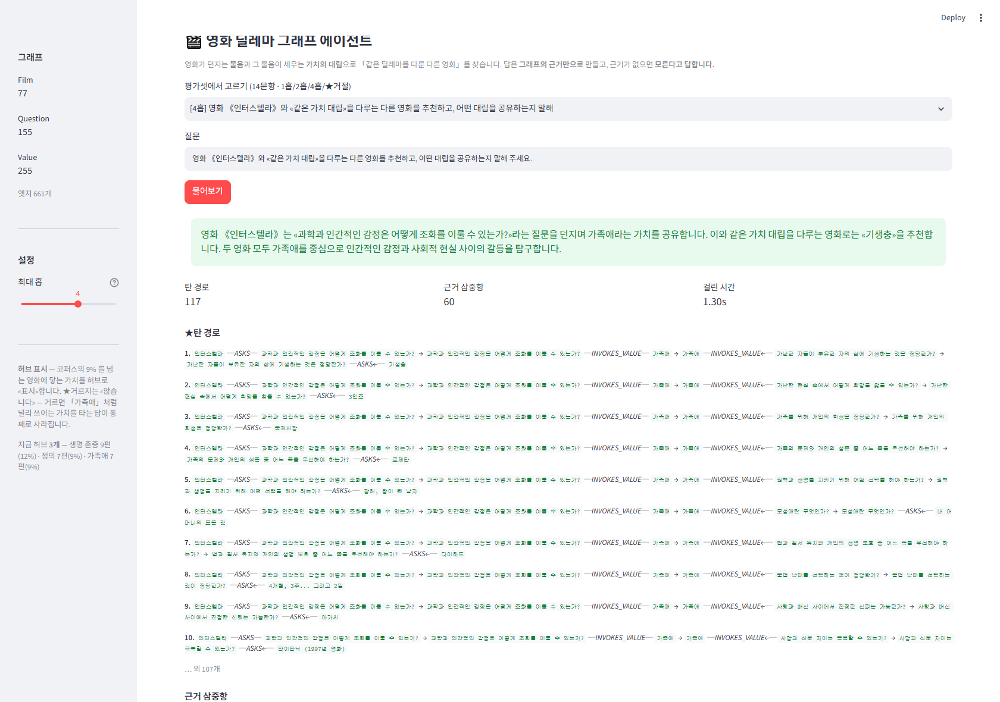

# 영화 딜레마 그래프 에이전트

**모듈5 노드7 「영화 추천 에이전트 만들기 [프로젝트]」** · 김주영 · 2026-09-22
<sub>LMS 스텝 제목은 「[실습 프로젝트] 지식 그래프 에이전트 만들기」 · node-version 5769</sub>

> 📄 자세한 판단 근거·측정·실패 분석 → **[REPORT.md](REPORT.md)**

---

## 한 줄

영화가 던지는 **물음**과 그 물음이 세우는 **가치의 대립**으로 지식 그래프를 만들고,
「이 영화와 **같은 딜레마**를 다루는 다른 영화」를 **근거와 경로를 갖춰** 답합니다.
근거가 없으면 **지어내지 않고 「모른다」고 답합니다.**

---

## 무엇이 다른가

같은 위키백과 영화 코퍼스에서 **사실이 아니라 «물음»을 뽑습니다.**

```
노드6 (앞 프로젝트)   Film · Person · Award   / DIRECTED · ACTED_IN · WON
이 프로젝트           Film · Question · Value / ASKS · INVOKES_VALUE · CONFLICTS_WITH
```

그래서 답이 **한 문서에 없습니다.** 「7번방의 선물」 문서에 「기생충」은 나오지 않습니다.
두 영화가 **같은 가치(가족애)** 를 건드린다는 것을 그래프가 이어 줍니다.

```
7번방의 선물 ─ASKS→ 「장애를 가진 사람도 가족의 사랑과 희생을 통해 존중받을 수 있는가?」
             ─INVOKES_VALUE→ 가족애
             ←INVOKES_VALUE─ 「가난한 자들이 부유한 자의 삶에 기생하는 것은 정당한가?」
             ←ASKS─ 기생충
```

---

## 실행 방법

### 1. 준비

```bash
python -m venv .venv
.venv\Scripts\activate            # Windows · macOS/Linux 는 source .venv/bin/activate
pip install -r requirements.txt
```

`.env` 를 만들고 OpenAI 키를 넣습니다 (`.env.example` 참고).

```
OPENAI_API_KEY=sk-...
```

> ⚠ `.env` 는 `.gitignore` 로 막혀 있습니다 — **키를 저장소에 올리지 않습니다.**

### 2. 코퍼스 → 그래프

```bash
python fetch_docs.py --stats          # 지금 쓸 수 있는 문서가 몇 건인지 «센다»
python fetch_docs.py --target 56      # 부족하면 위키백과에서 더 받는다
python build_graph.py                 # ①추출 (채택 기준을 통과한 문서만)
python normalize_dict.py              # ②새 가치를 축·극에 배정 (사전 확장)
python normalize_graph.py             # ③정제·병합 → output/graph.graphml
```

### 3. 물어보기

```bash
python agent.py "영화 «1987»과 같은 가치 대립을 다루는 다른 영화는?"
```

### 4. 평가

```bash
python make_goldenset.py              # 평가셋 14문항 생성 (그래프에서 «참»을 뽑아)
python agent.py --eval                # 전 문항 실행 → output/runs.jsonl
python evaluate.py --baseline         # 채점 + basic RAG(BM25) 대조 → output/eval.json
```

### 5. 웹 데모

```bash
streamlit run app.py
```

브라우저에서 질문을 넣으면 **답변 · 탄 경로 · 근거 삼중항 · 출처 문서**가 함께 나옵니다.

---

## 실행 화면



*「영화 《인터스텔라》와 «같은 가치 대립»을 다루는 다른 영화를 추천하고,
어떤 대립을 공유하는지」* — ★**답변 · 탄 경로 117개 · 근거 삼중항 60개 ·
출처**가 한 화면에 나옵니다.

- 평가셋 **14문항을 드롭다운**에서 고릅니다 (1홉 / 2홉 / 4홉 / ★거절)
- **「최대 홉」 슬라이더** — 홉 수가 답을 어떻게 바꾸는지 직접 봅니다
- **URL 로도 물어봅니다** — `http://localhost:8511/?q=질문&hop=4`
  질문이 평가셋 문항이면 **드롭다운·홉까지 같이** 맞춥니다
- 위 화면은 `python capture_demo.py` 로 **다시 찍을 수 있습니다**(헤드리스)

★**거절도 기능입니다.** 「영화 《라라랜드》는 어떤 가치 대립을 다루나요?」처럼
**코퍼스에 없는 영화**를 물으면 지어내지 않고 「근거를 찾지 못했습니다」라고 답합니다.
평가셋의 「거절-01」이 이 문항이고, 수집한 128건 어디에도 라라랜드 문서는 없습니다.

> 화면을 **왜** 이렇게 짰는지, 그리고 **데모를 만들다 잡은 결함 둘**은
> **[REPORT.md §5 데모 설계](REPORT.md)** 에 적었습니다.

---

## 성능 (2026-09-22 실측)

★**14문항을 3회 돌린 값입니다** (42건). 1회만 재고 「성능」이라 부르지 않기로 했습니다.

<!-- PERF:START -->

| 구분 | 문항×회 | 답변 정확 | 경로 재현 | 평균 초 | basic RAG(BM25) |
|---|---|---|---|---|---|
| 1홉 | 3×3 | **100.0%** | 50.0% | 1.1 | 0.0% |
| 2홉 | 4×3 | **100.0%** | 58.3% | 1.3 | 0.0% |
| 4홉 | 4×3 | **100.0%** | 45.8% | 1.3 | 0.0% |
| ★거절 | 3×3 | **100.0%** | — | 0.8 | ★0.0% (구조적) |
| 전체 | 42 | **100.0%** | | 1.2 | 0.0% |

```
★흔들림     0개 / 14개   — 모든 문항이 회차마다 «같은» 결과를 낸다
★구조적 실패 0개          — 항상 실패하는 문항이 없다
안정        14개          3/3
```

*위 표와 이 블록은 `output/eval.json` 에서 `sync_numbers.py` 가 찍어냅니다 — 손으로 옮기지 않습니다.*

<!-- PERF:END -->

### ★★100% 를 «달성»이라 부르지 않습니다

여기까지 **세 번** 움직였는데, **오른 이유가 서로 다릅니다.**

| 시점 | 전체 | 무엇이 바뀌었나 | 성능인가, 채점인가 |
|---|---|---|---|
| 코퍼스 56건 | — | 4홉 75.0% · 흔들리는 문항 1개 | — |
| 코퍼스 78건 | 85.7% | ★코퍼스를 늘렸다 | **성능** |
| 골든셋 수정 | **100.0%** | ★**제가 채점 잣대를 고쳤습니다** | **채점** |

★**마지막 칸을 숨기지 않겠습니다.** 2홉 두 문항이 0/3 이라 들여다봤더니,
**답은 맞는데 골든셋이 틀리게 찍고** 있었습니다 — 영화 하나가 물음을 2~3개 던지고
각각 다른 가치를 부르는데, 기대값에 «한 물음의 가치»만 넣어 뒀습니다.
(서브스턴스가 「내면화된 폭력」이라 답했는데 기대값은 「자기 인식」뿐이었습니다.)
기대값을 **「그 영화가 부르는 가치 전부」**로 고치니 통과했습니다.

⇒ **성능이 오른 게 아니라 «채점이 맞아진» 쪽입니다.** 무엇을 왜 고쳤는지는
[REPORT.md](REPORT.md) §3 에 전/후로 다 적었고, `make_goldenset.py` 에 주석으로도 남겼습니다.

⇒ 그리고 **14문항은 제가 냈습니다.** 홀드아웃이 없습니다. 그래서 절대 점수보다
**아래 대조**를 봐 주십시오.

**basic RAG(BM25) 대조 — 전 구간 0.0%.** 그래프 없이 문서만 검색하면
「같은 가치 대립을 다룬 다른 영화」에 닿지 못합니다. 답이 **한 문서에 없기** 때문입니다.
거절 문항은 BM25 가 **구조적으로 0%** 입니다 — 항상 문서를 내놓기 때문입니다.

**★경로 재현율은 45~58% 입니다.** 답변은 100% 인데 **「기대한 그 경로」는 절반쯤만
탑니다.** 같은 가치에 «다른 물음»으로 닿아도 답은 맞습니다.
⇒ **답이 맞았다고 «의도한 추론»을 했다는 뜻이 아닙니다.** 여기가 제일 약한 자리입니다.

자세한 분석·실패 층 분류는 [REPORT.md](REPORT.md) §3 을 보세요.

---

## 폴더

```
data/docs/          위키백과 문서 128건 — ★그 중 «채택» 78건이 그래프에 쓰인다
                    (탈락 50건은 지우지 않고 남긴다. 기준과 목록은 output/dropped_docs.json)
data/_probe_gold/   ★프롬프트 검증용 7편 — 코퍼스에 «넣지 않는다»
data/goldenset.json 평가셋 14문항 (1홉 3 · 2홉 4 · 4홉 4 · ★거절 3)
config.json         스키마 · 홉 수 · 허브 임계 · 거절 규칙 · ★뺀 관계와 그 «대가»
values.json         정규화 사전 — 축 8개 · 가치 336개 · ★미분류 목록
fetch_docs.py       코퍼스 수집 + 채택·탈락 판정
build_graph.py      ①추출 (스키마로 제한)
normalize_dict.py   ②새 가치를 축·극에 배정
normalize_graph.py  ③정제·병합 → graph.graphml
make_goldenset.py   평가셋 생성 (그래프에서 «참»을 뽑아)
agent.py            ★LangGraph — 시작개체 → 4홉 → 근거만으로 답 + 경로 기록
evaluate.py         홉 수별 채점 · basic RAG 대조 · ★실패 층 분류
app.py              streamlit 데모
output/             graph.graphml · runs.jsonl · eval.json · dropped_docs.json
```

---

## 🔍 피어리뷰 하시는 분께

**키 없이도 결과를 검증할 수 있습니다.** `output/` 에 산출물을 다 커밋해 뒀습니다.

| 보실 것 | 파일 | 무엇이 들어 있나 |
|---|---|---|
| 그래프 | `output/graph.graphml` | 노드 487 (Film 77 · Question 155 · Value 255) · 엣지 661 |
| ★정규화 전/후 | `output/graph_stats.json` | 다리 **2개 → 6개** · 가로지르는 충돌 **107건** · 축 8개 |
| ★채택·탈락 | `output/dropped_docs.json` | 기준 + **탈락 50건 전체 목록과 이유** (수집 128건 중 채택 78) |
| 실행 기록 | `output/runs.jsonl` | 42건(14문항×3회) **답변 · 탄 경로 · 근거 · 출처 · State 흐름** |
| 채점 | `output/eval.json` | 홉 수별 정확도 · **경로 재현율** · 문항별 통과 횟수 · basic RAG 대조 |
| 평가셋 | `data/goldenset.json` | 14문항 · 문항마다 기대정답·**기대경로**·원문근거 |

### 제가 아는 약점 넷 — 먼저 적습니다

```
① ★경로 재현율 0.46~0.58   여기가 제일 약합니다.
   (1홉 .50 · 2홉 .58 · 4홉 .46)  답변 정확도는 100% 인데, «기대한 그 경로»는
                                 절반쯤만 탑니다. 같은 가치에 «다른 물음»으로
                                 닿아도 답은 맞습니다. ⇒ 답이 맞았다고
                                 «의도한 추론»을 했다는 뜻이 아닙니다.

② ★골든셋을 제가 냈습니다     14문항 100% 는 «내가 낸 문제를 내가 푼 것»입니다.
                              홀드아웃이 없습니다. 그래서 basic RAG(BM25) 를
                              같은 문항으로 함께 돌려 놨습니다 — 전 구간 0.0%.
                              절대 점수보다 «이 대조»를 봐 주십시오.

③ 가로지르는 충돌 107건 미사용  축이 달라 견줄 잣대가 없는 충돌입니다
                              (과학적 성취[인정] ↔ 도덕적 책임[책임]).
                              ★이쪽이 진짜 딜레마의 모양일 수 있는데 아직 안 썼습니다.
                              output/graph_stats.json 의 cross_axis 에 전부 있습니다.

④ ★허브를 «표시»만 합니다      9% 임계로 판정은 하는데 «거르지 않습니다».
                              42건 중 18건에서 표시됐습니다(가족애·생명 존중·정의).
                              거르면 데모의 4홉 답이 사라져서 그냥 뒀는데,
                              ★«언제 걸러야 하는지»를 아직 못 쟀습니다.
                              REPORT §4 에 코드와 함께 적었습니다.
```

### 이건 봐 주셨으면 하는 것 셋

1. **정규화가 «있으면 좋은 것»이 아니라 «작동 조건»입니다** — 축·극으로 합치기 전에는
   영화 사이 다리가 **2개**뿐이었습니다. 합치고 나서 **6개**가 됐습니다.
   `REPORT.md` §2 에 전/후를 나란히 뒀습니다.
2. **채점기를 «오답으로» 검증했습니다** — 100% 가 채점이 관대해진 탓인지 확인하려고
   엉뚱한 답·빈 답·영화 이름만·지어낸 답 등 **7종을 넣어 전부 탈락**하는지 봤습니다.
   `REPORT.md` §3.
3. **거절이 홉수 정확도에 섞이지 않게 분리했습니다** — 거절 3문항을 1·2·4홉과 함께
   평균 내면 정답률이 올라갑니다. `eval.json` 의 `by_kind` 가 넷을 나눠 둔 이유입니다.

### 물어보고 싶은 것

- 축 8개(생명·소속·앎·권한·인정·시간·책임·동의)를 **제가 정했습니다.** 가치를 축·극에
  배정하는 일을 LLM 에 맡기는 게 나았을까요, 아니면 사람이 정하는 게 맞을까요?
- **경로 재현율이 낮은데 답은 맞는 경우** — 이걸 «성공»으로 봐야 할까요,
  «채점 기준의 결함»으로 봐야 할까요?
