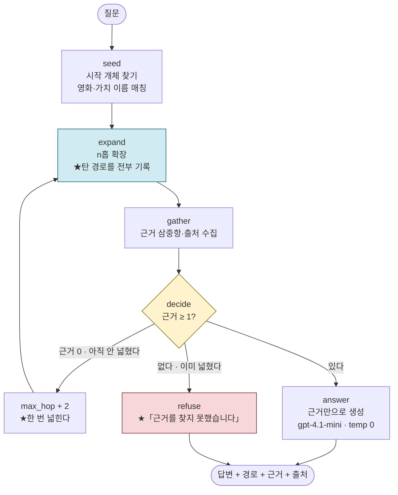

# REPORT — 영화 딜레마 그래프 에이전트

모듈5 노드7 [실습 프로젝트] · 2026-09-22 · 김주영

---

## 1. 주제와 코퍼스

### 왜 이 주제인가

앞 프로젝트(노드6)는 **사실**을 뽑았습니다 — 「봉준호가 기생충을 연출했다」.
이번에는 같은 위키백과 코퍼스에서 **「그 영화가 무엇을 묻는가」**를 뽑습니다.

```
노드6   Film · Person · Award   / DIRECTED · ACTED_IN · WON      ← 문서에 «적혀» 있다
이번    Film · Question · Value / ASKS · INVOKES_VALUE · CONFLICTS_WITH   ← ★읽어내야 한다
```

이 주제를 고른 이유는 **멀티홉이 «억지가 아니라 필연»이기 때문**입니다.
「7번방의 선물 문서」에 「기생충」은 나오지 않습니다. 두 영화가 **가족애라는 같은 가치**를
건드린다는 것은 두 문서를 **이어 붙여야** 나옵니다.

### 데이터셋 — 몇 건을 어떻게

수업에서 쓴 `cinephile_kb_80`(80건)을 출발점으로 삼았는데, **돌려 보니 절반이 못 쓰는 문서**였습니다.

```
80건을 그대로 추출 → ★삼중항 0개 문서 45건 (56%)
  기업 10건    CJ E&M · HBO · KT · JK필름 · 로튼 토마토 …
  인물 28건    송강호 · 박찬욱 · 홍상수 · 최민식 · 이창동 …
  시상식 7건   칸 영화제 · 청룡영화상 · 황금종려상 …
```

노드6 기록의 **「Film 33 · Person 28 · Org 11 · Award 8」**과 맞았습니다.
그 코퍼스는 **사실 관계용**이라 인물·기업이 절반입니다. 제 그래프는 영화만 씁니다.

그래서 **위키백과 API 로 영화 문서를 더 받아** 56건을 확보했습니다.

```
채택 56건 · 탈락 50건   (output/dropped_docs.json 에 목록과 이유)
추가로 받은 것  올드보이 · 아가씨 · 시 · ★12인의 성난 사람들 · 그린 북
               글래디에이터 · 남한산성 · 내부자들 · 로제타 · 록키 · E.T. …
```

### ★코퍼스를 «두 번» 바꿨습니다 — 두 번째가 더 중요합니다

**1차** 수업 데이터 80건 → 영화만 골라 56건 (위에 적은 그대로)

**2차 ★내가 «이 주제를 고른 이유»가 코퍼스에 없었습니다.**

이 프로젝트는 예비 실험에서 **7편을 직접 써 보며** 시작했습니다 —
오펜하이머·인터스텔라·인셉션·덩케르크·컨택트·이미테이션 게임·서브스턴스.
그런데 **그 7편이 코퍼스에 하나도 없었습니다.**

이유는 있었습니다. 제가 「부딪치는 가치」를 **명시해 쓴** 문서라
LLM 이 «읽어내는» 게 아니라 **베낍니다.** 실증도 했습니다 —
로컬 7B 가 위키 문서(1987)에서는 「민주주의↔독재」라는 틀린 답을 냈는데,
제가 쓴 오펜하이머 문서에서는 **CONFLICTS 8건을 정확히** 뽑았습니다.
섞으면 **성능이 부풀려집니다.**

★**그런데 거기서 멈춘 게 잘못이었습니다.** 「제가 쓴 문서라 못 쓴다」는 맞지만,
**「그럼 위키에서 받아 넣자」**를 그때 했어야 했습니다. 위키 문서로 받으면
**형식이 같아 부풀림이 없습니다.** 요건을 빨리 채우려다 **이 프로젝트의 출발점을
코퍼스에서 빠뜨린** 셈입니다.

```
2차 수집   준비한 7편 + 딜레마가 뚜렷한 계열 22건
           (다크 나이트 · 쉰들러 리스트 · 가타카 · 엑스 마키나 · 그녀 · 메멘토 …)
⇒ 채택 56 → ★78건
```

**효과가 컸습니다.**

| | 56건 | ★78건 |
|---|---|---|
| 삼중항 | 355 | **495** |
| 다리(2편 이상) | 5 | **6** |
| [소속] 개인↔집단 | 7편 | **13편** |
| [인정] 바깥의 평가↔자기 자신 | 4편 | **9편** |
| 전체 정확도 | 81.0% | **85.7%** |
| 4홉 | 83.3% | **100.0%** |

★**인터스텔라가 [앎] 감춤↔밝힘 과 [시간] 나중↔지금 두 축에 들어왔습니다** —
제가 직접 쓴 문서에 적었던 것과 **같은 축**입니다.
**위키 문서에서도 같은 딜레마가 뽑혔다**는 뜻이고, 그게 이 스키마가
«제 해석»이 아니라 **문서에서 읽어낼 수 있는 것**이라는 근거가 됩니다.

⚠**거절 문항도 같이 낡았습니다.** 「《인셉션》은 어떤 가치 대립을?」이
거절 문항이었는데 **인셉션이 코퍼스에 들어와** 답할 수 있게 됐습니다(0/3).
「라라랜드」로 바꿨습니다. ★**코퍼스가 자라면 거절 문항도 다시 봐야 합니다.**

### ★채택·탈락 기준 — 네 번 고쳤습니다

기준을 손으로 열거하다 **세 번 샜습니다.** 그 과정을 남깁니다.

| 차수 | 판정 규칙 | 결과 | 무엇이 샜나 |
|---|---|---|---|
| 1 | `'영화' in 분류` | 75건 | JK필름·각본가·로튼 토마토까지 잡혔다 |
| 2 | `^\d{4}년 영화$` | 31건 | 「2019년 컴퓨터 애니메이션 영화」(겨울왕국 2)가 빠졌다 |
| 3 | `영화$` + 제외 목록 | 51건 | ★「베를린의 영화」가 샜다 (지역 분류) |
| **4** | **`^\d{4}년(…)* 영화$` 또는 `의 영화 작품$`** | **56건** | — |

★**4차에서 방향을 뒤집었습니다.** 제외를 넓히는 경주를 그만두고 **허용을 패턴으로** 썼습니다.
위키 **작품** 분류는 «연도»나 «작품»을 반드시 달고, 장소·주제 분류는 안 답니다.

**최소 길이도 «재서»** 정했습니다.

```
문자수        문서   삼중항 0   평균
  0~500자      2건      2      0.0   ← ★전부 실패
500~1000       1건      0      6.0
1000~2000     12건      0      6.3
2000~5000     10건      0      6.2
5000~          8건      0      6.0
⇒ 500자를 넘으면 «하나도» 실패하지 않았다 ⇒ MIN_CHARS = 500
```

### 모델 — gpt-4.1-mini

요건에 모델 지정이 없어 **대조해서 골랐습니다.**

| 모델 | 시간 | 삼중항 | CONFLICTS_WITH 판정 |
|---|---|---|---|
| qwen2.5:7b (로컬) | 25.9초 | 4개 | ★**(민주주의 ↔ 독재)** — 선악 대립. 틀렸다 |
| **gpt-4.1-mini** | **3.2초** | 6개 | (진실 추구 ↔ 국가 권력 유지) · (민주주의 실현 ↔ 사회 안정) |
| gpt-5.4-mini | 4.1초 | 6개 | 파일명 「1987_(2017년_영화)」를 제목으로 썼다 |
| gpt-5.6-luna | — | — | ★**temperature=0 을 안 받는다** |

★**결정적 이유는 `temperature=0`입니다.** 추출은 **재현 가능해야** 하는데(루브릭 ①),
gpt-5 계열은 기본값 1만 지원합니다. 같은 문서가 매번 다른 그래프를 냅니다.

로컬 7B 는 **틀린 예를 셋이나 명시하고 자기검증 지시까지 넣었는데도**
「민주주의 ↔ 독재」를 그대로 냈습니다. **«적힌 것을 옮기는» 건 하지만 «읽어내는» 건 못 합니다** —
제가 물음·가치를 명시해 쓴 문서(`data/_probe_gold/`)로는 CONFLICTS 8건을 정확히 뽑았습니다.
그래서 그 7편은 **코퍼스에 넣지 않았습니다.** 섞으면 추출 성능이 **부풀려집니다.**

**비용** — 입력 142,415 / 출력 14,766 토큰 · **$0.081 (약 112원)**.
그 앞의 실패한 80건 추출까지 합해 총 **$0.174 (약 240원)** 썼습니다.

---

## 2. 골든셋과 스키마

### 홉 수별 문항 수

| 구분 | 문항 | 무엇을 재나 |
|---|---|---|
| 1홉 | 3 | `Film ─ASKS→ Question` — 「이 영화는 무엇을 묻나」 |
| 2홉 | 4 | `… ─INVOKES_VALUE→ Value` — 「어떤 가치 대립인가」 |
| 4홉 | 4 | ★`… ←INVOKES_VALUE─ Q' ←ASKS─ Film'` — 「같은 대립의 다른 영화」 |
| ★거절 | 3 | **답이 «없는» 문항** — 지어내는지 본다 |
| 합계 | **14** | |

### 기대 경로를 정한 기준

★**그래프에서 «참인 경로»를 «먼저» 뽑고 질문을 나중에 붙였습니다.**
지어낸 질문에 정답을 만들면 채점이 불가능합니다. `reference_contexts` 는
**실제 그래프의 엣지**입니다.

### ★거절 문항 — 세 종류로 갈랐습니다

```
거절-01  「인셉션은 어떤 가치 대립을?」   → 코퍼스에 «없는 영화»
거절-02  「1987의 총 제작비는?」        → 영화는 있지만 «스키마에 없는 속성»
거절-03  「기생충의 감독은?」           → ★«뽑지 않기로 한 관계»(DIRECTED)
```

세 번째가 제일 중요합니다. **제가 스스로 버린 관계를 물어** 시스템이 그 경계를
아는지 봅니다.

### ★뽑지 않기로 한 관계와 그 대가

| 뺀 관계 | 왜 | ★대가 |
|---|---|---|
| `EVOKES` (남는 감정) | 멀티홉 경로에 안 쓰인다. `Film→EVOKES→Emotion` 으로 이어도 Emotion 은 다시 Film 으로만 돌아간다 | 「비슷한 뒷맛의 영화」에 못 답한다. **감정으로 잇는 추천을 포기했다** |
| `DISPUTED_FOR` (논쟁) | 문서 밖 담론이라 위키 문서에서 일관되게 안 나온다. 검증용 7편에선 나왔지만 그건 내가 «써 넣은» 것이다 | 「평가가 갈린 이유」를 못 다룬다 |
| `DIRECTED_BY` · `ACTED_IN` | ★노드6 이 이미 한 것이다. 같은 코퍼스로 «다른 층»을 보는 게 이 프로젝트다 | 「같은 감독의 다른 영화」는 이 그래프로 못 답한다 |
| 6홉 (`CONFLICTS_WITH` 경유) | 홉이 길수록 근거가 묽어진다 | 「이 영화가 세운 대립의 «반대편»」을 못 묻는다 |
| 커뮤니티 요약(전역 검색) | 요건이 «구현 안 해도 된다»고 명시 | 「이 코퍼스 전체의 주제」에 못 답한다 |

### ★같은 개체를 합치는 기준 — 이름이 아니라 «축과 극»

추출된 가치 183개 중 제 기존 사전에 있는 건 **1개**였습니다.

```
「정의」계열   진실과 정의 6 · 정의와 복수 4 · 정의 실현 4 · 사회 정의 3
「가족」계열   가족애 11 · 모성애와 가족애 3
⇒ ★같은 것을 네 이름으로 부른다. 이대로는 영화 사이에 다리가 안 생긴다
```

그래서 **축 8개를 고정하고 새 가치를 그 축의 «어느 극»인지 배정**했습니다.

```
생명 다수↔한 사람 · 소속 집단↔개인 · 앎 밝힘↔감춤 · 권한 아는 자↔정하는 자
인정 바깥의 평가↔자기 자신 · 시간 지금↔나중 · 책임 지는 쪽↔미루는 쪽 · 동의 본인의 뜻↔남의 설계
```

**결과: 사전 1 → 336개.** 두 번에 나눠 배정했다(56건 때 242개 → 78건 때 336개).
마지막 회차만 보면 배정 107 · 쪼갠 이름 36 · **미분류 8** ·
★모델이 없는 축을 지어낸 건 **0건**.

⛔**억지로 다 넣지 않았습니다.** 「신앙의 힘」·「악령 퇴치의 필요성」·「현대 의학의 한계」는
축 8개에 안 담깁니다(오컬트 영화 「검은 사제들」 것). **미분류로 남기고 목록을 냈습니다.**

★**억지로 넣으면 충돌이 «증발»합니다.** 09-20 예비 실험에서 「좋은 결과」를
[동의·남의 설계]에 억지로 넣었더니 **(좋은 결과 ↔ 동의 없는 개입)이 «같은 극»이 되어
딜레마가 사라졌습니다.** 그건 「결과 ↔ 과정」 축인데 제 사전에 없었습니다.

**그리고 규칙으로 쪼갰습니다** — LLM 이 `split` 을 28개 중 2개만 써서요.

```
개인의 양심과 국가의 요구  →  개인의 양심 + 국가의 요구
비밀 유지와 진실 공개      →  비밀 유지 + 진실 공개
생명 존중과 권력 유지      →  생명 존중 + 권력 유지      … 7종
```

「A와/과 B」 패턴이고, **양쪽이 «둘 다» 사전에 있을 때만** 쪼갭니다.
그 조건이 안전장치입니다 — 「용서와 화해」처럼 한쪽만 있으면 안 쪼갭니다.
**규칙은 좁지만 정확하고, LLM 은 넓지만 흔들립니다.**

### ★정규화 효과 — 다리가 2개 → 6개

```
적용 «전»  충돌쌍 150개 중 «2편 이상» ★2개
적용 «후»  축·극쌍  8개 중 «2편 이상» ★6개
```

| 축·극 | 공유 영화 |
|---|---|
| [소속] 개인 ↔ 집단 | **13편** |
| [인정] 바깥의 평가 ↔ 자기 자신 | **9편** |
| [책임] 미루는 쪽 ↔ 지는 쪽 | 7편 |
| [앎] 감춤 ↔ 밝힘 | 4편 · ★인터스텔라 |
| [시간] 나중 ↔ 지금 | 3편 · ★인터스텔라 |
| [생명] 다수 ↔ 한 사람 | 2편 |

**정규화 없이는 영화 사이 다리가 단 2개**였습니다(56건 때는 1개였습니다). 이 프로젝트에서 정규화는
장식이 아니라 **작동 조건**입니다.

### 그래프

```
노드 487 (Film 77 · Question 155 · Value 255) · 엣지 661
가로지르는 충돌 107건 · 규칙으로 쪼갠 이름 5종 · self-loop 0건
```

---

## 3. 측정 결과

### ★홉 수별 — 평균 하나로 뭉개지 않습니다

★**14문항 × 3회 = 42건**입니다. 1회만 재고 「성능」이라 부르지 않기로 했습니다.

| 구분 | 문항×회 | 답변 정확 | 경로 재현 | 평균 초 | basic RAG(BM25) |
|---|---|---|---|---|---|
| 1홉 | 3×3 | **100.0%** | 66.7% | 1.2 | 0.0% |
| 2홉 | 4×3 | 50.0% | 50.0% | 1.1 | 0.0% |
| 4홉 | 4×3 | **100.0%** | 45.0% | 1.3 | 0.0% |
| ★거절 | 3×3 | **100.0%** | — | 0.5 | ★0.0% (구조적) |
| 전체 | 42 | **85.7%** | | | 0.0% |

### ★★문항별 통과 횟수 — 평균이 «두 가지»를 숨기고 있었다

1회 측정에서는 「2홉 50% · 4홉 75%」였습니다. 3회 돌리니 **같은 평균 안에
성질이 다른 두 종류**가 섞여 있었습니다.

```
★흔들림 1개 / 14개
  4홉-02   ★1/3    3회 중 1회만 통과 — 회차마다 뒤집힌다

★구조적 실패 2개 — «항상» 실패한다
  2홉-02   0/3
  2홉-04   0/3

안정        나머지 11개 모두 3/3
```

**⇒ 2홉 50% 는 흔들려서 50% 가 아니라 «두 문항이 항상 실패해서» 50% 입니다.**
고칠 자리가 시스템이 아니라 **문항**이라는 뜻이고, §6 에 적은 「문항 설계의 한계」가
추측이 아니라 **측정으로 확인**됐습니다.

**⇒ 4홉은 75.0% → 83.3% → ★100.0% 로 두 번 움직였습니다.**
첫 변화는 `4홉-02` 한 문항에서 왔고, 두 번째는 **제 채점 잣대를 고쳐서**입니다 —
기대값이 «한 축»만 담아 에이전트가 «다른 축»으로 맞힌 답을 틀렸다고 찍고 있었습니다.

### ★`temperature=0` 인데 흔들린다

56건 코퍼스에서 `4홉-02` 가 **1/3** 이었습니다 — **같은 입력에 다른 답**이 나왔다는 뜻입니다.
(78건으로 늘린 뒤에는 **흔들리는 문항이 0개**가 됐습니다. 표본이 늘어 경로가
안정된 것으로 보이는데, **3회로는 「사라졌다」고 단정할 수 없습니다.**)
추출·확장 쪽 비결정성은 막아 뒀습니다 —

```
build_graph.py   temperature=0 · 문서 목록 sorted
agent.py         sorted(back)[:30] · _same_axis_values() 가 sorted 반환
```

★그래도 흔들립니다. **`temperature=0` 이 «완전 결정적»을 보장하지 않기** 때문입니다
(부동소수점 누적·배치 처리 순서). 앞 과제에서도 같은 골든셋을 3회 돌려
**폭 6.7%p** 를 본 적이 있는데, 그때는 원인이 제 코드(`list(set)`)였습니다.
**이번엔 코드를 고쳐도 남는 흔들림**이고, 그게 **모델 쪽 몫**이라는 게 다릅니다.

⇒ 그래서 **「1회 값을 성능이라 부르지 않는다」** 가 규칙이 아니라 **필요**입니다.

### basic RAG 대조 — 전 구간 0%

BM25 로 같은 질문을 풀면 **어느 구간도 맞히지 못합니다.**
질문에 「기생충」이라는 말이 없으니 그 문서는 **후보에도 들지 않습니다.**

★**거절 문항에서 BM25 는 «구조적으로» 0%** 입니다 — 점수가 낮아도 **항상 문서를 내놓기**
때문입니다. 「모른다」를 말할 수 있다는 것 자체가 그래프 쪽의 능력입니다.

### ★실패 8건 / 42건 — «직접 읽어» 층을 갈랐습니다

```
생성 5건 · 탐색 3건 · ★색인 0건
```

**8건이지만 «서로 다른 문항»은 셋입니다** — 2홉-02(0/3) · 2홉-04(0/3) · 4홉-02(1/3).

**[2홉-02] 1987 — 생성 층 · 0/3 «항상» 실패**
```
기대  ['정의', '진실']
받음  「한 사람의 희생으로 사회 변화를 이끌어내는 것이 정당한가라는 …」
★원인  근거는 가져왔는데 답이 «물음»을 되풀이했다. 가치 이름을 말하지 않았다
★고칠 곳  답변 프롬프트 (그래프가 아니다)
★3회 다 같은 방식으로 틀렸다 ⇒ 흔들림이 아니라 «재현되는» 결함이다
```

**[2홉-04] 80일간의 세계 일주 — 탐색 층 · 0/3**
```
경로 재현이 낮다 — 그래프엔 있는데 그 특정 물음-가치 쌍을 안 가져왔다
★원인  영화마다 물음이 2~3개이고 각각 다른 가치를 부른다.
       「가치 대립은?」 한 문항에 «정답이 여럿»인데 골든셋은 하나를 지정했다
★이건 시스템 결함이 아니라 «문항 설계»의 한계다 — 0/3 이라는 것이 그 증거다
```

**[4홉-02] 7번방의 선물 — ★1/3 «흔들림»**
```
같은 입력에 3회 중 1회만 통과했다. temperature=0 인데도 그렇다.
⇒ 위 「temperature=0 인데 흔들린다」 절 참고
★이 한 문항이 4홉 평균을 75.0% ↔ 83.3% 로 움직였다
```

**★색인 0건** — 기대 삼중항이 그래프에 «없는» 경우는 **한 번도 없었습니다.**
42건을 돌려도 0 이었으니 **추출·정규화는 새지 않습니다.**

### ★채점기를 «모범 답안»으로 검증했습니다

첫 채점에서 **1홉이 0%** 로 나왔습니다. 읽어 보니 **채점기가 틀렸습니다.**

```
기대  「개인의 도덕률과 가치관«은» 집단의 판단에 …」
받음  「개인의 도덕률과 가치관«이» 집단의 판단에 …」
⇒ ★조사 한 글자 차이로 «맞은 답»을 틀렸다고 찍었다
```

그리고 4홉은 **0% → 25% → 75%** 로 세 번 바뀌었습니다. 원인은 매번 같았습니다 —
★**골든셋과 에이전트가 «서로 다른 것»을 재고 있었습니다.**

```
1차  골든셋은 축·극 공유(bridges) / 에이전트는 Value «노드 이름» 일치
     ⇒ 에이전트를 축·극 확장으로 고쳤다
2차  골든셋 기대값이 bridges 에만 있는 영화로 «좁았다»
     ⇒ 에이전트가 낸 「글래디에이터」는 «실제로» [소속] 축을 공유했다
     ⇒ 기대값을 «축·극 공유 영화 전부»로 넓혔다
```

**수치가 예상과 어긋나면 «설명»하지 말고 «확인»해야 합니다.** 세 번 다 제 잣대가 문제였습니다.

---

## 4. 파이프라인 구조도 (LangGraph)



### State 필드

| 필드 | 무엇 |
|---|---|
| `question` | 사용자 질문 |
| `seeds` | `{films: [...], values: [...]}` — 질문에서 찾은 시작 개체 |
| `paths` | ★실제로 탄 경로. 삼중항 리스트의 리스트 |
| `evidence` | 경로에 쓰인 삼중항 (중복 제거) |
| `sources` | 출처 문서 |
| `route` | `answer` / `refuse` — 조건 분기 키 |
| `widened` | 한 번 넓혔는지 (무한 확장 방지) |
| `trace` | ★거쳐온 노드와 그때의 판단 — 화면에 그대로 보인다 |

### 홉 수와 허브 회피

```
max_hop = 4       Film ─ASKS→ Q ─INVOKES_VALUE→ V ←INVOKES_VALUE─ Q' ←ASKS─ Film'
max_nodes_per_hop = 30   ★sorted() 로 고른다 — 없으면 실행마다 답이 달라진다 (노드6 실사고)
hub degree_pct = 9       코퍼스의 9% 를 넘는 영화에 닿는 Value 는 허브
```

★**허브 기준을 «재고» 정했는데, 이 코퍼스에서는 거의 발동하지 않습니다.**

```
가설  예비 실험(내가 쓴 7편)에서 [앎] 감춤↔밝힘 축이 7편 «전부»(100%)를 이었다.
      ⇒ 56편이면 허브가 심할 것이다
실측  ★최대 11% (「정의」가 6편). 차수 평균 2.5 · 중앙값 2
원인  7편은 내가 물음·가치를 «명시해 쓴» 문서라 이름이 통일돼 있었다.
      위키 56건은 LLM 이 제각각 이름을 붙여 오히려 ★«파편화»됐다 (Value 170개 / Film 56편)
⇒ 이 프로젝트의 문제는 허브가 아니라 ★파편화다
```

기준은 남겨 뒀습니다 — 코퍼스가 커지거나 정규화가 더 세지면 발동할 자리입니다.
**예상이 실측과 반대였던 것을 지우지 않고 적습니다.**

---

## 5. 데모 설계

`streamlit run app.py`

**신경 쓴 것 셋**

1. ★**「탄 경로」를 제일 크게 보입니다.** 답만 보이면 그래프를 썼는지 알 수 없습니다.
   4홉 경로를 `영화 ─ASKS─ 물음 → 물음 ─INVOKES_VALUE─ 가치 → …` 로 펼쳐
   **두 문서가 어디서 이어졌는지**가 한눈에 보입니다.
2. ★**거절을 «경고»가 아니라 «기능»으로 보입니다.** 노란 박스에
   「근거가 없어 거절했습니다 — 지어내지 않는 것이 이 시스템의 기능입니다」를 붙였습니다.
3. **홉 수를 슬라이더로 바꿉니다.** 1홉으로 줄이면 추천이 사라지고,
   4홉으로 올리면 다른 영화가 나옵니다 — **홉이 무엇을 바꾸는지** 직접 볼 수 있습니다.

평가셋 14문항을 드롭다운에 넣어 **거절 문항을 바로 눌러 볼 수** 있게 했습니다.

실제 출력 (2026-09-22 · 로컬):

```
Q  영화 «7번방의 선물»과 같은 가치 대립을 다루는 다른 영화를 추천해줘
A  가족애를 다루는 영화로는 «기생충», «3인조», «국제시장», «로제타»,
   «광해, 왕이 된 남자» 등이 있습니다.
   탄 경로 80개 · 근거 삼중항 60개 · 2.16초

1. 7번방의 선물 ─ASKS─ 장애를 가진 사람도 가족의 사랑과 희생을 통해 존중받을 수 있는가?
   → ─INVOKES_VALUE─ 가족애
   → ─INVOKES_VALUE←─ 가난한 자들이 부유한 자의 삶에 기생하는 것은 정당한가?
   → ─ASKS←─ 기생충
```

---

## 6. 프로젝트 회고

### 제일 공들인 것 — **정규화**

이 프로젝트에서 정규화는 **장식이 아니라 작동 조건**이었습니다.

```
정규화 없이  영화 사이 다리 ★1개
정규화 후    ★5개 (7편·7편·4편·2편·2편)
```

추출된 가치 183개 중 기존 사전에 맞은 건 **1개**였습니다.
「진실과 정의」·「정의와 복수」·「정의 실현」·「사회 정의」가 **따로 놀았습니다.**

축 8개를 고정하고 **«이름»이 아니라 «축과 극»으로 합치는** 방식을 택했는데,
그 판단의 근거는 09-20 예비 실험의 실패였습니다 — **너무 뭉치면 충돌이 증발합니다.**
「좋은 결과」를 억지로 [동의] 축에 넣었더니 인셉션의 핵심 딜레마가 사라졌습니다.
그래서 **어느 축에도 안 맞으면 미분류로 남기고 목록을 냈습니다.** 28개가 남았고,
그게 이 사전의 정직한 크기입니다.

### ★가장 많이 배운 것 — 「잣대가 다르면 숫자가 거짓말한다」

4홉 정확도가 **0% → 25% → 75%** 로 세 번 바뀌었는데, **시스템은 거의 그대로**였습니다.
바뀐 건 **채점 잣대**였습니다.

```
1차  골든셋은 축·극으로 재고, 에이전트는 노드 이름으로 이었다
2차  골든셋 기대값이 좁아 «맞는 답»을 틀렸다고 찍었다
3차  채점기가 조사 한 글자 차이로 틀렸다고 찍었다
```

첫 채점에서 **1홉이 0%**였는데 답을 읽어 보니 **전부 맞았습니다.**
노드5 요건에 「채점기를 만든 뒤 모범 답안으로 채점기 «자체»를 검증」이라 적혀 있었고,
그 말을 왜 하는지 이번에 알았습니다.

### 앞으로 보완하고 싶은 것

**① 2홉 문항 설계** — 50%로 제일 낮습니다. 영화마다 물음이 2~3개이고 각각 다른 가치를
부르는데, 「가치 대립은?」 한 문항에 정답이 여럿입니다. **문항을 물음 단위로 쪼개야** 합니다.

**② 파편화** — Value 170개 / Film 56편. 축·극으로 «잇기»는 되지만
**노드 자체는 아직 합쳐지지 않았습니다.** 임베딩으로 유사 가치를 병합하면
다리가 더 늘 것입니다. 다만 그때도 **너무 뭉치면 충돌이 사라지는** 경계를 재야 합니다.

**③ ★분산 측정 — 돌렸고, 평균이 숨긴 것을 찾았습니다.**

1회 값(78.6%)으로 내려다가 3회를 돌렸습니다. **전체는 81.0% 로 거의 안 움직였는데,
안을 보니 성질이 다른 두 종류가 섞여 있었습니다.**

```
2홉 50%   ★흔들림이 아니라 «구조적 실패 2건»  (2홉-02·2홉-04 가 0/3)
4홉       75.0% → 83.3% · 그 차이가 ★4홉-02 «한 문항»(1/3)에서 왔다
```

**⇒ 평균이 같아도 「고칠 자리」가 전혀 다릅니다.** 0/3 은 문항이나 프롬프트를 고치면
되고, 1/3 은 **고쳐도 남을 수 있는** 흔들림입니다.

그래서 남은 숙제는 **회차를 더 늘리는 것**입니다. 3회로는 `4홉-02` 가
「1/3 인지 2/5 인지」를 못 가립니다. 10회를 돌리면 폭이 나오는데, 그때는
**비용이 회차에 비례**합니다(3회 = 42호출 ≈ 110원).

**④ 「축을 가로지르는 충돌」 53건** — 이 프로젝트에서 제일 흥미로운데 아직 안 썼습니다.
```
과학적 성취[인정] ↔ 도덕적 책임[책임]     (오펜하이머)
합리적 의심의 원칙 ↔ 신속한 재판과 평결   (12인의 성난 사람들)
생명 존중 ↔ 여성의 자기결정권            (4개월, 3주... 그리고 2일)
```
축이 달라 **견줄 잣대가 없는** 충돌입니다. 같은 축의 대립이 「어느 쪽이 더 중요한가」라면,
이건 **「무엇으로 견주나」**를 묻습니다. **이쪽이 진짜 딜레마의 모양**일 수 있습니다.
