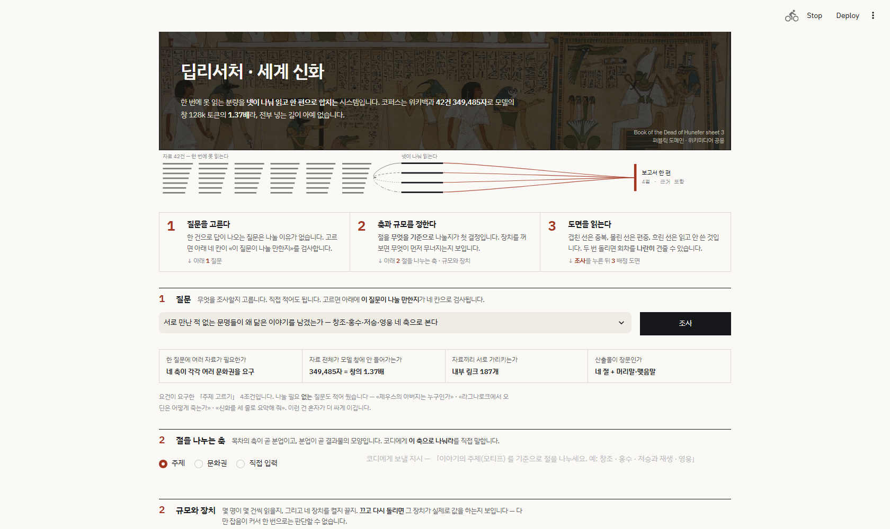

# 딥리서처 — 세계 신화 · 코디네이터 + 서브에이전트

**모듈5 노드9 [실습 프로젝트] 딥리서처 에이전트 만들기** · 김주영 · 2026-09-23

> 📄 왜 그렇게 짰나 · 절제 실험 · 어긋난 예측 → **[REPORT.md](REPORT.md)**

---

## 한 줄

「서로 만난 적 없는 문명들이 왜 닮은 이야기를 남겼는가」를 던지면,
**코디네이터가 목차를 짜고 조사관 넷을 동시에 파견해** 각자 한 절씩 써 오게 합니다.
세계 신화 위키 42건이 코퍼스이고, **정답표 없이** 채점하며,
**혼자 하는 대조군과 예산을 맞춰** 붙였습니다.

---

## 실행

```bash
pip install -r requirements.txt
cp .env.example .env          # OPENAI_API_KEY 를 채운다

python fetch_corpus.py        # 세계 신화 위키 42건 수집 (키 불필요)
python run.py                 # 질문 하나 → 보고서 + 계기판     (약 $0.012)
python baseline.py            # ★혼자 하는 대조군 + 공정성 점검
python baseline.py --fairness # 공정성만 (호출 없음)
python ablation.py --axis --runs 4   # ★절제 실험 + 축 비교 (약 $0.11)
streamlit run app.py          # ★데모 — 누가 뭘 읽고 뭘 썼나

python e2e.py                 # ★전 과정을 «실제로» 돌려 기록을 남긴다
python e2e.py --fresh         #   코퍼스를 지우고 위키부터 (키 불필요)
python redteam.py             # ★제출물 자체를 친다 (59항목)
python axis_test.py           # ★축이 실제로 갈리는지 «목차»로 잰다
```

---

## 여섯 노드

```
① plan       기획   카드(제목+앞 250자)를 보고 목차·역할·시작문서를 정한다
② dispatch   배치   Send 로 팬아웃. 각자에게 «남의 구역»을 들려 보낸다
③ researcher 조사   ★노드 «안»에 루프. 읽고 → 다음 후보 고르고 → 절 원고
④ review     점검   자기신고를 모아 빈 칸을 찾고 재위임. LLM 호출 0회
⑤ compose    종합   절을 이어 붙이고 머리말·맺음말
⑥ evaluate   평가   ★정답표 없이 잰다
                      │
                      └── ④ → ② 재위임 루프 (이중 종료 조건)
```

---

## 코퍼스

<!-- CORPUS:START -->

```
문서 42건 · 349,485자 (≈174,742 토큰) = 창 128k 의 ★1.37배
내부 링크 187개 · 문서당 평균 4.5
가장 긴 문서 «이슈타르» 34,037자
★링크 0개 3건 — 동명성왕 · 조지프 캠벨 · 카를 융
   ⇒ 링크를 타고는 «절대» 못 닿는다. 코디네이터가 카드를 보고
     직접 배정해야만 닿는 문서다.
```

*`config.json` · `data/corpus.json` 에서 찍어냅니다.*

<!-- CORPUS:END -->

---

## ★절을 «주제»로 나눴습니다 — 이게 이 프로젝트의 첫 결정

요건이 못 박았습니다 — 「목차의 축이 곧 분업이고, 분업이 곧 결과물의 모양이다.
**형식으로 나누면(개요·연표·분석) 전원이 같은 자료를 읽는다**」.

```
A 주제 축    창조 · 홍수 · 저승 · 영웅            ← 골랐다
B 문화권 축  메소포타미아 · 그리스 · 이집트 · 북유럽
⛔형식 축    개요 · 연표 · 분석                   요건이 이름 붙여 경고한 나쁜 예
```

**B 를 버린 결정적 이유** — 한국어 위키에서 「주제」 문서는 **토막글**입니다
(창조 신화 2,070바이트 · 트릭스터 2,331 · 중국 신화 666). 내용은 **문화권·개별 신**
문서에 있습니다. ⇒ 「창조 담당」은 그리스·메소포타미아·이집트·한국 문서를 **찾아** 읽어야
하는데 **링크를 타고는 못 닿습니다.** ★**배정이 유일한 경로**가 됩니다.

⇒ 말로 두지 않고 **ablation 의 스위치로 넣어 A·B 를 같은 예산으로 돌렸습니다.**
근거는 `config.json` 의 `_축`, 결과는 [REPORT.md](REPORT.md) §5.

---

## 계기판 — 정답표도 판정 모델도 쓰지 않습니다

지표마다 **어느 장치를 보는 신호인지**를 `metrics.py` 의 `지표사전` 이 갖고 있습니다
(문서에만 적으면 코드와 갈립니다).

| 지표 | 종류 | 어느 장치 | 한 줄 |
|---|---|---|---|
| 근거율 | 신호 | 깊이·재위임 | 문장 중 출처가 붙은 비율 |
| **허위 인용** | ★경보 | 격리·프롬프트 | 안 읽은 문서를 인용했다 |
| **표기 흔들림** | ★경보 | 제목 복사 지시 | 읽은 문서를 «틀린 이름»으로 불렀다 |
| 읽고 안 쓴 | 신호 | 배정 품질 | 예산을 쓰고 버린 문서 |
| 편중 | 신호 | 구역 분할 | 인용이 한 문서에 몰린 정도 |
| 중복률 | 신호 | 배정·구역 | 두 절 이상이 같은 문서를 읽은 비율 |
| **인용 0곳 절** | ★경보 | 조사 실패 | 자료 없이 쓴 절 |
| 격리율 | 신호 | 컨텍스트 격리 | 코디가 본 글자 ÷ 팀이 읽은 글자 |

⛔**버린 지표 셋** — 가독성 점수 · 문체 일관성 · 인용 밀도 분산.
**잴 수는 있었지만 «어느 장치»를 보는지 한 줄로 못 적어서** 버렸습니다
(요건: 「설명이 한 줄로 안 되는 지표는 버립니다」).

---

## ★절제 실험

<!-- ABL:START -->

```
조건                     근거율        편중      중복률   안쓴  호출   자수
 전부 켬 (기준선)              59.8%±22.9  26.0%    50.0%  1.4   26   2362
 배정 끔                    66.5%±8.8   40.4%    43.2%  2.2   30   2191
 구역 끔                    65.7%±19.1  25.6%    43.3%  1.4   26   2450
 역할 끔                    68.5%±12.1  24.1%    37.8%  1.8   26   2272
 재위임 끔                   66.1%±20.6  27.3%    50.0%  1.4   26   2312
 카드 앞부분만                 73.9%±13.8  21.8%    50.0%  0.8   26   2463
★기준선 (재측정)               62.9%±18.0  25.6%    38.4%  1.6   26   2375
★축 A(명단만) — 주제           56.1%±14.2  23.8%    50.0%  1.2   26   2346
★축 B(명단만) — 문화권          66.0%±13.0  24.9%    50.0%  1.6   26   2495
★축 A(지시) — 주제            66.8%±16.4  21.7%    37.8%  1.2   26   2275
★축 B(지시) — 문화권           67.7%±20.6  28.7%    18.3%  1.8   26   2351
★solo (대조군)              24.4%±36.2  11.7%     0.0%  3.4   14   2165
```

### ★잣대 — 「전부 켬」·「기준선(재측정)」·「축 A」는 **완전히 같은 설정**입니다

```
같은 설정 15회 «원시값»
  48.6 · 51.4 · 52.8 · 52.9 · 55.6 · 55.6 · 58.8 · 59.5 · 60.6 · 61.1 · 61.8 · 62.9 · 64.7 · 73.5 · 74.3
  최소 48.6%  최대 74.3%   →  ★잡음 폭 25.6%p

장치를 바꾼 조건들의 «평균» 범위   56.1 ~ 73.9%  →  차이 17.8%p

⇒ ★잡음(25.6)이 차이(17.8)보다 «크다».
  이 지표로는 ★어떤 장치도 가를 수 없다.

단 하나 예외 — solo
  solo  4.8 · 23.7 · 24.2 · 28.6 · 40.9
  solo 최대 40.9%  vs  팀 최소 48.6%   →  ★겹치지 않는다
```

★**평균끼리 견주면 잡음이 «사라진 것처럼» 보입니다** — 같은 설정 세 묶음의 평균은 59.8 / 62.9 / 56.1 로 6.8%p 안이었습니다. 원시값(25.6%p)을 펴야 보입니다.

*이 블록은 `output/ablation.json` 에서 `sync_numbers.py` 가 찍어냅니다 — 손으로 옮기지 않습니다. 5회 평균 ± 폭.*

<!-- ABL:END -->

---

## 대조군이 «공정»한지 — 주장하지 않고 찍습니다

```
✅ 같은 코퍼스    42건 (팀과 같은 DOCS 객체)
✅ 같은 모델     gpt-4o-mini (config.json 의 그 값)
✅ 같은 도구     agent.ask · agent.read_one · agent.cards ← 팀이 쓰는 함수를 그대로
✅ ★예산 소진    요구 12건 / 실제 12건
   참고 — 팀이 읽은 문서 9건 / 대조군 12건
   ⇒ 대조군이 팀보다 «적지 않게» 읽었다. 묶어 두지 않았다.
```

요건: 「**예산을 다 쓰는지 확인하세요. 중간에 멈추면 이긴 것이 아니라 상대를 묶어 둔
것입니다**」. 그래서 `baseline.py` 가 돌 때마다 이 표를 찍고, 모델이 예산보다 적게
고르면 **자동으로 채워 줍니다** — 「혼자가 못한다」와 「혼자에게 덜 줬다」는 다릅니다.

---

## 폴더

```
data/corpus.json      문서 42건 + 내부 링크
data/questions.json   질문 + ★「왜 나눌 만한가」 + ⛔나눌 필요 «없는» 반례
config.json           ★도메인 값의 «유일한» 출처 (절수·예산·역할명단·축 근거)
graph.py              6노드 LangGraph · 리듀서 · Send 팬아웃 · 이중 종료
metrics.py            정답표 없는 계기판 + ★지표사전
baseline.py           ★혼자 하는 대조군 + 공정성 점검
ablation.py           절제 실험 (--axis 로 ★축 비교 · --runs N)
sync_numbers.py       ★표를 «찍어낸다» — 손으로 옮기지 않는다
app.py                데모 — ★절마다 누가 뭘 읽고 뭘 썼나
fetch_corpus.py       위키 수집 (429 를 «묶기»로 푼 기록이 주석에)
probe_titles.py       ★제목이 실재하는지 «찾아본다» (추측으로 안 메운다)
output/runs.jsonl     회차 누적 · reports/ 보고서 · ablation.json · baseline.jsonl
```

---

## 화면



```bash
streamlit run app.py        # 로컬 실행까지가 필수 요건입니다
```

```
표제       사자의 서 파피루스 (퍼블릭 도메인 · 위키미디어 공용)
1 질문     고르거나 직접 적습니다. 네 칸이 «나눌 만한지»를 검사합니다
2 축·규모  ★절을 «무엇을 기준으로» 나눌지 — 직접 입력도 됩니다
3 배정 도면 겹친 선 = 중복 · 몰린 선 = 편중 · 흐린 선 = 읽고 안 씀
판독       도면에서 읽히는 것을 «문장»으로
잡음 띠     같은 설정 15회 범위 안에 이번 값이 들어가면 ★못 읽는 차이입니다
회차 비교   두 번 돌리면 쌓이고, 둘을 골라 견줄 수 있습니다
절 원고     카드가 아니라 본문 조판. 근거에만 강조색
격리 단면   코디가 본 글자 ÷ 팀이 읽은 글자
```

★**왜 이렇게 생겼는지 · 화면을 세 번 만든 이유 · AI 표식 9개를 밟고 있었던 것**은
**[REPORT.md](REPORT.md) §9** 에 있습니다. 디자인 결정의 출처는
**[DESIGN.md](DESIGN.md)** 한 곳입니다.

---

## 피어리뷰 하시는 분께

**키 없이도 검증할 수 있게** `output/` 을 커밋해 뒀습니다.

| 보실 것 | 파일 |
|---|---|
| 회차별 실행 기록 | `output/runs.jsonl` — 답변·읽은 문서·인용·설정까지 |
| 절제 실험 원시값 | `output/ablation.json` 의 `_회차별` |
| 대조군 | `output/baseline.jsonl` + 공정성 필드 |
| 보고서 여러 편 | `output/reports/` |
| 고친 과정 | `output/fixlog.md` — ★허위 인용 경보를 열어 보니 오타였던 건 |

**제가 아는 약점은 [REPORT.md](REPORT.md) §7 에 먼저 적어 뒀습니다.**
