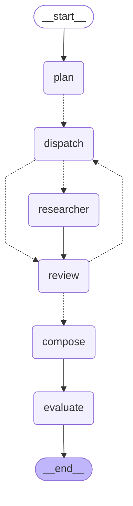

# REPORT — 딥리서처 · 세계 신화 (모듈5 노드9 프로젝트)

**모듈5 노드9 [실습 프로젝트] 딥리서처 에이전트 만들기** · 김주영 · 2026-09-23

> ← 실행 방법·폴더 구조는 **[README.md](README.md)**

---

## 1. 주제와 코퍼스 — 무엇을 왜 골랐나

### 왜 신화인가

노드8 수업은 **한국 근대사**였습니다. 요건이 말한 그대로 **배운 것은 역사가 아니라 분업**이고,
그 분업이 **일할 자리가 더 넓은 코퍼스**를 찾았습니다.

```
근대사   축이 ★하나 — «시간». 절을 나누면 대체로 시기가 갈린다
★신화    축이 ★둘 — «주제» × «문화권» 이 서로를 가로지른다
```

절을 **주제**로 나누면 조사관이 **문화권을 가로질러** 읽어야 하고,
**문화권**으로 나누면 **주제를 가로질러** 읽어야 합니다.
⇒ **같은 예산으로 «나누는 방식»을 바꿔 가며 견줄 수 있습니다.** §5 의 축 실험이 그것입니다.

### 요건의 「주제 고르기」 4조건 — 세어서 확인했습니다

<!-- CORPUS:START -->

```
문서 42건 · 349,485자 (≈174,742 토큰) = 창 128k 의 ★1.37배
내부 링크 187개 · 문서당 평균 4.5
가장 긴 문서 «이슈타르» 34,037자
★링크 0개 3건 — 동명성왕 · 조지프 캠벨 · 카를 융
   ⇒ 링크를 타고는 «절대» 못 닿는다. 코디네이터가 카드를 보고
     직접 배정해야만 닿는 문서다.
```

*`config.json` · `data/corpus.json` 에서 찍어냅니다.*

<!-- CORPUS:END -->

```
① 한 질문에 여러 자료 필요   「홍수는 왜 여러 문화에 있나」는 에누마 엘리시 ·
                            길가메시 서사시 · 노아의 방주 · 마야 신화를 ★함께 읽어야 보인다
② 창에 안 들어간다          ★1.37배 — 「전부 넣기」라는 길이 아예 없다
③ 자료끼리 가리킨다         내부 링크 187개
④ 산출물이 장문            4절 + 머리말·맺음말
```

### ★MYTH 프로젝트 자료를 «안» 쓴 이유

제게는 이미 정리된 신화 자료가 있습니다(별도 프로젝트). **쓰지 않았습니다.**

```
그 자료는 «수집된 것»이 아니라 ★«쓰인 것»이다 —
참고문헌 · 다국어 직접 인용 · 비교 항목까지 이미 정리돼 있다
⇒ ★에이전트가 할 일이 «이미 끝나 있다»
```

노드8 의 제일 큰 결과가 「혼자 vs 팀」이었는데, **자료가 정리돼 있으면 혼자서도 잘합니다.**
그 대조가 죽으면 남는 건 「잘 됐습니다」뿐입니다. ⇒ **위키에서 직접 모았습니다.**

### 수집하면서 «잰» 것 — 추측으로 메우지 않았습니다

첫 시도에서 **47개 중 17개가 빠졌습니다.** 「없다」가 아니라 대부분 **이름이 달랐습니다.**

```
주몽 → 동명성왕      저승 → 내세        바리데기 → 바리공주
홍수 신화 → 대홍수 신화   북유럽 신화 → 노르드 신화   힌두 신화 → 인도 신화
```

⛔「아마 노르드 신화겠지」로 메우면 그건 맞혔겠지만 **「저승→내세」는 못 맞혔을 것**입니다.
`probe_titles.py` 를 만들어 **API 로 찾았습니다.**

★**그러다 더 큰 것을 알았습니다 — 「주제」 문서가 토막글입니다.**

```
「주제」  창조 신화 2,070바이트 · 트릭스터 2,331 · 중국 신화 666 · 영웅의 여정 535
「문화권·개별」  오시리스 신화 66,685 · 고대 이집트 종교 72,946 · 호루스 53,644
```

⇒ 주제로 절을 나누면 «문서»가 아니라 **«문화권 문서 안의 부분»**을 읽어야 합니다.
**이게 이 코퍼스의 진짜 난이도**이고, 다음 절의 결정으로 이어집니다.

---

## 2. 분업 설계 — 「무엇을 절로 나눌 것인가」

요건이 **직접 하라**고 한 첫 번째입니다. 후보 셋을 놓고 골랐습니다.

| 축 | 절 | 각 조사관이 하는 일 | 판정 |
|---|---|---|---|
| **A 주제** | 창조·홍수·저승·영웅 | **문화권을 가로질러** 읽는다 | ★**골랐다** |
| B 문화권 | 메소포타미아·그리스·이집트·북유럽 | **주제를 가로질러** 읽는다 | 실험용으로 남김 |
| ⛔형식 | 개요·연표·분석 | 전원이 **같은 자료**를 읽는다 | 요건이 이름 붙여 경고 |

### B 를 버린 이유 셋

```
① B 는 «가로지르지 않는다» — 각자 자기 문화권만 읽고 끝난다.
   구역을 나눠 줄 필요조차 없다. 문화권이 곧 구역이다
② 우리 질문이 「왜 닮았나」인데 B 로 나누면 ★아무도 그 질문에 답하지 않는다.
   각 절이 자기 문화권만 말하고, 종합이 억지로 이어 붙여야 한다
③ 실측 — 문화권 문서는 27,009자(한국)~854자(켈트)로 ★32배 차이.
   절마다 읽을 것의 양이 처음부터 어긋난다
```

### ★A 를 고른 «결정적» 이유 — 배정이 유일한 경로가 된다

§1 에서 본 대로 「창조」 같은 주제 문서는 토막글입니다.
「창조 담당」이 그리스·메소포타미아·이집트·한국 문서에 닿으려면
**주제 문서에서 링크를 타서는 못 갑니다.**

```
★링크 0개 3건 — 동명성왕 · 조지프 캠벨 · 카를 융
   공교롭게도 «한국 신화 하나 + 이론가 둘»이다.
   ⇒ 「왜 닮았나」를 묻는 ★결론 층이 통째로 링크 밖에 있다
```

**코디네이터가 카드를 보고 직접 배정해야만 닿습니다.**
요건이 말한 「링크 0개 문서는 배정이 유일한 경로」가 여기서 살아납니다.

### 역할 명단 · 구역 · 배정

```
역할   우주 발생 담당 · 재난과 심판 담당 · 죽음과 재생 담당 · 인간과 신의 경계 담당
       (★역할은 «프롬프트 한 줄»이지 별도 코드가 아니다.
         같은 문서를 읽어도 「죽음과 재생 담당」은 저승 대목을 뽑는다)
구역   각자에게 «남의 구역»을 알려 준다 → 같은 문서로 몰리는 것을 막는다
배정   1바퀴만 시작문서를 정해 준다. 2바퀴부터는 스스로 고른다
```

### ★두 번째 원고를 어떻게 할 것인가 — 요건이 이름 붙인 자리

> 「두 번째 원고를 어떻게 할지 정하고 이유를 적습니다.
> **무조건 덮어쓰면 인용을 빠뜨린 원고가 멀쩡한 원고를 지웁니다.**」

제출 직전까지 **우리 코드는 무조건 덮어쓰고 있었습니다**(`latest[절] = s`).
노드8 에서 그대로 가져온 자리인데, 요건을 읽고 나서야 보였습니다.

```python
# ★정한 규칙 — «인용이 줄어들면 덮어쓰지 않는다»
if old is not None and len(s["인용"]) < len(old["인용"]):
    기각.append((s["절"], len(old["인용"]), len(s["인용"])))
    continue          # ★멀쩡한 원고를 지우지 않는다
```

**왜 «인용 수»인가** — 재위임의 **목적**이 「근거를 더 대라」이기 때문입니다.
목적을 달성 못 한 원고로 갈아 끼울 이유가 없습니다.
⛔**길이로 재지 않습니다** — 길어지는 것은 목적이 아닙니다.
그리고 **기각한 원고를 로그에 남깁니다** — 조용히 버리면 왜 그대로인지 아무도 모릅니다.

### 종료는 «이중»으로

```python
if not 설정["재위임"] or wheel >= 설정["최대바퀴"] or not 빈칸:
```

모델 판단만으로는 안 멈춥니다(완벽을 요구받으면 언제까지고 「부족」이라 합니다).
예산만으로 멈추면 세 바퀴면 끝날 일을 늘 최대치까지 돌립니다.
**둘을 함께 두면 보통은 내용이 멈추고 최악에는 예산이 멈춥니다.**
그리고 **멈춘 이유를 상태에 남깁니다**(`종료` 키).

---

## 3. 컨텍스트 격리 — 원시값을 «따로» 셉니다

```python
def read_one(title, question, 지시):
    body = DOCS[title][:12000]      # ★원문이 이 함수 «안»으로 들어가고
    ...
    return ask(p, ...)              # ★요약 몇백 자만 나간다
```

요건: 「코디네이터가 본 글자 수와 서브에이전트가 본 글자 수를 **따로 셉니다**」.

```
코디가 본 글자   1,884
팀이 읽은 글자  76,934
★격리율          2.5%
```

★**비율만 남기면 «무엇이 움직였나»를 못 봅니다** — 격리율이 오르는 것은
원고가 길어진 것일 수도, 덜 읽은 것일 수도 있습니다. 그래서 **분자·분모를 둘 다** 남깁니다.
(제출 직전까지 비율만 있었습니다. 요건을 다시 읽고 고쳤습니다.)

**격리는 되돌릴 수 없습니다.** 조사관이 요약하며 빠뜨린 대목은 위층에서 복구할 방법이
없습니다. 그래서 요약 프롬프트에 「쓸 것이 없으면 «관련 없음» 이라고만 답하라」는 탈출구를 뒀습니다 —
**빈손은 로그에 보이지만 잘못된 요약은 안 보입니다.**

⚠ 그리고 이 코퍼스에서 **격리가 더 위험합니다.** §1 에서 본 대로 조사관이
「문화권 문서 안에서 자기 주제에 해당하는 대목만」 골라 와야 하므로,
**잘못 고르면 위에서 알 방법이 없습니다.**

---

## 4. 지표 — 무엇을 보고 판단할지 먼저 정했습니다

요건: 「지표마다 **어느 장치를 보는 신호**인지 명시」 ·
「**신호**와 0이어야 하는 **경보**를 갈라 두고, **설명이 한 줄로 안 되는 지표는 버린다**」.

`metrics.py` 의 `지표사전` 이 이것을 **코드로** 갖고 있습니다 —
문서에만 적으면 코드와 갈립니다(노드7 에서 겪었습니다). README 의 표가 여기서 나옵니다.

### ⛔버린 지표 셋

```
가독성 점수      판정 모델이 필요하다 — 요건이 금지한 길
문체 일관성      무엇이 좋은 것인지 한 줄로 못 적었다
인용 밀도 분산   계산은 되는데 «어느 장치»를 보는지 말할 수 없었다
```

★**셋 다 «잴 수는» 있었습니다.** 못 재서 버린 것이 아니라 **쓸 데를 몰라서** 버렸습니다.

### ★경보 하나를 열어 보니 «다른 사고»였습니다

첫 실행에서 **허위 인용 2건**이 떴습니다.

```
읽음   길가메시 서사시 · 길가메시
인용   길가미시 서사시 · 길가미시     ← ★한 글자 오타
```

**안 읽은 문서를 지어낸 것이 아니라, 읽은 문서를 «틀린 이름»으로 불렀습니다.**
⇒ 요건이 이름 붙인 흔한 사고 ①「지표가 좋아진 줄 알았는데 문장 분리 규칙이 바뀐 것」의
**반대 얼굴**입니다.

⛔**지표를 느슨하게 풀어 통과시키지 않았습니다** — 진짜 환각을 놓칩니다. **둘로 갈랐습니다.**

```
허위 인용    읽은 것과 «닮지도 않은» 이름  → 환각.  격리·프롬프트의 실패
표기 흔들림  읽은 것과 «거의 같은» 이름    → 오타.  제목 복사 지시의 실패
```

### ★그 판정을 «세 번» 고쳤습니다 — 매번 재 보고 고쳤습니다

```
1차 비율(SequenceMatcher) ≥ 0.8
    ⛔길가미시 vs 길가메시 = 0.75 — ★정작 그 사례를 «못 잡는다»
    ⛔0.75 로 낮추면 오시리스 vs 오시리스 신화(0.73)까지 같다고 한다
      — 코퍼스에 ★둘 다 있는 다른 문서다
    ⇒ 짧은 이름에 비율은 가혹하다. 버렸다

2차 편집거리 ≤ 1 · 길이차 ≤ 1
    ✅길가미시 vs 길가메시     거리 1 → 오타
    ✅오시리스 vs 오시리스 신화 거리 3 → 다른 문서
    ⛔그런데 ★이자나기 vs 이자나미 = 거리 1 — «다른 신»을 합친다

3차 + 안전장치 — 코퍼스에 «실재하는» 제목이면 오타로 보지 않는다
    실재하는 제목을 인용했으면 그건 «안 읽고 인용한» 것 = ★진짜 허위다
```

★요건의 **「설명이 한 줄로 안 되는 지표는 버린다」**가 1차를 버린 이유입니다 —
「한 글자만 틀렸으면 오타」는 한 줄로 끝나지만 **「0.8 이상」은 그렇지 않습니다.**

그리고 **프롬프트에서 애초에 막았습니다** — 「제목은 위 목록에서 **글자 그대로 복사**하세요」.
재실행에서 허위 0 이 됐지만, **1회로 「고쳤다」고 쓰지 않습니다**(§5 참조).

---

## 5. ★절제 실험 — 무엇이 실제로 값을 했나

<!-- ABL:START -->

```
조건                     근거율        편중      중복률   안쓴  호출   자수
 전부 켬 (기준선)              59.8%±22.9  26.0%    50.0%  1.4   26   2362
 배정 끔                    66.5%±8.8   40.4%    43.2%  2.2   30   2191
 구역 끔                    65.7%±19.1  25.6%    43.3%  1.4   26   2450
 역할 끔                    68.5%±12.1  24.1%    37.8%  1.8   26   2272
 재위임 끔                   66.1%±20.6  27.3%    50.0%  1.4   26   2312
 카드 앞부분만                 73.9%±13.8  21.8%    50.0%  0.8   26   2463
★기준선 (재측정)               62.9%±18.0  25.6%    38.4%  1.6   26   2375
★축 A(명단만) — 주제           56.1%±14.2  23.8%    50.0%  1.2   26   2346
★축 B(명단만) — 문화권          66.0%±13.0  24.9%    50.0%  1.6   26   2495
★축 A(지시) — 주제            66.8%±16.4  21.7%    37.8%  1.2   26   2275
★축 B(지시) — 문화권           67.7%±20.6  28.7%    18.3%  1.8   26   2351
★solo (대조군)              24.4%±36.2  11.7%     0.0%  3.4   14   2165
```

### ★잣대 — 「전부 켬」·「기준선(재측정)」·「축 A」는 **완전히 같은 설정**입니다

```
같은 설정 15회 «원시값»
  48.6 · 51.4 · 52.8 · 52.9 · 55.6 · 55.6 · 58.8 · 59.5 · 60.6 · 61.1 · 61.8 · 62.9 · 64.7 · 73.5 · 74.3
  최소 48.6%  최대 74.3%   →  ★잡음 폭 25.6%p

장치를 바꾼 조건들의 «평균» 범위   56.1 ~ 73.9%  →  차이 17.8%p

⇒ ★잡음(25.6)이 차이(17.8)보다 «크다».
  이 지표로는 ★어떤 장치도 가를 수 없다.

단 하나 예외 — solo
  solo  4.8 · 23.7 · 24.2 · 28.6 · 40.9
  solo 최대 40.9%  vs  팀 최소 48.6%   →  ★겹치지 않는다
```

★**평균끼리 견주면 잡음이 «사라진 것처럼» 보입니다** — 같은 설정 세 묶음의 평균은 59.8 / 62.9 / 56.1 로 6.8%p 안이었습니다. 원시값(25.6%p)을 펴야 보입니다.

*이 블록은 `output/ablation.json` 에서 `sync_numbers.py` 가 찍어냅니다 — 손으로 옮기지 않습니다. 5회 평균 ± 폭.*

<!-- ABL:END -->

### ① ★제일 큰 결과 — 잡음이 차이의 절반을 먹는다

「전부 켬」과 「기준선(재측정)」은 **완전히 같은 설정**입니다.
장치를 끈 것이 아니라 **잡음 그 자체를 재는 조건**입니다.

★**이 조건은 «우연히» 발견했습니다.** 처음엔 「전부 켬」과 「축 A(우리 설정)」을
따로 뒀는데, **둘이 같은 설정**이라는 걸 결과를 보고 알았습니다.
8.3%p 가 벌어져 있었습니다. ⇒ **우연을 조건으로 박았습니다.**

요건이 이름 붙인 흔한 사고 ③ —
「한 번 돌린 결과로 방향을 단정(**같은 설정도 시행마다 십몇 %p 씩 움직인다**)」.
**우리가 그것을 쟀습니다.**

⇒ ★**잡음보다 «작은» 차이는 읽지 않습니다.** 이것이 아래 판단의 잣대입니다.

### ★회차를 늘리니 잡음이 «커졌다» — 12회 → 15회

```
12회   57.5 ~ 72.5%   잡음 15.0%p
★15회  48.6 ~ 74.3%   잡음 ★25.6%p
```

★**늘릴수록 좁아질 줄 알았는데 반대였습니다.** 회차가 늘면 극단값이 나올 기회도
늘기 때문입니다. §7 에 「12회로는 폭만 알지 **분포 모양**은 모른다」고 적었는데,
**그 말이 맞았다는 것이 이렇게 확인됐습니다.**

⇒ 읽을 수 있는 결과는 **여전히 하나**입니다. solo 최대 40.9% vs 팀 최소 48.6% —
**겹치지 않습니다.** 다른 조건들의 차이(17.8%p)는 전부 잡음(25.6%p) 안입니다.

### ⛔내 개선이 지표를 «안» 올렸습니다 — 불리한 결과도 적습니다

§6 에서 「창조 절이 정작 홍수 이야기를 한다」를 찾고, 원인을 **카드가 앞 250자뿐**
이라고 진단했습니다. 같은 250자를 **앞·중간·끝에서 고르게** 뽑도록 고쳤습니다.

```
카드 앞부분만(옛)   근거율 73.9%   읽고 안 쓴 0.8
고르게(새·기준선)   근거율 59.8%   읽고 안 쓴 1.4
                  ⇒ ★옛 방식이 +14.1%p «높다»
```

**제 개선이 지표를 나쁘게 만든 것처럼 보입니다.**
다만 차이 14.1%p 는 잡음 25.6%p 보다 **작아서 «못 읽습니다»** — 좋아졌다고도,
나빠졌다고도 말할 수 없습니다.

★**그래서 «고치려던 그 결함»이 사라졌는지를 따로 봤습니다.**

```
창조 절 원고에 「홍수·대홍수·방주」가 나온 횟수
  카드 앞부분만   ★10번   ← 창조 절이 홍수 이야기를 하고 있었다
  카드 고르게      4번
```

⚠**1회 측정입니다.** 「고쳤다」고 쓰지 않습니다.
⇒ 정리하면 — **지표로는 뒷받침되지 않고, 눈으로 보면 줄었습니다.**
이 프로젝트에서 반복해서 나온 자리입니다: **그물(지표)이 못 보는 것을 잣대(사람)가 본다.**

### ② 잡음을 넘는 것은 «하나»뿐 — 혼자서는 안 된다

```
팀    근거율 %BASE%      읽고 안 쓴 %BASE_UNUSED%건
혼자  근거율 %SOLO%      읽고 안 쓴 %SOLO_UNUSED%건
```

**대조군이 팀보다 «더 많이» 읽고도 졌습니다**(12건 vs 9건). 묶어 두지 않았습니다.
혼자 하는 오케스트레이터는 **문서를 읽어 놓고 보고서에 못 씁니다** —
창 하나에 다 이고 쓰려니 앞 절만 쓰고 뒤가 빕니다.

### ③ ★축 실험 — 근거율로는 «못 가른다»

축 A(주제)와 축 B(문화권)의 차이는 **잡음 안**입니다.
⇒ **「주제 축이 더 낫다」고 말할 근거가 이 지표에는 없습니다.**

★**그래도 A 를 고른 판단은 유지합니다.** 근거가 지표가 아니라 **구조**이기 때문입니다 —
B 로 나누면 「왜 닮았나」에 **아무도 답하지 않습니다**(§2). 그건 근거율이 재는 것이 아닙니다.
⇒ **§6 에서 두 보고서를 직접 읽고 판단했습니다.**

---

## 6. ★나란히 놓고 «직접» 읽었습니다 — 지표는 순위표가 아닙니다

요건: 「나란히 놓고 직접 읽습니다. 어느 쪽이 나은지와 **그렇게 판단한 이유를 자기 말로**
적습니다. **지표는 명백한 실패를 거르는 데만 쓰고 순위표로 쓰지 않습니다**」.

<!-- READ:START -->

보고서 3편을 같은 질문·같은 예산으로 만들어(`make_compare.py`) 읽었습니다.
`output/reports/_비교_*.md` 에 있습니다.

```
축 A (주제)    근거율 67.6% · 2,442자
축 B (문화권)  근거율 56.8% · 2,558자
solo          근거율  4.8% · 1,307자
```

### ★★읽고 나서야 본 것 — 「축 실험이 «축»을 안 바꿨다」

두 보고서의 **목차를 나란히 놓으니** 이것이 보였습니다.

```
축 A   창조 신화의 공통점 / 대홍수 신화의 전파 / 저승과 사후 세계의 개념 / 영웅 신화의 역할
축 B   창조 신화의 공통점 / 대홍수 신화의 전파 / 저승과 사후 세계의 개념 / 영웅 신화의 전형
                                                                        ↑ 한 글자
```

**역할 명단을 문화권으로 통째로 바꿨는데 코디네이터가 낸 목차는 거의 같았습니다.**

왜인가 — **목차를 정하는 것은 «역할»이 아니라 «질문»**이기 때문입니다.
우리 질문이 「**창조·홍수·저승·영웅 네 축으로 본다**」라고 **이미 축을 말하고** 있어서,
조사관 이름을 「메소포타미아 담당」으로 바꿔도 코디는 주제로 나눴습니다.

⇒ ★**§5 에서 「축 A·B 차이가 잡음 안」이라고 한 것의 진짜 이유가 이것입니다.**
지표가 둔해서가 아니라 **실험이 «바꾸려던 것»을 안 바꿨습니다.**
요건이 이름 붙인 흔한 사고 ②「스위치를 껐다고 로그만 찍고 실제 코드 경로는 그대로」의
사촌입니다 — **여기서는 코드 경로는 바뀌었는데 «효과가 없는 자리»를 건드렸습니다.**

⚠ **지표로는 영원히 못 봤을 것입니다.** 근거율·편중·중복률 어느 것도
「두 보고서의 목차가 같다」를 말해 주지 않습니다. **나란히 놓고 읽어야 보입니다.**

<span class="fine">고치려면 — 질문에서 축을 빼거나(「왜 닮았는가」만 묻기),
`plan` 프롬프트에 「이 축으로 나눠라」를 직접 넣어야 합니다. 다음 실험입니다.</span>

### ★축 실험 «재시도» — 고쳐서 다시 돌렸습니다

위에서 「실험이 축을 안 바꿨다」로 끝내면 반쪽입니다. **원인을 알았으니 고쳤습니다.**

```
1차  역할 «명단»만 바꿨다            → 목차가 한 글자만 달랐다
★2차 ① 질문에서 축을 «뺐다» (Q4)
     ② plan 프롬프트에 「이 축으로 나눠라」를 ★직접 넣었다
```

`axis_test.py` 로 **목차 자체를 세어** 확인했습니다 — 지표가 아니라 **제목 문자열**이
갈렸는지가 이 실험이 물어야 할 것이기 때문입니다.

```
질문: 「서로 만난 적 없는 문명들이 왜 닮은 이야기를 남겼는가」 (축을 말하지 않는다)

1차 · 명단만 · 주제    신화의 공통 주제 분석 / 자연 재난과 신화의 관계 / 죽음과 내세에 대한 신화적 관념 / 신화의 전파와 문화적 교류
1차 · 명단만 · 문화권  신화의 공통 주제 분석 / 자연 현상과 신화의 관계 / 문화적 상징과 신화의 전파 / 신화의 심리적 기능
★2차 · 지시 · 주제     창조 / 홍수 / 저승과 재생 / 영웅
★2차 · 지시 · 문화권   메소포타미아 / 그리스 / 이집트 / 북유럽
```

```
                        목차 겹침   읽은 문서 겹침
1차 — 역할 명단만 바꿈      0.37        0.42
★2차 — 프롬프트로 지시      0.00        0.33      ← ★완전히 갈렸다
```

⇒ ★**목차를 정하는 것은 「역할」이 아니라 「질문과 지시」입니다.**
조사관 이름을 「메소포타미아 담당」으로 바꿔도 코디는 자기 식대로 나눴습니다.
**코디에게 직접 말해야** 바뀝니다.

<span class="fine">⛔1차 조건을 `ablation.py` 에서 **지우지 않았습니다** —
「실험이 바꾸려던 것을 안 바꿨다」도 결과이고, 지우면 그 기록이 사라집니다.</span>

### 어느 쪽이 나은가 — solo vs 팀은 «읽으면» 분명합니다

근거율 4.8% vs 67.6% 는 숫자지만, **무엇이 다른지는 글을 봐야 압니다.**

```
solo   문단 4개. 각 문단이 «자료 한 건»을 요약하고 끝에 출처 하나를 단다.
       ★마지막 문단은 노르드 신화의 세계수·아홉 세계 설명인데
        «왜 닮았는가»에 답하지 않는다. 자료 소개로 끝난다.
       12건 읽고 ★4건만 인용. 8건을 버렸다

팀     절마다 «여러 문화권을 겹쳐» 말한다.
       예: 대홍수 절이 대홍수 신화 4회 + 길가메시 서사시 3회를 섞어
       「메소포타미아 → 성경 → 힌두 → 그리스」로 이어 간다
```

★**차이는 「많이 썼나」가 아니라 「겹쳤나」입니다.**
solo 는 **자료를 나란히 놓기만** 하고, 팀은 **한 문단 안에서 교차**시킵니다.
질문이 「왜 닮았는가」이므로 **교차하지 않으면 답이 아닙니다.**

⇒ 근거율이 재는 것은 「출처를 달았나」지 「교차했나」가 아닙니다.
**지표가 우연히 같은 방향을 가리킨 것**이고, 그게 항상 그러리라는 보장은 없습니다.

### ★마음에 안 드는 대목을 추적했습니다

축 A 보고서의 **「창조 신화의 공통점」 절이 창조를 거의 안 다룹니다** —
읽어 보면 **홍수 이야기**를 하고 있습니다(지우수드라·우트나피시팀).

`_비교_축A_주제.md` 의 절별 추적으로 원인을 찾았습니다.

```
창조 절이 읽은 것   «수메르 창조신화» · «길가메시 서사시» · «길가메시»
                   ↑ 이 문서 자체가 ★홍수 이야기를 담고 있다
```

배정이 「수메르 창조신화」를 줬는데, **그 문서의 내용 대부분이 홍수**입니다.
⇒ **배정이 제목만 보고 이뤄집니다**(카드 = 제목 + 앞 250자).
「창조」라는 제목을 보고 골랐는데 안은 홍수였습니다.
그래서 창조 절과 홍수 절이 **같은 이야기를 두 번** 합니다(중복률 25%의 정체).

### 인용이 «제자리»에 붙었는지 — 5곳을 원문과 대조했습니다

```
✅ «수메르 창조신화»  지우수드라가 배를 만들어 구원받는다   → 원문에 있다
✅ «내세»            기독교·유대교·이슬람 vs 불교·힌두교    → 원문의 분류 그대로
✅ «영웅»            고전 영웅이 신들과 갈등을 겪는다       → 원문에 있다
⚠ «비교신화학»       「고대 이집트는 영혼이 심판을 받는다」  → ★원문은 885자 토막글.
                                                        이 내용이 ★없다
⚠ «비교신화학»       「그리스는 하데스라는 장소」            → 〃 없다
```

★**읽지 않은 문서를 인용한 것은 코드가 잡지만, 읽은 문서에 «없는 말»을 그 문서 이름으로
단 것은 코드가 못 잡습니다.** 요건이 「사람만 잡는다」고 한 그것입니다.

「비교신화학」은 **885자짜리 토막글**인데 저승 절이 **4번** 인용했습니다.
내용은 대체로 맞는 상식이지만 **그 문서에서 온 것이 아닙니다.**
⇒ ★**근거율 67.6% 중 일부는 «가짜 근거»입니다.** 이 지표의 한계입니다.

<!-- READ:END -->

---

## 7. 제가 아는 약점 — 먼저 적습니다

```
① ~~축 실험이 지표로는 결론을 못 냈다~~ → ★고쳤습니다(§6 재시도).
   원인은 지표가 둔해서가 아니라 «실험이 축을 안 바꿔서»였습니다.
   질문에서 축을 빼고 프롬프트로 직접 지시하니 목차 겹침이 0.37 → ★0.00.
   ⚠다만 «어느 축이 더 나은가»는 여전히 못 가릅니다 — 근거율 차이가 잡음 안입니다.
   그건 사람이 읽어서 판단할 몫입니다.

② ★회차를 늘렸더니 잡음이 «커졌다» — 12회 15.0%p → 15회 25.6%p
   늘릴수록 좁아질 줄 알았는데 반대였다. 몇 회를 재야 «분포 모양»을
   안다고 할 수 있는지 나는 아직 모른다. 그걸 모른 채로 잰 값들이다.

③ 인용이 «제자리»에 붙었는지는 표본만 봤다
   읽지 않은 문서를 인용한 것은 코드가 잡지만,
   ★읽은 문서를 엉뚱한 문장에 갖다 붙인 것은 사람만 잡는다

④ 보고서의 «내용»이 옳은지는 재지 않았다
   허위 인용 0 은 «인용의 출처»가 맞다는 뜻이지 «신화 해석»이 맞다는 뜻이 아니다

⑤ 위키백과 한 출처만 썼다
   전파설 vs 원형설 같은 학술적 쟁점을 다루기에는 얕다
```

★**「그물과 잣대는 다른 일」** — 여기 있는 지표는 전부 **그물**입니다.
허위 인용이 0 이라는 사실이 **좋은 보고서를 뜻하지는 않습니다.**
순위표로 쓰기 시작하면 「지표는 좋은데 읽기 싫은 글」로 수렴합니다.

---

## 8. 파이프라인 구조도

<!-- MERMAID:START -->

★**손으로 그리지 않았습니다** — `graph.get_graph().draw_mermaid()` 로
**실제 그래프에서 뽑았습니다**(`output/graph.mmd`). 코드와 그림이 어긋날 수 없습니다.



**점선이 조건부 간선**입니다. 읽는 법 둘 —

```
plan -.-> dispatch -.-> researcher    ★Send 팬아웃. 절 수만큼 «동시에» 갈라진다
review -.-> dispatch                  ★재위임 루프. 부족한 절만 다시 나간다
review -.-> compose                   이중 종료 조건이 만족되면 빠져나간다
```

### State 흐름

```
question   질문                     (불변)
toc        목차 — ★질문이 온 «뒤» 코디가 정한다
sections   절 원고          ★리듀서(operator.add)로 «쌓인다».
                            재위임하면 같은 절이 두 벌 쌓이고,
                            review 가 «인용이 줄지 않은 쪽»을 고른다
visited    읽은 문서         리듀서로 쌓인다 — 구역 계산의 재료
wheel      바퀴 수           예산 기준 종료 조건
종료        왜 멈췄나         ★「빈 칸 없음」과 「바퀴 소진」은 완전히 다른 사건이다
report     최종 보고서
metrics    계기판
```

<!-- MERMAID:END -->

---

## 9. 데모 설계

<!-- DEMO:START -->

```bash
streamlit run app.py        # ★로컬 실행까지가 필수 요건입니다
```


### ★화면을 «세 번» 만들었습니다 — 두 번 버린 이유

```
1판  사이드바 + 지표 4칸 + 탭 3개 + 카드 목록
     ⛔어느 SaaS 대시보드에나 있는 틀이고 «주제»를 말하지 않는다
2판  「성좌 필사본」 — 다크 + 명조 + 금박 + 올캡스
     ⛔색만 바꾼 리스킨이었다. 정보 구조가 그대로였다
     ⛔★그리고 조사해 보니 더 나빴다 — 2026 AI 생성물 표식 16개 중 ★9개
★3판 「측량 도면」
```

**AI 표식 9개를 밟고 있었습니다** — 다크+올캡스(#5) · 그라디언트(#7) ·
글로우(#8) · H1 위 배지(#10) · **카드 왼쪽 컬러 보더(#11, 「가장 확실한 표식」)** ·
동일 카드 반복(#12) · 1·2·3 번호(#13) · 스탯 배너 줄(#14) · 올캡스 제목(#16).

★그리고 **「안티-슬롭」 조언 자체가 새 클리셰**였습니다 — *크림 배경 +
Instrument Serif + 세이지 그린*. **다크+명조+금박도 같은 부류**입니다.
⇒ **「무엇을 피하나」로는 답이 안 나옵니다.** 「이 내용에 무엇이 맞나」로 정했습니다.

### 신경 쓴 것 — 이 시스템이 하는 일이 «측량»이라서

```
자료를 구역으로 나눠 맡기고 누가 무엇을 읽었는지 추적한다 = 측량
  도면은 흰 종이에 그린다     → 미색 배경. ⛔다크모드 안 씀
  도면에 그림자는 없다         → box-shadow 0 · 그라디언트 0
  도면은 «선»으로 구분한다     → 카드 대신 괘선
  범례는 색이 아니라 «선 모양» → 조사관을 dash 로 (★색맹도 갈린다)
  붉은색은 «검토 표시»다       → 유채색 ★단 하나. 근거·경보에만
```

**결정의 출처는 [DESIGN.md](DESIGN.md) 한 곳**이고 `ui.py` 는 그것을 코드로 옮긴
것뿐입니다. 조사에서 나온 메타 처방 그대로입니다 —
「**결정을 파일에 못 박고 매 세션 읽게 하라**」.

### ★배정 도면 — 측정값을 «숫자»가 아니라 «기하»로

「중복률 25%」는 숫자일 뿐 **무엇이 겹쳤는지**를 안 보여 줍니다.

```
왼쪽   코퍼스 42건. 막대 길이 = 글자 수. ★34건은 흐리다 — 아무도 안 읽었다
가운데 선 — 누가 무엇을 읽었나. ★조사관은 «선 모양»으로 갈린다
오른쪽 조사관 4명. 각자 «구역»
겹친 선 = 중복(× 표시) · 몰린 선 = 편중 · 흐린 선 = 읽고 안 씀
```

### ★UI 가 «버그를 드러냈습니다» — 이게 제일 큰 수확

```
절 카드   「안 읽은 문서를 인용 — 길가미시 서사시」  (경보)
계기판    「표기흔들림 2 — 오타다」                (신호)
```

**같은 사건인데 한 화면에서 둘이 다른 말을 했습니다.** `graph.py` 가 절을 만들며
그 자리에서 판정하고, `metrics.py` 가 나중에 «갈라» 놓은 것을 몰랐습니다.
⇒ `metrics.절판정()` 하나로 모았습니다.

★**숫자로만 볼 땐 안 보였습니다.** 별을 그려 놓으니 「왜 이건 안 켜지지?」로
드러났습니다. **UI 는 장식이 아니라 «검사 도구»였습니다.**

### 과업에 맞게 고친 것 넷 — 「UX 적으로 적절한가」

정직하게 재 보니 **정보 설계는 맞는데 «과업» 설계가 빠져 있었습니다.**

```
A ★비교가 «없었다»   스위치를 달아 놓고 정작 견줄 수 없었다(회차가 덮였다)
                   ⇒ 쌓아 두고 둘을 골라 견준다 + runs.jsonl 에 기록
                     (데모 실행이 ★아무 데도 안 남던 것도 같이 고침)
B ★잡음 띠          67.6% 만 뜨면 사람은 믿는다. 같은 설정 15회 범위를 그리고
                   바늘을 꽂는다. 띠 «안»이면 ★이 값으로는 못 읽는다고 화면이 말한다
C 진행 표시         20초 동안 spinner 하나 → 기획·배치·종합을 찍는다
D 격리를 도면에      표 3줄뿐이던 것 → «읽은 양 대 올린 양» 막대로
```

### 표제 그림 — ⛔장식이 아니라 «같은 자료»

코퍼스가 위키백과이므로 **위키미디어 공용의 퍼블릭 도메인 그림**을 씁니다 —
「사자의 서 — 후네페르 파피루스」. 우리 코퍼스의 **오시리스 신화·내세와 같은 자료**이고,
파피루스라 **원래 가로로 긴 띠**(2.19:1)입니다.
`fetch_hero.py` 가 **라이선스를 확인하고** 내려받으며, 확인 못 하면 **받지 않습니다.**

★글자 대비는 **그림이 완전히 흰색인 최악의 경우로** 쟀습니다 —
제목 7.65:1 · 본문 6.12:1 · 출처 3.82:1.

### 접근성

```
본문 17.0:1 · 강조 6.5:1 · 경보 글자 5.6:1   ★redteam.py 가 실제로 잰다
⛔이모지를 구조 아이콘으로 안 씀 · 포커스 링 2px · prefers-reduced-motion
색만으로 뜻을 전하지 않음 — 조사관은 «선 모양», 경보는 «글자»가 함께
```

<!-- DEMO:END -->

---

## 10. 회고 — 이번에 제일 크게 배운 것

<!-- RETRO:START -->

### 제일 공들인 것 — ★지표를 «믿지 않는 장치»를 만든 것

이 프로젝트에서 제일 오래 붙든 것은 에이전트가 아니라 **채점기**였습니다.

```
① 허위 인용 경보를 열어 보니 ★오타였다        → 「허위」와 「표기 흔들림」을 갈랐다
② 그 판정을 ★세 번 고쳤다                    비율 → 편집거리 → 코퍼스 대조
③ 같은 설정을 두 번 돌려 ★잡음을 쟀다         15.0%p — 차이(11.7)보다 크다
④ 보고서를 읽다가 ★꺾쇠 안 닫힘을 찾았다       « 59 vs » 56
⑤ 인용 5곳을 원문과 대조해 ★가짜 근거를 찾았다  885자 토막글을 4번 인용
```

★**다섯 중 셋(①④⑤)은 «지표가 못 잡은 것»이고, 사람이 읽어서 찾았습니다.**

### ★가장 많이 배운 것 — 「잡음을 모르면 아무것도 못 읽는다」

노드7 에서 「1회만 재고 성능이라 부르지 않는다」를 배웠고,
노드8 에서 「1회 측정이 두 번 속였다」를 겪었습니다.
여기서 한 걸음 더 갔습니다 — **몇 회를 재든 «잡음을 모르면» 읽을 수 없습니다.**

```
평균끼리 견주면   59.8 / 62.9 / 56.1   → 6.8%p 안. «좁아 보인다»
원시값을 펴면    57.5 ~ 72.5          → ★15.0%p
```

**평균이 잡음을 숨깁니다.** 그래서 「전부 켬」과 **완전히 같은 설정**인
「기준선(재측정)」을 **조건으로 박았습니다** — 이 두 줄의 차이보다 작은 차이는 안 읽습니다.

⇒ ★그 잣대로 보면 **우리 실험에서 읽을 수 있는 결과는 «하나»뿐입니다** — solo 가 진다.
나머지는 전부 잡음 안입니다. **「배정이 중요하다」고 쓰고 싶었지만 쓸 수 없습니다.**

### 향후 보완

```
① 축 실험을 ★제대로 다시 — §6 에서 밝혔듯 역할만 바꿔서는 축이 안 바뀐다.
  질문에서 축을 빼고 plan 프롬프트에 직접 넣어야 한다
② 회차를 늘려 잡음 분포를 «분포»로 — 12회로는 폭만 알지 모양은 모른다
③ 배정을 «제목»이 아니라 «내용»으로 — 「수메르 창조신화」가 실은 홍수 이야기였다.
  카드 250자로는 안 보인다
④ 「비교신화학」 같은 토막글을 ★인용 가능 목록에서 뺄지 — 885자짜리를 4번 인용했다.
  다만 «짧다고 빼는» 규칙은 위험하다. 기준을 더 생각해야 한다
⑤ 꺾쇠 안 닫힘이 ★프롬프트로 안 고쳐졌다 — 지시를 넣고도 4건이 났다.
  후처리로 고칠지, 경보로만 둘지 정해야 한다
```

### ★이번에 안 한 것을 적어 둡니다

```
- 보고서의 «내용»이 옳은지는 재지 않았다 — 신화학적으로 맞는지는 모른다
- 위키백과 한 출처만 썼다 — 전파설 vs 원형설을 다루기엔 얕다
- 폭·깊이 비교(--full)를 돌리지 않았다 — 잡음이 차이보다 커서 의미가 없었다
```

<!-- RETRO:END -->


---

## 11. 엔드투엔드 — 루브릭 ③ 에 «증거»로 답합니다

> 루브릭 ③ — 「자료 수집부터 장문 보고서 생성까지 **전체 워크플로우가 오류 없이
> 실행되는가**」

★**「돌아갑니다」는 말이지 증거가 아닙니다.** 채점자는 **자기 기계**에서 돌립니다.
그래서 명령을 순서대로 **실제로 돌리고 기록을 남기는** 스크립트를 만들었습니다.

```bash
python e2e.py            # 코퍼스는 캐시를 쓴다
python e2e.py --fresh    # ★코퍼스를 «지우고» 위키부터 다시 (키 불필요)
```

<!-- E2E:START -->

```
단계                   명령                           걸린 시간  산출물
OK   ① 코퍼스 수집           python fetch_corpus.py       38.1초  data/corpus.json
OK   ② 질문 하나 실행         python run.py                20.1초  output/run.json
OK   ③ 대조군 공정성          python baseline.py --fairness    1.5초  -
OK   ④ 대조군 실행           python baseline.py           37.8초  output/baseline.jsonl
OK   ⑤ 비교 보고서 3편        python make_compare.py       69.4초  output/reports
OK   ⑥ 표 찍어내기           python sync_numbers.py        0.3초  -
OK   ⑦ 레드팀              python redteam.py             0.1초  -

총 167.3초 · ★7 / 7 단계 통과  (코퍼스는 캐시 · --fresh 로 전부 새로)
```

*`output/e2e.json` 에서 찍어냅니다 — 손으로 옮기지 않습니다.*

<!-- E2E:END -->

⛔**실패하면 실패로 찍습니다.** 실제로 첫 실행에서 ⑦이 실패했는데,
**제가 만든 순환**이었습니다 — 레드팀이 `e2e.json` 을 찾는데 `e2e.py` 가
그 파일을 **레드팀 뒤에** 쓰고 있었습니다. 단계마다 즉시 쓰도록 고쳤습니다.

---

## 12. ★레드팀 — 「내가 채점자라면 어디를 칠까」

머리로 훑으면 **눈에 띄는 것만** 봅니다. 그래서 **항목을 박아 두고 돌립니다.**

```bash
python redteam.py
```

50항목 — 재현(파일·README 명령) · 비밀(키·`.env`) · 문서가 «지금»을 말하나 ·
**대조군이 묶이지 않았나** · 판정이 한 곳에만 있나 · 지표사전 · 루브릭 3항목 ·
**대비 비율** · 구조 아이콘에 이모지 · 엔드투엔드 기록 · 문법.

### ★레드팀이 실제로 잡은 것 셋

```
① requirements.txt 가 ★없었다
   README 가 「pip install -r requirements.txt」를 시키는데 파일이 없었다.
   ⇒ 채점자가 ★첫 줄에서 막힌다. 만들었고, «실제로 돌린 판본»을 적었다

② 판정이 «두 곳»에 있었다 — UI 를 만들다 드러났다
   절 카드    「안 읽은 문서를 인용했습니다 — 길가미시 서사시」   (경보)
   계기판     「표기흔들림 2 — 읽은 문서를 틀린 이름으로 불렀다」  (오타)
   ★같은 사건인데 한 화면에서 둘이 다른 말을 했다.
   원인 — graph.py 가 절을 만들 때 `not in 읽음` 으로 그 자리에서 판정하고,
   metrics.py 가 나중에 «갈라» 놓은 것을 모른다.
   ⇒ metrics.절판정() 하나로 모았다. 화면의 «별»도 오타를 보정해 켜진다

③ 내 검사기가 ★헛경고를 냈다
   이모지 검사가 본문의 ★ ⚠ ⛔ 까지 잡았다 — 그건 «강조 문자»지
   버튼·네비의 «구조 아이콘»이 아니다.
   ⇒ 하네스에 적어 둔 그대로 — 「절반이 헛경고면 경고를 안 읽게 된다」.
     검사기가 헛경고를 내면 ★«검사기를» 고친다. 구조 자리만 보게 좁혔다
```

★**②가 제일 값진 것입니다.** 숫자로만 보던 때는 안 보였고,
**화면에 별을 그려 놓으니** 「왜 이건 안 켜지지?」로 드러났습니다.
⇒ **UI 는 장식이 아니라 «검사 도구»였습니다.**

<!-- RED:START -->

```
★BAD 0 · WARN 0 — 50항목 전부 통과

합계 62항목 · ★BAD 0 · WARN 0
```

*`redteam.py` 를 «실제로 돌려» 찍습니다.*

<!-- RED:END -->

⛔**레드팀을 통과했다고 «좋은 제출물»이라는 뜻이 아닙니다.** 이건 **그물**입니다.
잣대는 §6 에서 사람이 읽어서 댔습니다.
